# 💎코틀린 기본

## 1.idea  단축키

>Run : Alt+4
>
>Debug: Alt+5
>
>Ctrl+shift+f10 : 바로 컴파일
>
>Alt+shift+f10: 파일을 골라서 컴파일
>
>String 키워드를 클릭하고 Ctrl+b 를 눌러보면 String.kt파일이 열린다.
>
>
>
>자료형이 지정하지 않은 변수는 값을 할당해야 함.
>
>코틀린이 자동으로 자료형을 추론한 값을 알고 싶으면 변수를 클릭하고
>
>Ctrl+Shift +p 를 클릭.
>
>
>
>디버깅시에 하고자하는 줄에 브레이크포인트를 가르키는 회색에 빨간 점을 찍거나
>
>단축키 Ctrl+f8 을 누름
>
>그 다음 디버깅을 시작 하는 단축키 Shift + f9 을 누르고 한줄 씩 실행하려면
>
>f8키를 누른다.
>
>종료시에는 Ctrl+ f2 를 누른다.

## 2.기본개념

>프로그램의 실행 진입점인 main() 함수에서 매개변수를 통해 프로그램 외부의 인자를 
>
>받아들이려면 함수의 선언을 fun main(args: Array<String>) 로 선언해야한다.
>
>#### 코틀린 구성
>
>>코틀린 에서 프로젝트는 module,Package, File 등으로 구성되어 있다.( 자바랑 유사)
>>
>>코틀린은 자바처럼 클래스 이름과 파일 이름이 동일해야 하는 것이나  public 클래스는 
>>
>>하나만 사용해야 하는 등의 규칙은 없음. 대신에 파일이름이 클래스 이름과 같으면 파일명이
>>
>>Hello.kt ->Hello 로 변경된다.
>>
>>패키지는 개발시에 소스코드의 소속을 정해지기 위한 논리적 단위이다.
>>
>>코틀린은 자바와 달리 패키지명과 폴더구조와 같게 하지 않아도 된다.
>>
>>패키지가 점으로 표시되어 있으면 하위폴더 생성
>>
>
>
>
>코틀린은 함수형 프로그래밍 과 객체지향 프로그래밍을 모두 지원하는 다중 패러다임 언어이다.
>
>함수형 프로그래밍은 코드가 간략화 되고 테스트나 재사용성이 더 좋아지면서 개발 생산성이 늘어나는 장점이 있다.
>
>다중 패러다임 언어: 한 가지 구현 규칙에 얽매이지 않고 다양한 문법과 형식을 지원하는 언어이다.
>
>일급객체의 특징
>
>>일급 객체는 함수의 인자로 전달 가능
>>
>>일급 객체는 함수의 반환값에 사용
>>
>>일급 객체는 변수에 담을 수 있다.
>
>함수형 프로그래밍의 특징
>
>>순수 함수를 사용해야 한다.
>>
>>순수 함수: 같은 인자에 대해 같은 값 반환
>>
>>람다식을 사용할 수 있다.
>>
>>고차 함수를 사용할 수 있다.
>>
>>고차 함수: 다른함수를 인자로 받거나 함수를 결과값으로 반환
>
>자바나 코틀린은 함수를 호출할때 인자의 값만 복사하는 '값의 의한 호출'이 일반적이다.
>
>c/c++ 에서 사용하는 포인터 주소 연산이 없기 때문에 주소 자체를 사용해 호출하는 '참조에 의한 호출' 은 자바나 코틀린에서 사용되지 않는다. 
>
>람다식을 매개변수로 받는 함수에 일반 함수로 받으려면
>
> ::sum 혹은  { sum()} 같은 형식으로 받아야 한다.
>
>일반함수에 람다식을 매개변수로 하나만 받는경우 () 생략 가능하다.
>
>ex)noParam{"Hello World"} 
>
>하지만 람다식을 매개변수로 2개이상 받는 다면 생략 불가능 하지만 마지막 람다식만 빼내어 구성가능
>
>코틀린은 변수,필드,데이터,속성같은 외부 언어 에서 사용하는 단어를 프로퍼티라고 한다.
>
>필드나 메소드는 클래스 내부에서 정의되므로  멤버 필드,멤버 메서드라고 한다.
>
>외부언어에서의 인스턴스를 코틀린에서는 객체(object)라고 한다.
>
>정확히는 특정 클래스로부터 만들어진 객체는 그 클래스의 인스턴스 라고 한다.
>
>클래스 생성자 constructor : [https://medium.com/@sket8993/kotlin-%EC%83%9D%EC%84%B1%EC%9E%90-%EC%B4%88%EA%B0%84%EB%8B%A8-%EC%9D%B4%ED%95%B4%ED%95%98%EA%B8%B0-b8a61df6fe6](https://medium.com/@sket8993/kotlin-생성자-초간단-이해하기-b8a61df6fe6)
>
>

### 3.자료형

>자료형을 입력받을 시에 readLine()을 사용한다.  readLine()는 어떤 입력이든 String 타입으로 
>
>받기 때문에 받고자 하는 자료형으로 파싱하는 작업이 필요하다.
>
>ex) readLine!!.toInt() , readLine!!.toDouble()
>
>코틀린은 컴파일 과정을 거치면 참조형이 기본형으로 바뀐다.
>
>코틀린 컴파일러가 자동으로 최적화를 수행하는 것이다.
>
>이스케이프 문자로 /를 사용
>
>여러줄을 문자열로 담기 위해 """
>
>qwe
>
>123
>
>""" 를사용한다.
>
>자료형을 다른 이름으로 하려면  typelias Username =String  으로 설정 가능하다.
>
>변수가 null값을 할당 받으려면 자료형에 ? 추가
>
>기본적으로 자료형의 길이를 구할때는 .lenth를 붙이지만
>
>변수가 null값을 할당받았을시에 nullPointerExeception 발생하므로 안전하게 세이프 콜을
>
>하려면 str1?.lenth를 사용한다. 
>
>이러한 ?. 를 null sfe operator 라고 한다.
>
>?: 는 객체가 null이 아니라면 그대로 사용하지만 null 아리면 연산자 우측의 객체로 반환된다.
>
>이러한 ?: 를 Elvis operator (엘비스연산자) 라고 한다.
>
>!!.는 참조연산자를 사용할때 null여부를 컴파일시 확인하지 않도록 하여 런타임시 NPE가 발생하도록 의도적으로 방치하는 연산자 이다.
>
>이러한 !!.non-null assertion operator라고 한다.
>
>var은 다른 객체로 변경이 가능하다 
>
>val은 할당된 객체를 바꿀 순 없을 뿐이지 객체 내부의 속성을 변경 할 수 없는 것은 아니다. 
>
>절대 불가능은 const val 과 같은 상수를 의미한다. 상수 선언은 기본 자료형만 가능하며 런타임에 생성되는 일반적인 다른 클래스의 객체들은 담을수 없다.  속성이나 지역변수 로 단독적으로 사용할 수 없으며 
>
>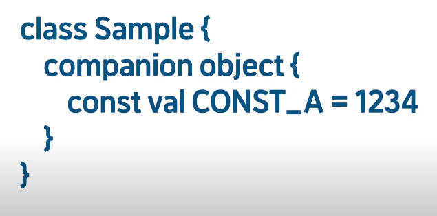
>
>
>
>반드시 companion object 안에서 생성해야 한다. 
>
>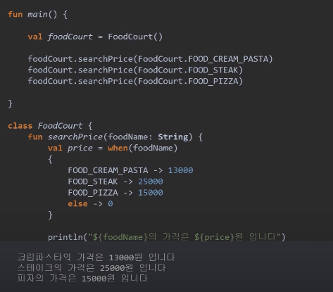
>
>
>
>상수를 통해 객체의 생성없이 메모리에 값을 고정하여 성능을 향상시킨다. 
>
>
>
>변수를 선언만 하고 할당을 해주는 것을 코틀린에서 허락하지 않지만 lateinit를 통해 사용 할 수있다.
>
>lateinit 은 초기값 할당 전까지 변수를 사용할 수 없으며 기본 자료형에는 사용할 수 없다. (String은 가능 )
>
>할당 하였는지 검사를 하고 싶을때에는 :a.isInitialized 를 통해 알 수 있다. 
>
>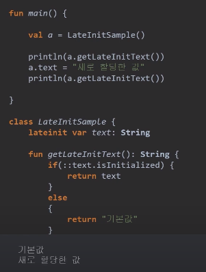
>
>
>
>마지막으로 변수를 사용하는 시점까지 변수를 초기화를 자동으로 늦추는 lazy delegate properties가 있다. 즉시 객체를 생성 및 할당하여 변수를 초기화하는 형태를 갖고 있지만 실제 실행시에 초기화 과정을 통해 실행시간을 최적화 할 수 있는  코드이다. 
>
>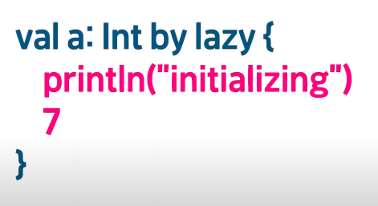
>
>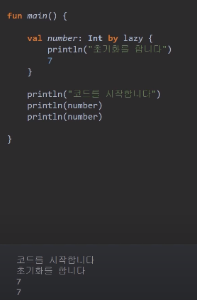
>
>

### 3.자료형 변환

>a.toDouble() 를 사용 ( 원하는 각각의 자료형으로 넣으면 된다.)
>
>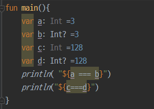
>
>
>
>
>
>
>
>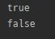
>
>
>
>
>
>Int형으로 선언된 c는 기본형으로 변환되어 스택에 128이라는 값 자체를 저장하지만
>
>Int?형으로 선언된 d는 참조형으로 저장되므로 b에는 128이 저장된 힙의 참조 주소가
>
>저장되어 있다. 따라서 삼중 부호를 하면 false값이 나온다.
>
>코틀린에서 참조형으로 선언된 변수의 값이 -128~127 범위에 있으면 캐쉬에 저장되기때문에
>
>a,b는 스택이 아닌 캐시에 저장되게 된다. 따라서 true값이 나오는것.
>
>자료형 검사
>
>>is라는 키워드를 사용 
>>
>>ex) num is Int
>

### 4.스마트 캐스트

>스마트 캐스트에 적용되는 자료형은 Number형이다.
>
>Number형은 숫자를 저장하기 위한 특수한 자료형 객체
>
>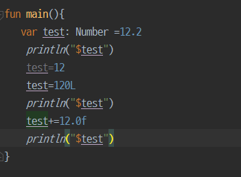
>
>
>
>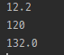
>
>
>
>

### 5.최상위 기본 클래스 Any 

>코틀린의 모든 클래스는 바로 any형이라는 슈퍼클래스를 가진다.
>
>Any는 자바의 최상위 클래스인 Object와 비슷하지만 서로 다른 유형이다.
>
>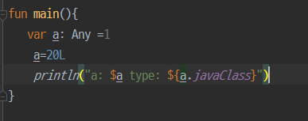
>
>
>
>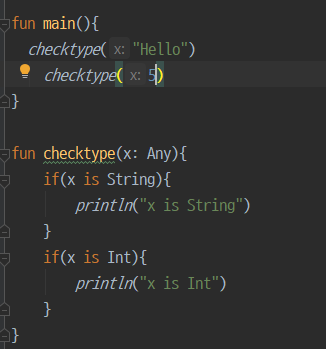
>
>

### 6.when

>다중 조건문을 편하게 사용하기 위하여 when 을 사용
>
>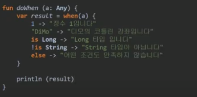
>
>복수 값을 지정가능 ex) 1,2-> 
>
>또한 함수의 반환값과 일치하는 문장도 삽입가능 하다. ex) parseInt(s)->
>
>범위지정자도 사용가능하다. ex) in 1..100 ->
>
>when 반환값을 값에다가도 할당가능하다.
>
>#### 인자가 없는 when 문
>
>>변수와 조건식을 when문에 직접 사용 할 수 있다.
>>
>>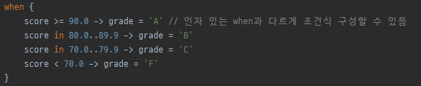
>>
>>

### 7. fun 설정

>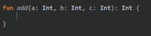
>
>
>
>여기서 함수를 선언할때 안의 값을 매개변수 함수를 호출할때는 인자라고 부른다.
>
>코틀린은 매개변수 기본값 설정을 제공한다.
>
>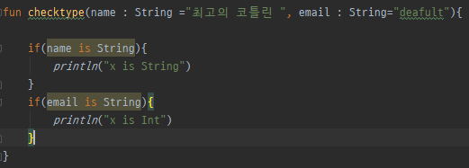
>
>
>
>또한 매개변수의 갯수가 다른경우를 설정하는 vararg (variable argument)를 이용하여
>
>좀 더 유연한 함수사용을 제공한다.
>
>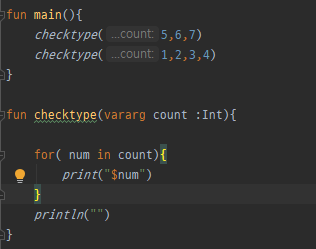
>
>
>
>return 값을 설정  , return 값이 없으면 :Int 를 삭제하거나 
>
>코틀린에서 다루는 특수한 자료형 Unit을 표기한다.
>
>함수를 더 간단하게 표현하게 위해서 **단일표현식** **함수**를 사용한다.
>
>또한 단일표현식에서는 반환형의 타입추론이 가능하므로 
>
>
>
>
>
>반환형을 생략할 수 있다.
>
>코틀린에서 함수는 내부적으로 기능을 가진 형태이지만 외부에서 볼때는
>
>**자료형이 결정된 변수라는 개념**으로 이해해야 함수형 언어의 특징을 가진 
>
>코틀린을 이해할 수 있다.
>
>#### 순수 함수
>
>>부작용이 없는 함수가 함수 외부의 어떤 상태도 바꾸지 않는다면 순수 함수라고 부른다.
>>
>>이런 특성 때문에 스레드에 사용해도 안전하고 코드를 테스트하기도 쉽다라는 장점이 있다.
>>
>>순수 함수의 조건.
>>
>>같은 인자에 대하여 항상 같은 값을 반환한다.
>>
>>함수 외부의 어떤 상태도 바꾸지 않는다.
>
>#### 람다함수
>
>>함수형 프로그래밍의 람다식은 다른 함수의 인자로 넘기는 함수, 함수의 결괏값으로 변환
>>
>>하는 함수, 변수에 저장하는 함수를 말한다.
>>
>>ex) {x,y -> x+y}
>>
>>또 한 변수에 람다식을 넣을 수 있다.
>>
>>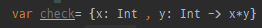
>>
>>또 한 생략을 통해 여라기지로 표현 가능하다.
>>
>>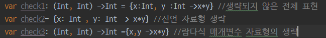
>>
>>람다식은 인자 와 봔환값이 없을 수 있다. 이때에는 Unit을 사용한다.
>>
>>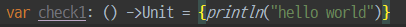
>>
>>
>>
>>람다함수도 일반 함수처럼 여러구문의 사용이 가능한데
>>
>>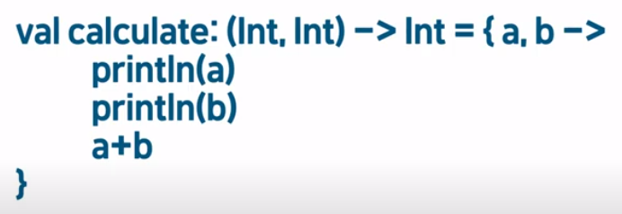
>>
>>여기서는 마지막 구문인 a+b 의 값을 Int로 반환된다.
>>
>>파라미터가 하나인 람다 함수는 it을 사용하여 간결하게 적을 수 있다.
>>
>>
>>
>>
>
>#### 일급 객체
>
>>일급 객체는 함수의 인자로 전달할 수 있다.
>>
>>일급 객체는 함수의 반환값에 사용 될 수 있다.
>>
>>일급 객체는 변수에 담을 수 있다.
>>
>>따라서 람다식이 일급 객체의 특성을 가질 수 있다.
>
>#### 고차 함수
>
>>고차함수란 다른 함수를 인자로 사용하거나 함수를 결괏값으로 반환하는 함수를 말한다.
>>
>>(**인스턴스로 취급하는 방법이다.**)
>>
>>**(String)->Unit** 이 꼴이 함 수를 나타낸 자료형의 일종으로 보는것이 이해하기 쉽다.
>>
>>val c: (String)-> Unit ={str:String} 이 기본 형식 () 안에 파라미터의 자료형이 기술되어 
>>
>>있으므로  val c: (String)-> Unit ={str} 로 생략할 수 있다.
>>
>>파라미터로 동작시킬 구문을 작성하면 val c: (String)-> Unit ={str-> println("$str 람다함수")}
>>
>>처럼 -> 뒤에 실행될 부분을 작성한다.
>>
>>람다형식을 변수에 할당할 시에는 코틀린의 타입추론 기능을 사용하여 축약하여
>>
>> val c ={str-> println("$str 람다함수")} 처럼 람다식 안에만 패러미터의 자료형을 기술하여
>>
>>*(String)->Unit 자료형으로 저장된다.
>>
>>
>>
>>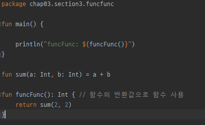
>>
>>매개변수에 람다식 함수를 이용한 고차함수이다.
>>
>>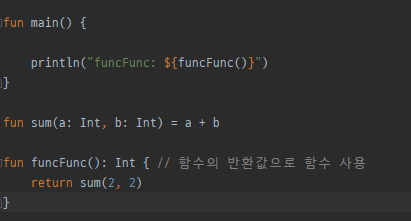
>>
>>값에 의한 호출로 람다식 사용하기
>>
>>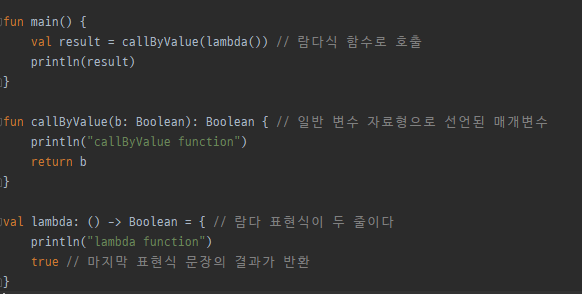
>>
>>이름에 의한 람다식 호출하기 
>>
>>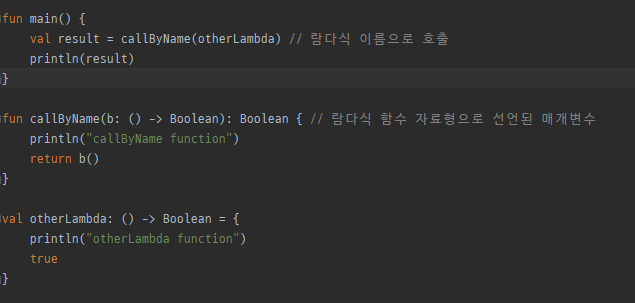
>>
>>참조에 의한 호출방식으로 일반 함수 호출하려면 함수앞에 ::를 붙여준다.
>>
>>::는 일반함수를 고차함수로 변경해주는 연산자이다.
>>
>>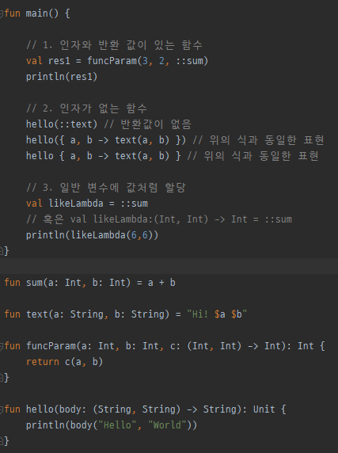
>>
>>
>>
>
>#### 스코프함수
>
>>함수형 언어의 특징을 좀 더 편리하게 사용 할 수 있도록 기본 제공함수이다.
>>
>>인스턴스의 속성이나 함수를 좀더 깔끔하게 불러 쓸수 있는 기능을 한다.
>>
>>스코프 함수의 종류로 apply, run,with,also,let 이 있다.
>>
>>apply는 인스턴스를 생성한 후 변수를 초기화 과정을 할때 주로 사용한다.
>>
>>인스턴스에 참조연산자를 사용하여 apply를 붙이고 중괄호로 람다함수를 만들어
>>
>>apply의 scope 안에서 직접 인스턴스의 속성과 함수를 참조연산자 없이 사용이 가능하다.
>>
>>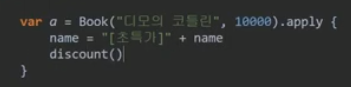
>>
>>main함수와 별도의 scope에서 인스턴스의 변수와 함수를 조작하므로 코드깔끔해 진다.
>>
>>
>>
>>run 스코프 함수는 람다함수와 같이 인스턴스 대신 마지막 구문에 결과값을 적는다.
>>
>>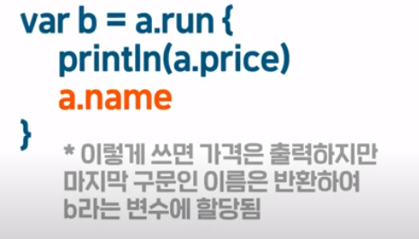
>>
>>이미 인스턴스가 만들어진 후에 인스턴스의 함수나 속성을 scope내에서 사용해야할때 유용함.
>>
>>
>>
>>with는 run과 동일한 기능을 가지지만 단지 인스턴스를 참조연산자 대신 파라미터로 받는다
>>
>>라는 차이점만 가진다. with(a) {...}
>>
>>
>>
>>also와 let은 파라미터로 인스턴스를 넘긴것처럼 it을 통해 인스턴스를 사용할 수 있다.
>>
>>
>>
>>
>>
>>같은 이름의 변수나 함수가 scope바깥에 중복되어 있는 경우 혼란을 막기 위한 것이다.
>>
>>
>>
>>
>
>#### 익명 함수
>
>>anonymous Funciion 이라고도 하며 람다식에서 return 이나 break,continue 같은 제어문을
>>
>>사용하기 어렵기 때문에 만들어졌다.
>>
>>val add: (Int, Int)-> Int =fun(x,y) =x+y 가 예시이다.
>
>#### 인라인 함수
>
>>함수가 호출되는 곳에 함수 본문의 내용을 모두 복사해 넣어 함수의 분기없이 처리 되기 때문에
>>
>>코드의 성능을 높일 수 있다. 인라인 함수는 람다식 매개변수를 가지고있는 함수에서 작동한다. 
>>
>>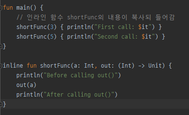
>
>#### 중위 함수
>
>>클래스의 멤버를 호출 할때 사용하는 점을 생략하고 함수이름 뒤에 소괄호를 붙이지 않아 지관적인 이름을 사용할 수 있는 표현법이다. 
>>
>>중위함수는 맴버 메소드 또는 확장함수이어야 하며 하나의 매겨변수를 가져야 사용할 수 있다.
>>
>>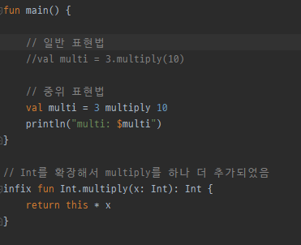
>>
>>
>
>

### 8.반복문

>다른 언어의  for문 과 다른 점이 있다. 코틀린은 ; 를 사용하지 못한다. 
>
>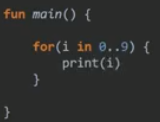
>
>
>
>돌고자 하는 변수를 설정한 뒤에 숫자와 숫자 사이에 ..(인터레이터)으로 범위를 표시한다.
>
>1씩 증가하는 것을 말고 일정한 크기만큼 증가 하기 위해서는 (0<=i<=9)
>
>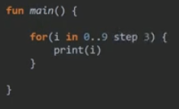
>
>
>
>step이라는 단어를 사용하여 표기한다.
>
>내림차순으로 표기 하기 위해서는 ..를 말고 downTo를 사용한다.
>
>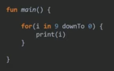
>
>#### 제어문
>
>>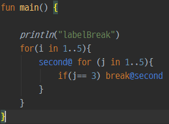
>>
>>반복 제어문에서 라벨을 통해서 원하는 곳으로 break,continue를 할 수 있다.
>
>
>
>

### 9.Class

>클래스는 '값'과 그 값을 사용하는 '기능'들을 묶어두운 것이다.
>
>즉 고유의 특징값인 속성과 기능의 구현을 위한 함수를 합친 개념이다.
>
>
>
>이처럼 클래스 선언과 동시에 생성자 선언을 동시에 한 코드이다.
>
>생성자는 새로운 인스턴스를 만들기 위해 호출하는 특수한 함수이다.
>
>생성자를 호출하면 클래스의 인스턴스를 만들어 반환 받을 수 있다.
>
>생성자는 인스턴스의 속성을 초기화하는 동시에 인스턴스 생성시 구문을 수행하는 역할을 한다.
>
>속성의 초기화는 init를 통해 하며 패러미터와 반환형이 없는 특수한 함수이다.
>
>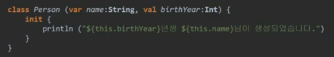
>
>보조생성자는 기본생성자와 다른 생성자를 제공하여 인스턴스 생성시 편의를 제공하거나 추가적인 기능을 제공한다. 보조 생성자는 constructor() 를 사용한다.
>
>보조생성자는 반드시 기본 생성자를 통해 속성을 초기화 해줘야 한다.
>
>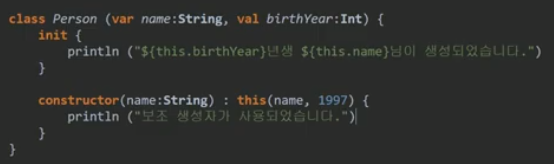
>
>#### 클래스 상속
>
>>코틀린은 상속금지가 기본값으로 실행. 'open' 상태에서만 상속 가능
>>
>>상속에는 두가지 규칙이 있다.
>>
>>서브클래스는 슈퍼클래스에 존재하는 속성과 같은 이름의 속성을 가질수 없다.
>>
>>서브클래스가 생성될때 반드시 슈퍼클래스의 생성자가 호출되어야 한다.
>>
>>클래스의 상속은  클래스 선언뒤에 콜론을 붙이고 슈퍼클래스의 생성자의 호출을 한다.
>>
>>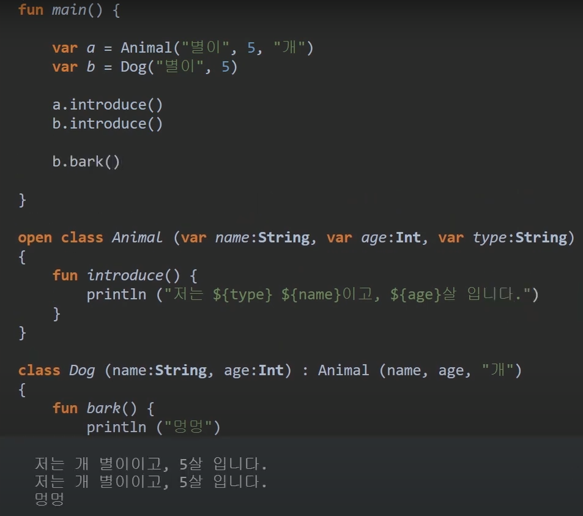
>>
>>슈퍼 클래스에서 허용만 한다면 오버라이딩이라는 방법으로 서브클래스에서
>>
>>같은 이름과 형태로된 함수의 내용을 구현할 수 있다.
>>
>>수퍼클래스에서 open이 붙은 함수는  서브클래스에서 override를 붙여 재구현 할 수 있다.
>>
>>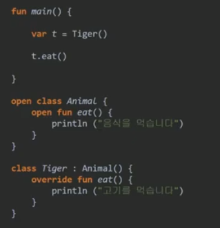
>>
>>추상화는 선언부만 기능이 구현되지않는 추상함수,추상함수를 포함하는 추상클래스로 구현되어있다.
>>
>>abstarct를 붙인 추상클래스는 미완성 클래스 이기때문에 반드시 서브클래스에서 상속을 받아
>>
>>abstarct 표시가 된 함수를 구현해야 한다.
>>
>>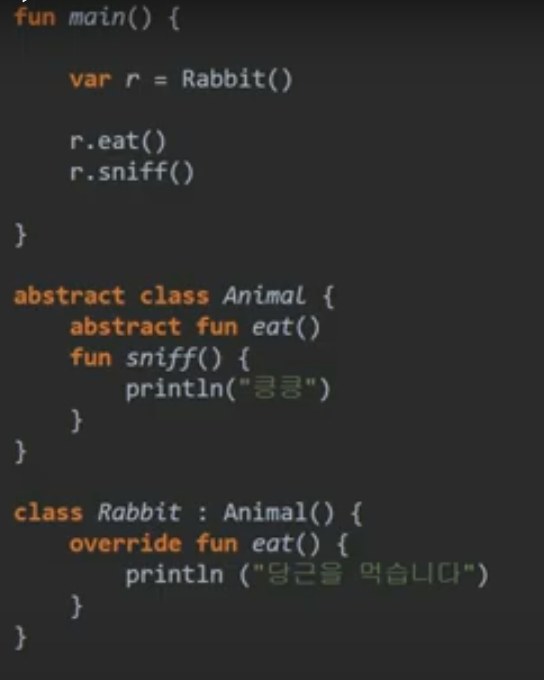
>>
>>추상화의 다른 방법으로 인터페이스가 있다.
>>
>>인터페이스에서 생성된 추상화 함수는 open이 붙지 않아도서브클래스에서 상속 받을 수 있다.
>>
>>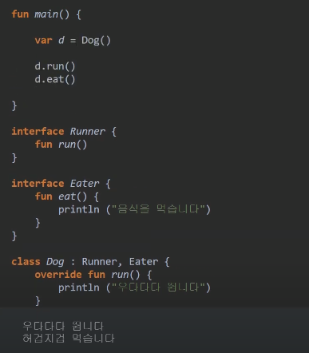
>>
>
>#### 내부클래스 와 중첩클래스
>
>>중첩 클래스는 하나의 클래스가 다른클래스의 기능과 강하게 연고나되어 있다는 의미를 
>>
>>전달하기 위해 만들어진 형식으로 사용 할때는 외부클래스.내부클래스로 사용한다.
>>
>>중첩 클래스는 형식만 안에 있을뿐 외부 클래스의 내용을 공유 할 수 없다.
>>
>>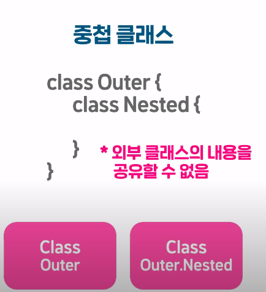
>>
>>
>>
>>내부클래스는 중첩클래스에 inner 를 붙이고 혼자 내부객체를 만들수 없고 외부 클래스의 
>>
>>객체가 있어야만 생성과 사용이 가능한 클래스이다.
>>
>>내부 클래스는 외부 클래스의 속성과 함수를 사용 할 수 있다.
>>
>>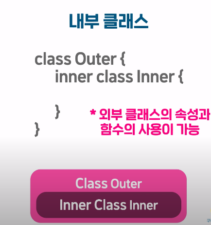
>>
>>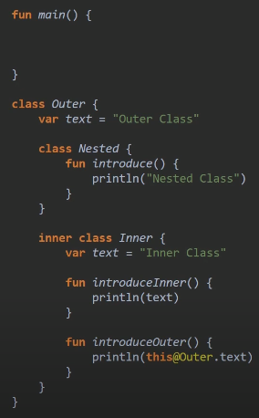
>>
>>예제와 같이 Outer 클래스와 Inner  클래스에 같은 이름의 속성이나 함수가 있다면
>>
>>this@Outer.text처럼 사용하면 된다.
>
>#### 데이터 클래스 
>
>>데이터를 다루는 데에 최적화된 class로 5가지 기능을 내부적으로 자동으로 생성한다.
>>
>>내용의 동일성을 판단하는 equals()의 자동구현
>>
>>객체의 내용에서 고유한 코드를 생성하는 hashcode()의 자동구현
>>
>>포함된 속성을 보기쉽게 나타내는 toString()의 자동구현
>>
>>객체를 복사하여 똑같은 내용의 새 객체를 만드는 copy()의 자동구현
>>
>>copy()함수를 통해 새 객체를 생성할때에는 똑같은 내용으로도 생성할 수 있고 일부 속성을 바꿀수 있다.
>>
>>속성을 순서대로 반환하는 componentX()의 자동구현
>>
>>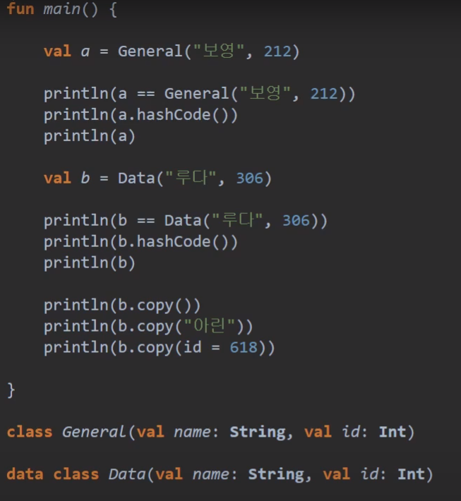
>>
>>
>
>#### 이넘 클래스 (Enum class)
>
>>열거형의 줄임말로 상태를 구분하기 위한 객체를 여러가지 생성하고 그 중 하나를 나타낸다.
>>
>>일반 클래스처럼 메소드를 넣을 수 있으며 객체 마지막 선언부에 : 를 추가하고 그 다음 에 넣는다.

### 10.scope

>#### 스코프 규칙 3가지
>
>>스코프 외부에서는 스코프 내부의 멤버를 참조 연산자로만 참조가 가능하다.
>>
>>> 다른 패키지 에 있는 것을 import를 할때
>>>
>>> 클래스 참조 ex) a.eat() <- 참조 연산자를 사용
>>>
>>> 젭근제한자는 외부에서 내부의 멤버를 참조 할때 그 권한을 개발자가 제어 할 수 있는
>>>
>>> 기능이다. public, internal, private, protected 등이 있다. 변수 함수 클래스 앞에 
>>>
>>> 붙일 수 있다.
>>>
>>> 패키지 스코프에서는 public은 어떤 패키지에서도 접근 가능이며
>>>
>>> internal은 같은 모듈 내에서만 접근 가능하며 private는 같은 파일 내에서만 접근 가능하다.
>>>
>>> 
>>>
>>> 클래스 스코프에서는 public은 클래스 외부에서 늘 접근가능 하며 pirvate는 클래스 내부에서만 접근 가능 하며 potected 는 클래스 자신과 상속받은 클래스에서 접근 가능하다.
>>
>>동일스코프내에서는 멤버들을 공유할수 있다.
>>
>>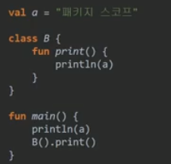
>>
>>하위 스코프에서는 상위 스코프의 맴버를 재정의 할 수 있다.
>>
>>
>
>

### 11.object

>단 하나의 객체만으로 공통적인 속성과 함수를 사용해야 하는 코드에는 object를 사용
>
>인스턴스를 생성하지않고 그 자체가 객체이다.
>
>프로그램이 종료되기 전까지 저장하는 용도로 사용한다.
>
>따라서 인스턴스를 사용하지 않기 때문에 object 이름에 직접 참조연산자를 붙여 사용한다.
>
>singleton Pattern 을 지원한다.(클래스의 인스턴스를 단 하나만 만들어 사용하도록 하는
>
>코딩 아키택쳐 패턴)
>
>기존 클래스에 object를 만들 수 있다. (companion object) 라고 한다.
>
>인스턴스간에 공용속성 및 함수를 별도로 만드는 기능이다. (static 멤버랑 유사하다)

### 12.observer

> 이벤트가 일어나는 것을 감시하는 역할을 한다.
>
> 이벤트를 즉각적으로 처리할수 있도록  만드는 프로그래밍 패턴이다.
>
> 이벤트를 수신하는 클래스, 이벤트의 발생 및 전달하는 클래스 2가지가 필요한다.
>
> 
>
> 클래스 A에서 클래스 B로 수신을 할 수 있지만 반대로는 불가 하기때문에 만들어 진것이
>
> 인터페이스를 통한 호출이다. 이 인터페이스를 옵저버 이며 코틀린에서는 리스너이며
>
> 이렇게 이벤트를 넘겨주는 행위를 callback 이라고 한다.
>
> 예시로 이벤트를 수신해서 출력하는 EventPrinter ,숫자를 카운트 하면 5의배수마다 이벤트를 발생할 count, 둘을 연결하는 인터페이스 EvnetListener가 있다고 가정한다.
>
> 
>
> 클래스 카운터는 이벤트를 상속받기 위해 생성자에서 이벤트리스너를 속성으로 받아온다.
>
> 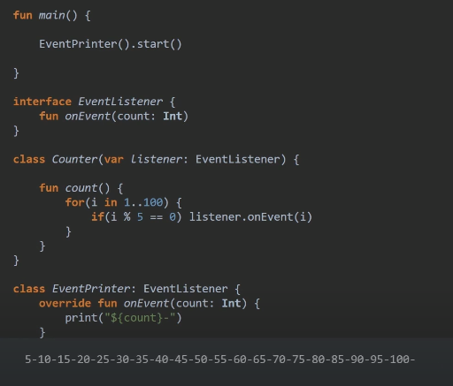
>
> 이벤트를 발생하기 위해 각자 인터페이스를 상속 받는다. 
>
> Event 클래스에서 Counter의 인스턴스를 만들되  this라는 키워드로 이벤트리스너의   구현부를
>
> 넘겨준다.
>
> 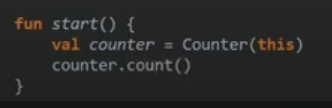
>
> 
>
> 1. EventPrinter는 EventListener를 상속받아 구현된 클래스 입니다 
>
> 2. EventPrinter내에서 선언된 this 는 EventPrinter() 를 통해 생성된 객체 자신을 나타냅니다. 여러개의 객체를 생성했다면 각각 자기 자신을 가리키는 것입니다. 
> 3. EventPrinter의 this 를 넘겼지만 받는 쪽(Counter)에서는 EventListener를 요구했기 때문에 업캐스팅이라는 과정을 거쳐 해당 객체의 기능이 제한됩니다. 
>
> EvnetListner를 상속받아 구현하지 않고 임시로 만든 별도의 EvnetListener 객체를 대신넘겨줄 수 있다. 익명객체라고 한다.(Anonymous Object)

### 13.다형성

>상위 자료형인 수퍼클래스로 변환하는 것을 up-Casting 이라고 하고
>
>상위 자료형을 담는 역할을 한다.
>
>Up-Casting된 자료를 하위자료로 바꾸게 되면 Down-Casting이라고 하고
>
>별도의 as,is 연산자가 필요하다.
>
>as는 변수를 호환되는 자료형으로 변환해주는 캐스팅 연산자로 코드내에서 사용하면
>
>즉시 자료형을 변환하고 반환한다. as는 반환값 뿐만 아니라 변수자체도 다운캐스팅 된다.
>
>is는 변수가 자료형에 호환되는지를 먼저 체크한 후 변환해 주는 캐스팅 연사자로 
>
>조건문 안에서 사용된다.  따라서 is는 조건문 안에서만 잠시 다운캐스팅 된다는 점이다.
>
>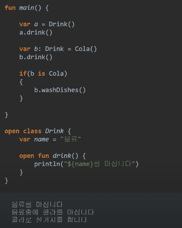
>
>

### 14.generic

>클래스나 함수에서 사용하는 자료형을 외부에서 지정할 수 있는 기능이다.
>
>캐스팅 연산자는  프로그램의 속도를 저하시킬수 있는 것이 배경이다.
>
>함수나 클래스를 선언할때 고정적인 자료형 대신 실제 자료형으로 대체되는 
>
>타입 패러미터를 받아 사용하는 방법이다.
>
>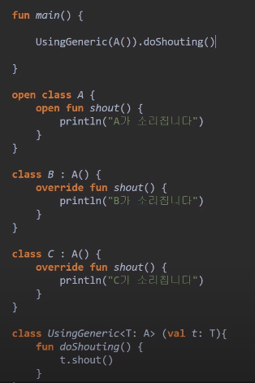
>
>

### 15.Collection 

>#### List
>
>>데이터를 모아 관리하는 Collection 클래스를 상속받는 서브클래스중 가장 단순한 형태로
>>
>>여러개의 데이터를 원하는 순서로 넣어 관리하는 형태이다.
>>
>>List<out T> , mutableList<T> 이렇게 존재한다.
>>
>>List<out T>는 생성시에 넣은 객체를 대체,추가,삭제 할수 없다.
>>
>>mutableList<T>는 생성시에 객체를 대체,추가,삭제 할 수 있다.
>>
>>리스트를 만들때에는 전용 생성단어인
>>
>>listOf(1,2,3) , mutableListOf("a","b","c") 를 사용한다.
>>
>>mutableList<T>에는 add() , remove(),removeAt(), 추가 삭제 할 수 있으며
>>
>>무작위로 섞는 shuffle() 과 정렬하는 sort() 를 제공한다.
>>
>>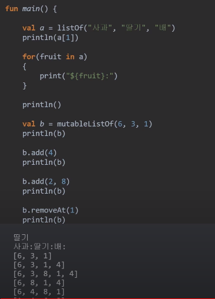
>
>#### Set
>
>>list는와 달리 중복을 허용하지 않으며 순서가 없다.
>>
>>set은 인덱스로 위치를 지정하여 객체를 참조 할수는 없으며 contains()을 통해 데이터 존재 여부를
>>
>>알때 사용한다. 추가와 삭제는 add(), remove() 를 통해 만든다.
>>
>>set<out T> , mutabelSet<T> 를 통해 생성 한다.
>
>#### Map
>
>>Map은 객체를 넣을때 그 객체를 찾아낼 수 있는 key를 쌍으로 넣어주는 객체이다.
>>
>>객체의 위치가 아닌 고유의 key를 통해 존재 여부를 알아낸다.
>>
>>추가와 삭제는 put(), remove() 를 사용한다.
>>
>>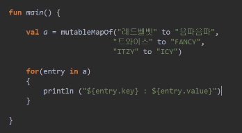
>>
>>속성값이 key와 value로 이루어져 있고 연결시킬때는 to를 사용하여 연결한다.
>
>#### 컬렉션에서 유용한 함수
>
>>코틀린은 함수형 언어의 특징을 가지고 있기 때문에  좀 더 collection 을 용이하게 사용 가능하다.
>>
>>일반 함수 또는 람다 함수 형태를 사용하여  for문 업싱도 아이템을 순회하며 참조하거나 조건을 걸고
>>
>>구조의 변경까지 가능하다.
>>
>>forEach()는 it을 통해 순서대로 출력 할 수 있다. 
>>
>>filter{} 는 특정조건을 거를 수 있다. 
>>
>>map{} 수식을 변경하여 collection으로 만들어 수정하게 만들수 있다. 
>>
>>
>>
>>first()는 첫번째값을 반환하지만 람다함수 형태  first{it>3} 이면 조건에 맞는 첫번째 아이템을 반환한다. 
>>
>>last{}는 조건에 맞는 마지막 아이템을 반환한다. 
>>
>>first는 -> find로 대체 될 수 있으며 last는 ->findLast로 대체 할 수 있다. 
>>
>>조건에 맞는 객체가 없는경우 
>>
>>
>>
>>를 사용하면 null 값을 반환한다. 
>>
>>count()는 컬렉션의 모든 아이템의 개수를 반환하고 람다식으로 할시에 조건에 맞는 갯수만 반환한다. 
>>
>>
>>
>>
>>
>>associateBy는 객체에서 key를 추출하여 map으로 만드는 함수이다. 
>>
>>
>>
>>
>>
>>groupBy는 특정한 값을 키로 지정하여 해당 값을 가진 객체들끼리 묶은 배열을 map으로 만들어 주는 기능을 한다.
>>
>>
>>
>>
>>
>>partition는 조건을 걸어 true ,false 그룹으로 만든다. 두 그룹 객체는 하나의 Pair라는 클래스 객체로 반환
>>
>>
>>
>>first, second로 참조하여 사용한다. 
>>
>>
>>
>>
>>
>>flatMap{}은 아이템마다 만들어진 컬렉션을 합쳐서 반환하는 함수이다. 
>>
>>
>>
>>
>>
>>합쳐서 하나의 객체로 반환하여 준다. 
>>
>>
>>
>>getOrElse()는 인덱스 위치에 아이템이 있으면 아이템을 반환하고 아닌 경우 지정한 기본값을 반환하는 함수이다. 
>>
>>
>>
>>5라는 객체가 있으므로 반환하고 없는 객체이면 기본값인 50을 넣는다.
>>
>>
>>
>>zip은 컬렉션 두개의 아이템을 1:1로 매칭하여 새로운 컬렉션을 제공하는 함수이다. 
>>
>>
>>
>>
>>
>>결과 List의 아이템의 개수는 적은 컬렉션을 따라간다. 
>>
>>
>>
>>
>
>

### 16.String

>length는 길이는 알려주는 기능을 하며 toLowerCase(),toUpperCase() 는 대소문자로 반환시켜주는 기능을 하며
>
>Split()은 특정 문자로 문자열을 나누어 주는 역할을 하면서,자바와 달리 정규식이 아닌 일반 문자열에을 넣어도 동작한다.
>
>jointoString()은 문자열들을 합쳐주는 역할을 하며 괄호안에 특정문자를 넣어서 연결시킬수 있다.
>
>substring(5..10)는 IntRange형식을 사용하여  일정부분만 나오는 기능을 제공한다.
>
>
>
>null 혹은 비어있거나 빈칸인지 알기 위해서 만들어진 함수들을 제공한다.
>
>isNullOrEmpty() 와 isNullOrBlank() 가 그의 예시이다.
>
>또한 특정 문자로 시작하거나 끝나는 문자열인지 알기 위해서 사용하는 함수로
>
>startsWith() 과 endsWith()등이 있고 특정문자를 포함하는 여부를 뭍는 contains()가 있다.
>
>
>
>
>
>

### 17.코루틴

>일반적으로 모든구문을 동기적으로 실행한다.
>
>여러개의 루틴을 동시에 실행하여 동기적으로 결과값을 얻고 싶으면 비동기 처리인 코루틴을 통해 얻어야 한다.
>
>코루틴을 사용하려면 import kotlinx.coroutines.*을 사용한다. 
>
>제어 범위 실행범위를 지정할 수 있다.
>
>GloblaScope: 프로그램 어디서나 제어,동작이 가능한 기본범위를 말하며 
>
>CoroutineScope: 특정한 목적의 Dispacher를 지정하여 제어 및 동작이 가능한 범위를 말한다. 
>
>
>
>
>
>launch 나 async를 통해 새로운 코루틴을 생성할수 있다. 
>
>
>
>
>
>루틴의 대기를 위한 delay(),join(),await() 가 있다.
>
>
>
>
>
>위의 3가지 함수는 루틴의 대기가 가능한 구문안에서만 동작이 가능하다. 

//익명함수와 람다함수 다시한 번 보기

### Singleton Pattern

>
>
>
>
>