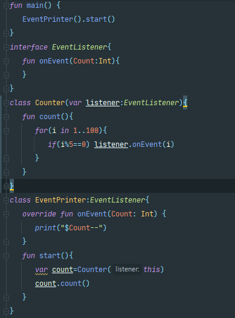

# 💎코틀린 기본

## idea  단축키

>Run : Alt+4
>
>Debug: Alt+5
>
>Ctrl+shift+f10 : 바로 컴파일
>
>Alt+shift+f10: 파일을 골라서 컴파일
>
>String 키워드를 클릭하고 Ctrl+b 를 눌러보면 String.kt파일이 열린다.
>
>
>
>자료형이 지정하지 않은 변수는 값을 할당해야 함.
>
>코틀린이 자동으로 자료형을 추론한 값을 알고 싶으면 변수를 클릭하고
>
>Ctrl+Shift +p 를 클릭.
>
>
>
>디버깅시에 하고자하는 줄에 브레이크포인트를 가르키는 회색에 빨간 점을 찍거나
>
>단축키 Ctrl+f8 을 누름
>
>그 다음 디버깅을 시작 하는 단축키 Shift + f9 을 누르고 한줄 씩 실행하려면
>
>f8키를 누른다.
>
>종료시에는 Ctrl+ f2 를 누른다.

### JVM 및 실행 과정 GC

>JVM을 사용하게 된 이유
>
>c,c++ 가 OS가 다르면 다르게 실행되거나 안되는 것이 문제 그래서 모든 os 와 독립적인 특징을 가지게 된 것이 JVM이다.
>
>따라서 JVM은 자바 소스코드 컴파일 후 생성된 파일이 해석(Interpret)과 Link없이 바로 JVM에 적재되고, 
>
>OS로 부터 메모리를 할당받아 GC(Garbage Collection)를 통해 스스로 메모리 관리를 한다는 특징이 있다.
>
>#### 실행과정
>
>>
>>
>>1. **`작성한 자바 소스(.java)를 자바 컴파일러를 통해 자바 바이트 코드(.class)로 컴파일한다.`**
>>   - 자바 바이트 코드 : JVM이 이해할 수 있는 코드로 아직 컴퓨터는 읽을 수 없는 반기계어이다. 자바 바이트 코드의 각 명령어는 1바이트 크기의 Opcode와 추가 피연산자로 이루어져 있다.
>>2. **`컴파일된 바이트코드를 JVM의 클래스 로더에게 전달합니다.`**
>>   - 클래스 로더 세부 동작
>>     - 로드 : 클래스 파일을 가져와서 JVM의 메모리에 로드한다.
>>     - 검증 : 자바 언어 명세(Java Language Specification) 및 JVM 명세에 명시된 대로 구성되어 있는지 검사한다.
>>     - 준비 : 클래스가 필요로 하는 메모리를 할당한다. (필드, 메서드, 인터페이스 등등)
>>     - 분석 : 클래스의 상수 풀 내 모든 심볼릭 레퍼런스를 다이렉트 레퍼런스로 변경한다.
>>     - 초기화 : 클래스 변수들을 적절한 값으로 초기화한다. (static 필드)
>>3. **`JVM의 클래스 로더는 동적 로딩(Dynamic Loading)을 통해 필요한 클래스들을 로딩 및 링크하여 런타임 데이터 영역(Runtime Data area), 즉 JVM의 메모리에 올린다.`**
>>4. **`실행엔진(Execution Engine)은 JVM 메모리에 올라온 바이트 코드들을 명령어 단위로 하나씩 가져와서 실행한다. 이때, 실행엔진은 2가지 방식으로 동작할 수 있다.`**
>>   - 자바 인터프리터 : 바이트 코드 명령어를 하나씩 읽어서 해석하고 실행합니다. 하나하나의 실행은 빠르나, 전체적인 실행 속도가 느리다는 단점을 가집니다.
>>   - JIT 컴파일러(Just-In-Time Compiler) : 인터프리터의 단점을 보완하기 위해 도입된 방식으로 바이트 코드 전체를 컴파일하여 바이너리 코드로 변경하고 이후에는 해당 메서드를 더이상 인터프리팅 하지 않고, 바이너리 코드로 직접 실행하는 방식이다. 따라서 전체적인 실행속도는 인터프리팅 방식보다 빠르다. 런타임 시간에 실행한다.
>
>#### JVM
>
>>
>>
>>- #### Class Loader
>>
>>  `.java` 파일은 컴파일 되어 `.class` 의 바이트 코드로 전환됩니다. 이러한 바이트 코드는 JVM의 Class Loader로 진입하게 됩니다. 그 후, 링크를 통해 배치하는 작업을 수행합니다.
>>
>>  - 컴파일타임이 아닌 런타임에 클래스 파일을 참조한다.
>>  - 사용되지 않는 클래스들을 메모리에서 삭제하고, jar파일 내에 저장된 클래스들을 JVM위에 탑재합니다.
>>  - Runtime Data Area 에 바이트 코드 배치
>>
>>- #### Execution Engine
>>
>>  실행시키는 역할을 수행합니다. `.class` 들은 기계가 바로 수행할 수 없어, 실행 엔진을 통해 JVM 내부에서 실행 가능한 기계어로 변형된 후 실행되는데, 변형되는 과정은 위에 설명 한 2가지 방법이 있다.
>>
>>  또 한 가비지 컬렉션이나 스레드 동기화를 진행한다.
>>
>>- #### GC
>>
>>  Heap 영역에 배치된 객체들을 관리하는 모듈입니다. 자세한 동작 원리는뒤에서 확인하실 수 있다.
>>
>>- #### Runtime Data Area
>>
>>  프로그램을 수행하기 위해 OS로부터 할당받은 메모리 영역을 의미합니다. 간단하게 Java 메모리 공간이라고도한다.
>>
>>  🌟 Java 는 멀티쓰레드 환경으로 모든 쓰레드는 **Heap, Method Area** 를 공유한다.
>>
>>  
>>
>>  - ##### PC Register
>>
>>    쓰레드가 시작될 떄 생성되며, 현재 수행중인 JVM의 명령어 주소를 저장하는 공간이다.
>>
>>    따라서, 현재 쓰레드가 어떤 부분을 어떤 명령어로 실행해야할 지에 대한 기록을 담당합니다.
>>
>>  - ##### Native Method Stacks
>>
>>    Java 이외의 언어에 제공되는 Method의 정보가 저장되는 공간이다. Java Native Interface를 통해 바이트 코드로 저장된다. 
>>
>>  - ##### JVM Stacks
>>
>>    호출된 메서드의 파라미터, 지역 변수, 리턴 값 및 연산값 등이 저장되는 영역이다. 프로그램 실행시 임시로 할당되었다가 메서드를 빠져나가게 되면 소멸되는 특성의 데이터들이 저장되는 영역
>>
>>    메서드 호출 시마다 스택에 각각의 스택 프레임이 생성이 되고 메서드 수행이 끝나면 스택 포인트에서 해당 프레임이 제거된다.
>>
>>    
>>
>>  - ##### Heap
>>
>>    GC의 대상이 되는 영역 
>>
>>    객체를 동적으로 생성하게 되면 인스턴스가 Heap 영역의 메모리에 할당된다. 단, 레퍼런스 변수의 경우, Heap에 인스턴스가 저장되는 것이 아닌 포인터가 저장된다.
>>
>>  - ##### Method Area
>>
>>    클래스 정보를 처음 메모리에 올릴 때 초기화되는 대상을 저장하기 위한 영역이다. 메소드 바이트코드가 올라가게 되는데, 컴파일된 바이트코드는 대부분이 메소드 바이트코드로 거의 모든 바이트코드가 올라간다고 봐도 될 것 같다고 합니다.
>>
>>    올라가는 정보는 다음과 같습니다.
>>
>>    1. **Field Information**
>>
>>       멤버변수에 대한 정보 (이름, 타입, 접근 지정자 등)
>>
>>    2. **Method Information**
>>
>>       메서드에 대한 정보 (이름, 리턴타입, 파라미터, 접근 지정자 등)
>>
>>    3. **Type Information**
>>
>>       Class 인지 Interface 인지? Type의 속성, 이름, super class의 이름
>>
>>    또한, Method Area 에는 상수형을 저장하고 중복을 막는 **Runtime Constant Pool** 이 존재
>>
>>  
>
>### GC
>
>>JAVA에서는 JVM(Java Virtual Machine)이 구성된 JRE(Java Runtime Environment)가 제공되며, 그 구성 요소 중 하나인 Garbage Collection(이하 GC)이 자동으로 사용하지 않는 객체를 파괴한다.
>>
>>'stop-the-world'란, GC를 실행하기 위해 JVM이 애플리케이션 실행을 멈추는 것이다. 어떤 GC 알고리즘을 사용하더라도 'stop-the-world'는 발생하게 되는데, 대개의 경우 GC 튜닝은 이 'stop-the-world' 시간을 줄이는 것이다.
>>
>>GC를 해도 더이상 사용 가능한 메모리 영역이 없는데 계속 메모리를 할당하려고 하면, OutOfMemoryError가 발생한다.
>>
>>일반적으로 다음과 같은 경우에 GC의 대상이 된다.
>>
>>1. 객체가 NULL인 경우 (ex. String str = null)
>>2. 블럭 실행 종료 후, 블럭 안에서 생성된 객체
>>3. 부모 객체가 NULL인 경우, 포함하는 자식 객체
>>
>>GC는 `Weak Generational Hypothesis`  (약한 세대 가설) 즉 신규로 생성한 객체의 대부분은 금방 사용하지 않는 상태가 되고, 오래된 객체에서 신규 객체로의 참조는 매우 적게 존재한다는 가설이다.
>>
>>#### GC의 메모리 해제 과정
>>
>>>Marking
>>>
>>>>
>>>>
>>>>프로세스는 마킹을 호출한다. 이것은 GC가 메모리가 사용되는지 아닌지를 찾아낸다. 
>>>>
>>>>참조되는 객체는 파란색으로, 참조되지 않는 객체는 주황색으로 보여진다. 
>>>>
>>>>모든 오브젝트는 마킹 단계에서 결정을 위해 스캔되어진다. 모든 오브젝트를 스캔하기 때문에 매우 많은 시간을 소모하게 된다.
>>>
>>>sweep
>>>
>>>>
>>>>
>>>>참조되지 않는 객체를 제거하고, 메모리를 반환합니다. 메모리 Allocator는 반환되어 비어진 블럭의 참조 위치를 저장해 두었다고 새로운 오브젝트가 선언되면 할당되도록 합니다.
>>>
>>>compacting
>>>
>>>>
>>>>
>>>>퍼포먼스를 향상시키기 위해, 참조되지 않는 객체를 제거하고 또한 남은 참조되어지는 객체들을 묶는다. 이들을 묶음으로서 공간이 생기므로 새로운 메모리 할당 시에 더 쉽고 빠르게 진행 할 수 있다.
>>>
>>>#### Generational Gabage Collection
>>>
>>>>
>>>>
>>>>1. Young 영역(Yong Generation 영역)
>>>>
>>>>   새롭게 생성한 객체의 대부분이 여기에 위치한다. 대부분의 객체가 금방 접근 불가능 상태가 되기 때문에 매우 많은 객체가 Young 영역에 생성되었다가 사라진다. 이 영역에서 객체가 사라질때 **Minor GC** 가 발생한다고 말한다. 
>>>>
>>>>2. Old 영역(Old Generation 영역)
>>>>
>>>>   접근 불가능 상태로 되지 않아 Young 영역에서 살아남은 객체가 여기로 복사됩니다. 대부분 Young 영역보다 크게 할당하며, 크기가 큰 만큼 Young 영역보다 GC는 적게 발생합니다. 이 영역에서 객체가 사라질 때 **Major GC(혹은 Full GC)** 가 발생한다고 말합니다.
>>>>
>>>>3. Permanet 영역
>>>>
>>>>   Method Area라고도 합니다. JVM이 클래스들과 메소드들을 설명하기 위해 필요한 메타데이터들을 포함하고 있습니다. JDK8부터는 PermGen은 Metaspace로 교체된다.
>>>
>>>#### Generational Garbage Collection 과정
>>>
>>>>
>>>>
>>>>어떠한 새로운 객체가 들어오면 Eden Space에 할당한다.
>>>>
>>>>Eden space가 가득차게 되면, minor garbage collection이 시작된다.
>>>>
>>>>참조되는 객체들은 첫 번째 survivor(S0)로 이동되어지고, 비 참조 객체는 Eden space가 clear 될 때 반환된다.
>>>>
>>>>Eden에서 또 minor GC가 발생하게 되면 S0으로 옮겨지게 되고 그안에서도 minorGC가 발생하게 된다.(처음에 들어간 곳이 S1이면 S1으로 가게된다.)
>>>>
>>>>이 후 S0가 꽉차게 되면 minor GC를 실행하고 age값을 1더한후 S1으로 이동하게 된다.
>>>>
>>>>S1이 꽉차게 되면 minor GC를 실행하고 S0으로 옮겨지면서 age값이 증가한다.
>>>>
>>>>age값이 설정해둔 age임계값을 넘어가게 된다면 old generation으로 움직여진다.
>>>>
>>>>이 과정을 **promotion** 이라고 한다. Old Genration이 꽉차게 되면 major GC를 하여 메모리 공간을 확보한다. 
>>>
>>>#### Garbage Collector 종류
>>>
>>>>#### 1.Serial GC
>>>>
>>>>>GC를 처리하는 스레드가 1개이며 CPu코어가 1개만 있을 때 사용하는 방식이다.
>>>>>
>>>>>CPU 코어가 1개만 있을 때 사용하는 방식이며 Mark-Compact Collection 사용
>>>>
>>>>#### 2.Parallel GC
>>>>
>>>>>Serial GC보다 빠르게 객체를 처리할 수 있으며 
>>>>>
>>>>>Parllel GC는 메모리가 충분하고 코어의 개수가 많을 떄 사용하면 좋다.
>>>>>
>>>>>
>>>>
>>>>#### 3.Concurrent Mark Swepp GC(CMS GC)
>>>>
>>>>>
>>>>>
>>>>>GC가 Stack의 모든 변수를 스캔하면서 각각 어떤 객체를 참조하고 있는지 찾아서 마킹한다.
>>>>>
>>>>>REachable Object가 참조하고 있는 객체도 찾아서 마킹한다.
>>>>>
>>>>>1. Initial Mark Phase
>>>>>   - 애플리케이션 일시 정지.
>>>>>   - GC에 싱글 스레드를 사용.
>>>>>     - 애플리케이션의 Root set과 직접적으로 관계가 있는 살아있는 객체만 마크한다.
>>>>>2. Concurrent Mark Phase
>>>>>   - GC 스레드는 GC 작업을 하고, Working 스레드는 애플리케이션 작업을 한다.
>>>>>   - GC에 싱글 스레드를 사용.
>>>>>     - 바로 전 단계에서 체크한 객체가 바라보고 있는 객체들을 추적해 살아있는지 마크한다.
>>>>>3. Remark Phase
>>>>>   - 애플리케이션 일시 정지.
>>>>>   - GC에 멀티 스레드 사용.
>>>>>   - 마크한 객체를 다시 추적해, 살아있는지 확인한다.
>>>>>4. Concurrent Sweep Phase
>>>>>   - 애플리케이션은 멈추지 않고 작업을 계속한다.
>>>>>   - GC에 싱글 스레드 사용.
>>>>>   - Sweep: 살아있는 객체를 제외한 죽은 객체를 모두 삭제한다.
>>>>>   - compaction(조각 모음)은 하지 않는다.
>>>>>     - 따라서, Sweep을 하다 보면 단편화가 발생한다.
>>>>>     - Free List를 사용해 단편화를 최소화한다.
>>>>
>>>>#### 4.G1 GC
>>>>
>>>>>### G1 Garbage Collector
>>>>>
>>>>>```java
>>>>>-XX:+UseG1GC
>>>>>```
>>>>>
>>>>>Java7부터 사용가능하다 . 여러 CPU와 아주 큰 memory에서 효과적인 GC를 활용하기 위함이다. Oracle문서에 따르면 heap size가 6GB보다 클 경우 GC의 latency를 0.5sec이하로 낮출수 있다고 한다.([Oracle G1 GC문서](https://www.oracle.com/technetwork/tutorials/tutorials-1876574.html)) 
>>>>>
>>>>>Java9에서는 default GC로 설정되어 있다.(이전까지는 Parallel GC가 default)

## 기본개념

>프로그램의 실행 진입점인 main() 함수에서 매개변수를 통해 프로그램 외부의 인자를 
>
>받아들이려면 함수의 선언을 fun main(args: Array<String>) 로 선언해야한다.
>
>코틀린은 타입추론을 지원하는 정적 타입의 언어이다.
>
>정적타입과 동적 타입
>
>>정적 언어라는 것은 자료형이 컴파일 시에 결정 되는 것이다.
>>
>>C,C#,Java,kotlin 등이 있다.  ->컴파일 시에 타입에 대한 정보를 결정 하기에 속도가 향상되고 타입 에러로 인한 문제점을 초기에 발견할 수 있어 안정성이 향상댐
>>
>>동적타입의 언어는 컴파일 시에 자료형을 정하는 것이 아니고 실행시에 결정되는 것이다.
>>
>>python,JavaScrpit등이 있다 ->
>>
>>Run time까지 타입에 대한 결정을 끌고 갈 수 있기 때문에 많은 선택의 여지가 있지만 도중에 Type Error를 뿜는 경우가 생길 수 있다.
>
>#### 코틀린 구성
>
>>코틀린 에서 프로젝트는 module,Package, File 등으로 구성되어 있다.( 자바랑 유사)
>>
>>코틀린은 자바처럼 클래스 이름과 파일 이름이 동일해야 하는 것이나  public 클래스는 
>>
>>하나만 사용해야 하는 등의 규칙은 없음. 대신에 파일이름이 클래스 이름과 같으면 파일명이
>>
>>Hello.kt ->Hello 로 변경된다.
>>
>>패키지는 개발시에 소스코드의 소속을 정해지기 위한 논리적 단위이다.
>>
>>코틀린은 자바와 달리 패키지명과 폴더구조와 같게 하지 않아도 된다.
>>
>>패키지가 점으로 표시되어 있으면 하위폴더 생성
>
>코틀린은 변수,필드,데이터,속성같은 외부 언어 에서 사용하는 단어를 프로퍼티라고 한다.
>
>필드나 메소드는 클래스 내부에서 정의되므로  멤버 필드,멤버 메서드라고 한다.
>
>외부언어에서의 인스턴스를 코틀린에서는 객체(object)라고 한다.
>
>정확히는 특정 클래스로부터 만들어진 객체는 그 클래스의 인스턴스 라고 한다.
>

### 코틀린 함수

>코틀린은 함수형 프로그래밍 과 객체지향 프로그래밍을 모두 지원하는 다중 패러다임 언어이다.
>
>함수형 프로그래밍은 코드가 간략화 되고 테스트나 재사용성이 더 좋아지면서 개발 생산성이 늘어나는 장점이 있다.
>
>다중 패러다임 언어: 한 가지 구현 규칙에 얽매이지 않고 다양한 문법과 형식을 지원하는 언어이다.
>
>자바나 코틀린은 함수를 호출할때 인자의 값만 복사하는 '값의 의한 호출'이 일반적이다.
>
>c/c++ 에서 사용하는 포인터 주소 연산이 없기 때문에 주소 자체를 사용해 호출하는 '참조에 의한 호출' 은 자바나 코틀린에서 사용되지 않는다. 
>
>#### 람다식을 매개변수로 받는 함수에 일반 함수로 받기
>
>> ::sum 혹은  { sum()} 같은 형식으로 받아야 한다.
>
>#### 일반함수에 람다식을 매개변수로 하나만 받는경우 () 생략 가능하다.
>
>ex)noParam{"Hello World"} 
>
>람다식을 매개변수로 2개이상 받는 다면 생략 불가능 혹은 마지막 람다식만 빼내어 구성가능
>
>ex)noParam({"Hello World"}){"Hello World"}
>
>#### 인라인 함수
>
>>함수가 호출되는 곳에 함수 본문의 내용을 모두 복사해 넣어 함수의 분기를 없애는 것.
>>
>>-> 코드의 성능 향상 
>>
>>함수 앞부분에 inline 작성
>>
>>ex) inline fun shortFunc()
>>
>>인라인 함수를 자주 사용하게 되면 코드 양만 증가하여 비 효율적이므로 일부 람다식은 
>>
>>noinline 으로 제어가능
>>
>>ex) noinline out: (Int)->Int
>
>#### 확장 함수
>
>>기존 클래스에 내가 원하는 함수를 하나 더 포함시켜 확장하는 기능 ex) Int, String
>>
>>fun String.getLongString(target:String) : String=
>>
>>​	if(this.length> tartget.length) this else target
>>
>>#### 확장함수의 장점
>>
>>- 유틸리티 클래스 등을 별도로 지정하지 않고, 직접적인 객체 확장의 방법을 제공합니다.
>>- 함수와 프로퍼티 양측에 대한 확장을 지원합니다.
>>- Generic을 통해 객체의 타입을 처리할 수 있습니다.
>>- Extension이 적용될 범위(Scope)를 지정할 수 있습니다.
>>
>>#### 몇가지 규칙들
>>
>>>#### 규칙.1 Extensions은 정적으로 처리된다.
>>>
>>>```kotlin
>>>open class Cclass D: C()fun C.foo() = "c"
>>>fun D.foo() = "d"fun printFoo(c: C) {
>>>    println(c.foo())
>>>}class Demo {
>>>    fun run() {
>>>        printFoo(D())        
>>>    }
>>>}
>>>```
>>>
>>>일반적인 객체의 멤버라면 실제로 참조하고 있는 자신의 타입을 기반으로 함수를 호출하겠지만, 
>>>
>>>즉, `printFoo()`에서 D의 객체를 생성하여 전달하기 때문에 `D.foo()`를 호출 할 것 같지만 Extension은 정적으로 처리되는 이유로 `printFoo()`에서 사용하고 있는 타입인 `C.foo()`를 호출하게 됩니다.
>>>
>>>따라서 Extension 은 정적인 함수로 코드가 생성 되므로 인스턴스가 아닌 현재 참조되는 타입에 
>>>
>>>의한 호출을 한다. 
>>>
>>>#### 규칙.2 Extension보다 멤버가 우선이다.
>>>
>>>```kotlin
>>>class Person {
>>>    fun hello() { println("hello!") }
>>>}fun Person.hello() { println("HELLLLLLOOOOOOOOO!!!!") }fun main(args: Array<String) {
>>>    Person().hello()
>>>}// Result
>>>hello!
>>>```
>>>
>>>#### 규칙 3. Extension 역시 범위(Scope)를 가진다.
>>>
>>>일반적인 멤버와 동일하게 Extensions을 클래스의 멤버로 선언하면 해당 클래스 내에서만 범위가 결정됩니다. 간단하게 말하자면, 클래스의 멤버로 선언된 Extension은 당연히 자신이 선언된 클래스의 멤버에 자유롭게 액세스할 수 있습니다.
>>>
>>>```kotlin
>>>class D {
>>>    fun bar() { println("D.bar()") }
>>>}class C {
>>>    fun baz() { println("C.bar()") }    fun D.foo() {
>>>        bar()   // calls D.bar
>>>        baz()   // calls C.baz
>>>    }    fun caller(d: D) {
>>>        d.foo()   // call the extension function
>>>    }
>>>}
>>>```
>>>
>>>
>
>#### 최상위 함수와 지역 함수
>
>>최상위 함수는 main함수와 동등하게 선언된 함수를 말한다. 지역 함수는 main 내부에 선언된 함수를 
>>
>>말한다. 따라서 사용자 함수는 위치에 상관 없이 사용가능하지만 지역 함수는 선언부가 먼저 나와야
>>
>>사용 가능하다.

### 프로그램 흐름 제어

>#### if 문과 if~else문
>
>>if,else 문 블록중에 수행할 문장이 하나인 경우 블록 구문인 중괄호를 생략 가능하다.
>>
>>만약 블록의 표현식이 길어질때는 람다식 처럼 마지막 표현식이 변수에 반환되어 할당된다.
>>
>>```kotlin
>>val max= if(a>b){
>>   println("a 선택")
>>   a
>>}
>> else
>>   b
>>```
>
>#### when문
>
>>코틀린의 when은 자바 등 다른 언어에서 쓰이는 switch~case문과 비슷하지만
>>
>>각 수행 문장을 멈추는 break와 같은 문장이 필요하지 않다.
>>
>>아래 보는것과 같이 함수의 반환값과 값 비교도 가능하며(pareInt)
>>
>>in 연산자를 통해 범위 값 검사를 할 수 도 있고 , 
>>
>>is 라는 특정 자료형 검사도 할 수 있다. 
>>
>>```kotlin
>>when(x){
>>   0,1-> println(x)
>>   parseInt(y)-> println(y)
>>   in 1..10 -> println("in")
>>   is Int ->println("Int")
>>   else->println("error")
>>}
>> when{
>>    x in 0..10 ->println(x)
>> }
>>```
>
>#### for문
>
>>자바의 for문은 ; 으로 식을 구분하지만 코틀린은 세미콜론을 사용 할 수 없다.
>>
>>기본꼴 
>>
>>```kotlin
>>for(i in 0..3)
>>```
>>
>>을 통해서 0~3까지 반복하게 된다. 
>>
>>하행, 상행 및 다양한 반복 방법
>>
>>```kotlin
>>for(i in 5..3)
>>```
>>
>>을 하게 되면 실행하지 않게 된다. 역순으로 하고자 하면
>>
>>```kotlin
>>for(i in 5 downTo 3)
>>```
>>
>>로 작성하면 되며 특정 갯수만큼 증가나 감소하게 하려면
>>
>>```kotlin
>>for(i in 5 downTo 3 step 2)
>>```
>>
>> 처럼 step이라는 키워드를 사용한다. 
>>
>>#### While문
>>
>>>while문은 자바나 c언어 이랑 같게 동작한다. 

### 흐름의 중단

>#### return 으로 Unit반환하기 
>
>>return 
>>
>>return Unit
>>
>>하고 아무것도 적지 않는 것은 코틀린 상에서 Unit이라는 자료형 반환을 의미한다.
>
>인라인 함수, 익명함수 에서는 return문을 그대로 사용 가능하지만 일반 람다식에서는 
>
>return @lable 같은 형식을 사용해야 하며 break,continue는 지원하지 않는다.
>
>```kotlin
> Hello(2,3)lit@{a,b->
>      val result:Int=a+b
>      if(result>10) return@lit
>   }
>   
>```
>
>return 시에 라벨이 붙은 블록의 끝부분으로 반환하게 된다.  이 외에도 기존 코드를 명시적인 라벨이 아닌 암묵적인 라벨 즉 람다식의 이름을 사용해도된다. 

### 3.자료형

>자료형을 입력받을 시에 readLine()을 사용한다.  readLine()는 어떤 입력이든 String 타입으로 
>
>받기 때문에 받고자 하는 자료형으로 파싱하는 작업이 필요하다.
>
>ex) readLine!!.toInt() , readLine!!.toDouble()
>
>코틀린은 컴파일 과정을 거치면 참조형이 기본형으로 바뀐다.
>
>코틀린 컴파일러가 자동으로 최적화를 수행하는 것이다.
>
>
>
>이스케이프 문자로 /를 사용
>
>자료형을 다른 이름으로 하려면  typelias Username =String  으로 설정 가능하다.
>
>?. 를 null sfe operator 라고 한다.
>
>?: 는 객체가 null이 아니라면 그대로 사용하지만 null 아리면 연산자 우측의 객체로 반환된다.
>
>이러한 ?: 를 Elvis operator (엘비스연산자) 라고 한다.
>
>!!.는 참조연산자를 사용할때 null여부를 컴파일시 확인하지 않도록 하여 런타임시 NPE가 발생하도록 의도적으로 방치하는 연산자 이다.
>
>이러한 !!.non-null assertion operator라고 한다.
>
>##### val은 할당된 객체를 바꿀 순 없을 뿐이지 객체 내부의 속성을 변경 할 수 없는 것은 아니다. 
>
>절대 불가능은 const val 과 같은 상수를 의미한다. 상수 선언은 기본 자료형만 가능하며 런타임에 생성되는 일반적인 다른 클래스의 객체들은 담을수 없다.  속성이나 지역변수 로 단독적으로 사용할 수 없으며 
>
>반드시 companion object 안에서 생성해야 한다. 
>
>코틀린은 static이 없기 때문에 컴페니언 객체를 제공한다.
>
>
>
>#### 자바에서 코틀린 컴패니언 객체 사용하기 (@어노테이션)
>
>#### JvmStatic,JvmField
>
>>자바에서 코틀린의 컴패니언 객체를 접근하려면 @JvmStatic 애노테이션을 사용한다. 
>>
>>또 한 프로퍼티를 자바에서 사용하고자 할 경우에는 @JvmField  를 사용한다.
>>
>>이 둘의 차이를 알아보자
>>
>>#### JvmStatic은 static 변수의 get/set 함수를 자동으로 만들라는 의미이다.
>>
>>사실 companion object는 자바의 static과 다르다. 자바로 반환하면 bar클래스에 barSize 선언되었지만
>>
>>get/set 함수는 Bar.Companion 클래스에 들록 되어있다. 
>>
>>자바에서의 get/set 함수에 접근하려면 다음 Companion을 꼭 써줘야 한다. 
>>
>>
>>
>>#### JvmField는 get/set 을 생성하지 말라는 의미이다. 
>>
>>
>>
>>JvmField를 통해 get/set 함수가 만들어 지지 않는 것을 알 수 있다. 
>>
>>```kotlin
>>class KCustomer {
>>companion object {
>>const val LEVEL = "INTERMEDIATE"
>>@JvmStatic fun login() = println("Login...") // 어노테이션 표기 사용
>>@JvmStatic val score = 3
>>@JvmField val JOB = KJob()
>>}
>>}
>>```
>
>#### JvmName
>
>>최상위 함수는 main밑에 있어도 실행이 되고 역컴파일 되는 것을 보면 JVM에서 실행되기 위해
>>
>>static으로 선언되었음을 알 수 있다.
>>
>>자바코드에서는 이름이 자동 생성된 코틀린 클래스에 멤버 메소드처럼 접근 가능하다.
>>
>>이를 자동생성하지않고 코틀린 코드에서 이름을 명시 할 수 있다.
>>
>>접근할 클래스 이름을 바꾸고 싶다면 @file:JvmName("ClassName")을 코드 상단에 입력하면 된다.
>>
>>이처럼 파일명이나 메소드 이름을 변경 할 수 있다. 
>>
>>
>
>#### Throws
>
>>
>>
>>위의 코드는 자바에서 사용하는 Throw 예외함수 처리 이다. 사실 코틀린에서 throws 코드가 없기 때문에 
>>
>>@Throws(NumberFormatException::class) 을 사용한다. 
>
>#### JvmOverlads
>
>>코틀린 함수의 오버로딩 메소드들을 생성해주는 annotation 이다
>>
>>자바에서는 기본 인자라는 개념이 없기 때문에 자바에서 모든 인자를 입력해 주어야한다. 
>>
>>이를 자동으로 오버로딩 메소드를 생성해 주는 애노테이션이다. 
>
>
>
>

### 3.자료형 변환

>
>
>
>
>Int형으로 선언된 c는 기본형으로 변환되어 스택에 128이라는 값 자체를 저장하지만
>
>Int?형으로 선언된 d는 참조형으로 저장되므로 b에는 128이 저장된 힙의 참조 주소가
>
>저장되어 있다. 따라서 삼중 부호를 하면 false값이 나온다.
>
>코틀린에서 참조형으로 선언된 변수의 값이 -128~127 범위에 있으면 캐쉬에 저장되기때문에
>
>a,b는 스택이 아닌 캐시에 저장되게 된다. 따라서 true값이 나오는것.
>
>자료형 검사
>
>>is라는 키워드를 사용 
>>
>>ex) num is Int
>

### 4.스마트 캐스트

>스마트 캐스트에 적용되는 자료형은 Number형이다.
>
>Number형은 숫자를 저장하기 위한 특수한 자료형 객체
>
>
>
>
>

### 5.최상위 기본 클래스 Any 

>코틀린의 모든 클래스는 바로 any형이라는 슈퍼클래스를 가진다.
>
>Any는 자바의 최상위 클래스인 Object와 비슷하지만 서로 다른 유형이다.
>
>
>
>
>
>
>
>

### 6.when

>다중 조건문을 편하게 사용하기 위하여 when 을 사용
>
>
>
>복수 값을 지정가능 ex) 1,2-> 
>
>또한 함수의 반환값과 일치하는 문장도 삽입가능 하다. ex) parseInt(s)->
>
>범위지정자도 사용가능하다. ex) in 1..100 ->
>
>when 반환값을 값에다가도 할당가능하다.
>
>#### 인자가 없는 when 문
>
>>변수와 조건식을 when문에 직접 사용 할 수 있다.
>>
>>
>>
>>

### 7. fun 설정

>
>
>
>
>여기서 함수를 선언할때 안의 값을 매개변수 함수를 호출할때는 인자라고 부른다.
>
>코틀린은 매개변수 기본값 설정을 제공한다.
>
>
>
>
>
>또한 매개변수의 갯수가 다른경우를 설정하는 vararg (variable argument)를 이용하여
>
>좀 더 유연한 함수사용을 제공한다.
>
>
>
>
>
>return 값을 설정  , return 값이 없으면 :Int 를 삭제하거나 
>
>코틀린에서 다루는 특수한 자료형 Unit을 표기한다.
>
>함수를 더 간단하게 표현하게 위해서 **단일표현식** **함수**를 사용한다.
>
>또한 단일표현식에서는 반환형의 타입추론이 가능하므로 
>
>
>
>
>
>반환형을 생략할 수 있다.
>
>코틀린에서 함수는 내부적으로 기능을 가진 형태이지만 외부에서 볼때는
>
>**자료형이 결정된 변수라는 개념**으로 이해해야 함수형 언어의 특징을 가진 
>
>코틀린을 이해할 수 있다.
>
>#### 순수 함수
>
>>부작용이 없는 함수가 함수 외부의 어떤 상태도 바꾸지 않는다면 순수 함수라고 부른다.
>>
>>이런 특성 때문에 스레드에 사용해도 안전하고 코드를 테스트하기도 쉽다라는 장점이 있다.
>>
>>순수 함수의 조건.
>>
>>같은 인자에 대하여 항상 같은 값을 반환한다.
>>
>>함수 외부의 어떤 상태도 바꾸지 않는다.
>
>
>
>#### 람다함수
>
>>함수형 프로그래밍의 람다식은 다른 함수의 인자로 넘기는 함수, 함수의 결괏값으로 변환
>>
>>하는 함수, 변수에 저장하는 함수를 말한다.
>>
>>ex) {x,y -> x+y}
>>
>>또 한 변수에 람다식을 넣을 수 있다.
>>
>>
>>
>>또 한 생략을 통해 여라기지로 표현 가능하다.
>>
>>
>>
>>람다식은 인자 와 봔환값이 없을 수 있다. 이때에는 Unit을 사용한다.
>>
>>
>>
>>
>>
>>람다함수도 일반 함수처럼 여러구문의 사용이 가능한데
>>
>>
>>
>>여기서는 마지막 구문인 a+b 의 값을 Int로 반환된다.
>>
>>파라미터가 하나인 람다 함수는 it을 사용하여 간결하게 적을 수 있다.
>>
>>
>>
>
>#### 일급 객체
>
>>일급 객체는 함수의 인자로 전달할 수 있다.
>>
>>일급 객체는 함수의 반환값에 사용 될 수 있다.
>>
>>일급 객체는 변수에 담을 수 있다.
>>
>>따라서 람다식이 일급 객체의 특성을 가질 수 있다.
>
>#### 고차 함수
>
>>고차함수란 다른 함수를 인자로 사용하거나 함수를 결괏값으로 반환하는 함수를 말한다.
>>
>>(**인스턴스로 취급하는 방법이다.**)
>>
>>**(String)->Unit** 이 꼴이 함 수를 나타낸 자료형의 일종으로 보는것이 이해하기 쉽다.
>>
>>val c: (String)-> Unit ={str:String} 이 기본 형식 () 안에 파라미터의 자료형이 기술되어 
>>
>>있으므로  val c: (String)-> Unit ={str} 로 생략할 수 있다.
>>
>>파라미터로 동작시킬 구문을 작성하면 val c: (String)-> Unit ={str-> println("$str 람다함수")}
>>
>>처럼 -> 뒤에 실행될 부분을 작성한다.
>>
>>람다형식을 변수에 할당할 시에는 코틀린의 타입추론 기능을 사용하여 축약하여
>>
>> val c ={str-> println("$str 람다함수")} 처럼 람다식 안에만 패러미터의 자료형을 기술하여
>>
>>*(String)->Unit 자료형으로 저장된다.
>>
>>매개변수에 람다식 함수를 이용한 고차함수이다.
>>
>>
>>
>>값에 의한 호출로 람다식 사용하기
>>
>>
>>
>>이름에 의한 람다식 호출하기 
>>
>>
>>
>>참조에 의한 호출방식으로 일반 함수 호출하려면 함수앞에 ::를 붙여준다.
>>
>>::는 일반함수를 고차함수로 변경해주는 연산자이다.
>>
>>
>>
>>
>>
>
>#### 스코프함수
>
>>함수형 언어의 특징을 좀 더 편리하게 사용 할 수 있도록 기본 제공함수이다.
>>
>>인스턴스의 속성이나 함수를 좀더 깔끔하게 불러 쓸수 있는 기능을 한다.
>>
>>스코프 함수의 종류로 apply, run,with,also,let 이 있다.
>>
>>apply는 인스턴스를 생성한 후 변수를 초기화 과정을 할때 주로 사용한다.
>>
>>인스턴스에 참조연산자를 사용하여 apply를 붙이고 중괄호로 람다함수를 만들어
>>
>>apply의 scope 안에서 직접 인스턴스의 속성과 함수를 참조연산자 없이 사용이 가능하다.
>>
>>
>>
>>main함수와 별도의 scope에서 인스턴스의 변수와 함수를 조작하므로 코드깔끔해 진다.
>>
>>
>>
>>run 스코프 함수는 람다함수와 같이 인스턴스 대신 마지막 구문에 결과값을 적는다.
>>
>>
>>
>>이미 인스턴스가 만들어진 후에 인스턴스의 함수나 속성을 scope내에서 사용해야할때 유용함.
>>
>>
>>
>>with는 run과 동일한 기능을 가지지만 단지 인스턴스를 참조연산자 대신 파라미터로 받는다
>>
>>라는 차이점만 가진다. with(a) {...} with은 null 검사를 하지 못하기 때문에 run을 많이 사용한다. 
>>
>>
>>
>>also와 let은 파라미터로 인스턴스를 넘긴것처럼 it을 통해 인스턴스를 사용할 수 있다.
>>
>>
>>
>>
>>
>>같은 이름의 변수나 함수가 scope바깥에 중복되어 있는 경우 혼란을 막기 위한 것이다.
>>
>>
>>
>>
>
>#### 익명 함수
>
>>anonymous Funciion 이라고도 하며 람다식에서 return 이나 break,continue 같은 제어문을
>>
>>사용하기 어렵기 때문에 만들어졌다.
>>
>>val add: (Int, Int)-> Int =fun(x,y) =x+y 가 예시이다.
>
>#### 인라인 함수
>
>>함수가 호출되는 곳에 함수 본문의 내용을 모두 복사해 넣어 함수의 분기없이 처리 되기 때문에
>>
>>코드의 성능을 높일 수 있다. 인라인 함수는 람다식 매개변수를 가지고있는 함수에서 작동한다. 
>>
>>
>
>#### 중위 함수
>
>>클래스의 멤버를 호출 할때 사용하는 점을 생략하고 함수이름 뒤에 소괄호를 붙이지 않아 지관적인 이름을 사용할 수 있는 표현법이다. 
>>
>>중위함수는 맴버 메소드 또는 확장함수이어야 하며 하나의 매겨변수를 가져야 사용할 수 있다.
>>
>>
>>
>>
>

### 8.지연 초기화와 위임

>#### 프로퍼티 지연 초기화하기
>
>>클래스를 선언할 때 프로퍼티 선언은 null을 허용하지 않는다.
>>
>>하지만 지연 초기화를 위한 lateinit키워드를 사용하면 값을 할당하지 않아도 컴파일러에서
>>
>>허용하게 된다.
>>
>>#### lateinit의 제한
>>
>>>var로 서언된 프로퍼티만 가능하다.
>>>프로퍼티에 대한 게터와 세터를 사용할 수 없다.
>>>
>>>**null을 통한 초기화를 할 수 없다.**
>>>
>>>모든 변수에 가능 한 것이 아닌 primitive type에서는 불가능하다. (String 가능)
>>>
>>>
>>>
>>>
>>
>>#### lazy의 제한
>>
>>>by lazy는 객체의 위임을 나타내며 lazy는 변수에 위임된 Lazy객체를 자체를 나타내므로
>>>
>>>이 변수의  value를 한 단계 더 거쳐 객체의 멤버로 접근 해야한다.
>>>
>>>호출 시점에 by lazy의 정의에 의해서 초기화를 진행한다.
>>>
>>>val 에서만 사용 가능하며 원시 자료형도 선언가능하다.
>>>
>>>lazy를 사용하는 경우 기본 Synchronized로 동작한다.
>>>
>>>
>>>
>>>
>>
>>#### lateinit,lazy는 Nullable이 필요하지 않는 경우에만 사용 할 것.
>
>#### by로 클래스위임
>
>>하나의 클래스를 다른 클래스에 위임하도록 선언하여 위임된 클래스가 가지는 인터페이스 메소드를 참조 
>>
>>없이 호출할 수 있도록 생성해주는 기능입니다.
>>
>>
>>
>>C는 B가 가지는 모든 A의 메소드를 가지며, 이를 `클래스 위임(Class delegation)`이라고 합니다.
>>
>>따라서 B가 가지고 있는 상속하지 않는 메소드는 가지지 않는다. 
>>
>>또 한 클래스 위임은 인스턴스에 대한 참조 없이 구현된 메소드를 더 쉽게 사용 할 수 있다. 
>>
>>코틀린은 final 형태의 클래스이므로 직접 클래스의 확장이 어렵다.
>>
>>이를 통해 무분별한 상속에 따른 복잡한 문제를 방지 할 수 있다.
>>
>>이 때 일반적으로 사용하는 것이 **데코레이터 패턴**이다. 
>
>#### observable(),vetoable()
>
>>두 함수는 비슷하지만 반환값에 따라 프로퍼티 변경을 허용하거나 취소할 수 있다.
>>
>>vetoable()변화가 있을때만 값을 지정한다.
>>
>>
>>
>>```kotlin
>>class User {
>>// observable은 값의 변화를 감시하는 일종의 콜백 루틴
>>var name: String by Delegates.observable("NONAME") {
>>   prop, old, new -> // 프로퍼티, 기존값, 새로운 값
>>   println("$old -> $new") // 이 부분은 이벤트가 발생할 때만 실행
>>}
>>}
>>
>>fun main() {
>>val user = User()
>>user.name = "Kildong" // 값이 변경되는 시점에서 첫 이벤트 발생
>>user.name = "Dooly" // 값이 변경되는 시점에서 두 번째 이벤트 발생
>>}
>>```
>>
>>```kotlin
>>fun main() {
>>
>>var max: Int by Delegates.vetoable(0) { // 초기값은 0
>>   prop, old, new ->
>>   new > old // 조건에 맞지 않으면 거부권 행사
>>}
>>
>>println(max) // 0
>>max = 10
>>println(max) // 10
>>
>>// 여기서는 기존값이 새 값보다 크므로 false 따라서 5를 재할당 하지 않음
>>max = 5
>>println(max) // 10
>>}
>>```
>
>

### 9.Class

>클래스는 '값'과 그 값을 사용하는 '기능'들을 묶어두운 것이다.
>
>즉 고유의 특징값인 속성과 기능의 구현을 위한 함수를 합친 개념이다.
>
>
>
>이처럼 클래스 선언과 동시에 생성자 선언을 동시에 한 코드이다.
>
>생성자는 새로운 인스턴스를 만들기 위해 호출하는 특수한 함수이다.
>
>생성자를 호출하면 클래스의 인스턴스를 만들어 반환 받을 수 있다.
>
>생성자는 인스턴스의 속성을 초기화하는 동시에 인스턴스 생성시 구문을 수행하는 역할을 한다.
>
>#### 객체와 인스턴스 정리하기
>
>>객체지향언어에서는 메모리에 올라간 객체를 인스턴스라고 한다. 
>>
>>따라서 특정 클래스로부터 만들어진 객체는 그 클래스의 인스턴스라고 한다. 
>
>
>
>속성의 초기화는 init를 통해 하며 패러미터와 반환형이 없는 특수한 함수이다.
>
>
>
>보조생성자는 기본생성자와 다른 생성자를 제공하여 인스턴스 생성시 편의를 제공하거나 추가적인 기능을 제공한다. 보조 생성자는 constructor() 를 사용한다.
>
>보조생성자는 반드시 기본 생성자를 통해 속성을 초기화 해줘야 한다. 
>
>constructor 는 기본생성자가 아니기 때문에 안에 매개변수 부분에 val,var선언은 불가하다.
>
>
>
>#### 클래스 상속
>
>>코틀린은 상속금지가 기본값으로 실행. 'open' 상태에서만 상속 가능
>>
>>상속에는 두가지 규칙이 있다.
>>
>>서브클래스는 슈퍼클래스에 존재하는 속성과 같은 이름의 속성을 가질수 없다.
>>
>>서브클래스가 생성될때 반드시 슈퍼클래스의 생성자가 호출되어야 한다.
>>
>>클래스의 상속은  클래스 선언뒤에 콜론을 붙이고 슈퍼클래스의 생성자의 호출을 한다.
>>
>>
>>
>>슈퍼 클래스에서 허용만 한다면 오버라이딩이라는 방법으로 서브클래스에서
>>
>>같은 이름과 형태로된 함수의 내용을 구현할 수 있다.
>>
>>수퍼클래스에서 open이 붙은 함수는  서브클래스에서 override를 붙여 재구현 할 수 있다.
>>
>>#### 추상화 클래스
>>
>>>추상화는 선언부만 기능이 구현되지않는 추상함수,추상함수를 포함하는 추상클래스로 구현되어있다.
>>>
>>>abstarct를 붙인 추상클래스는 미완성 클래스 이기때문에 반드시 서브클래스에서 상속을 받아
>>>
>>>abstarct 표시가 된 함수를 무조건 구현해야 한다. 상속시 ()가 들어간다. 
>>>
>>>
>>
>>#### 인터페이스
>>
>>>인터페이스에서 생성된 추상화 함수는 open이 붙지 않아도서브클래스에서 상속 받을 수 있다.
>>>
>>>(자동으로 인터페이스 내부에 abstract이 선언되어있기 때문이다. )
>>>
>>>
>>
>>#### 인터페이스와 추상 클래스의 차이
>>
>>>인터페이스는 추상클래스와 다르게 프로퍼티에 상태 정보를 저장할 수 없다. 
>>>
>>>단 val로 선언된 프로퍼티에 대해서는 get()을 구현 가능
>
>#### 내부클래스 와 중첩클래스
>
>>중첩 클래스는 하나의 클래스가 다른클래스의 기능과 강하게 연관 되어 있다는 의미를 
>>
>>전달하기 위해 만들어진 형식으로 사용 할때는 외부클래스.내부클래스로 사용한다.
>>
>>중첩 클래스는 형식만 안에 있을뿐 외부 클래스의 내용을 공유 할 수 없다.
>>
>>중첩 클래스는 오로지 companion object만 접근 할 수 있다. 
>>
>>
>>
>>
>>
>>내부클래스는 중첩클래스에 inner 를 붙이고 혼자 내부객체를 만들수 없고 외부 클래스의 
>>
>>객체가 있어야만 생성과 사용이 가능한 클래스이다.
>>
>>내부 클래스는 외부 클래스의 속성과 함수를 사용 할 수 있다.
>>
>>
>>
>>예제와 같이 Outer 클래스와 Inner  클래스에 같은 이름의 속성이나 함수가 있다면
>>
>>this@Outer.text처럼 사용하면 된다.
>>
>>따라서 innerClass는 외부 클래스 객체 가 있어야 부를 수 있으므로
>>
>>Outer().Inner() 를 통해 생성하며 중첩 클래스는 Outer.Inner()로 부르면 된다. 
>
>#### 가시성 지시자
>
>>private: 이 요스는 외부에서 접근할 수 없다.
>>
>>public: 이 요소는 어디서든 접근이 가능하다
>>
>>protected:외부에서 접근할 수 없으나 하위 상속 요소에서는 가능하다.
>>
>>>이때 클래스의 생성자 constructor 앞에 기재하게 된다면 constructor를 생략 할 수 없으며
>>>
>>>상속받은 클래스만 생성가능
>>
>>internal: 같은 정의의 모듈 내부에서는 접근이 가능하다. 
>
>#### 대수적 데이터 타입
>
>>다른 자료형의 값을 가지는 자료형 
>>
>> 대수적 타입은 곱타입과 합타입으로 분리 할 수 있습니다. 두 타입의 차이점을 설명하면 다음과 같습니다.
>>
>>#### 곱타입
>>
>>>예시로 class가 있다. 
>>>
>>>```kotlin
>>>data class Person(val name: String, val age: Int, val email: String)
>>>
>>>val lazysoul = Person("lazysoul", 33, "kotlin@gmail.com")
>>>val goinhacker = Person("goinhacker", 36, "fp@gmail.com")
>>>val myeongin = Person("myeongin", 33, "myeongin@gmail.comm")
>>>
>>>```
>>>
>>>Person 으로 만들 수있는 인스턴스는 String으로 올수 있는 값의 개수 * Int 로 올수 있는 값의 개수 * 
>>>
>>>String으로 올수 있는 값의 개수 라고 볼 수 있다. 
>>
>>#### 합타입
>>
>>>예시로 enum class 가 있다. 
>>>
>>>```kotlin
>>>enum class RGB {
>>>    RED(),
>>>    GREEN(),
>>>    BLUE()
>>>}
>>>fun sayRGB(rgb: RGB) = when (rgb) {
>>>       RGB.RED -> println("rgb = RED")
>>>       RGB.GREEN -> println("rgb = GREEN")
>>>       RGB.BLUE -> println("rgb = BLUE")
>>>   }
>>>```
>>>
>>>Kotlin은 when()을 사용해 패턴매칭을 한다. 
>>>
>>>red는 RED, green은 GREEN, blue는 BLUE 로 값을 할당했습니다. 각 프로퍼티들의 타입은 RGB이다.
>>>
>>>즉 RGB로 선언된 값들 중에 하나가 할당되어야 한다. 
>>>
>>>합타입생성 시점에 모든 타입에대해 알고 있기때문에 모든 타입에 대해 처리가 가능하다. 모든 타입에대
>>>
>>>해 처리가 되어 있다면 else 구문이 필요 없다. 
>>>
>>>합타입을 사용하면 타입을 강제 하면서, 동시에 다형성을 표현 할수 있다.
>>>
>>>인터페이스는 합타입과 비슷하지만 다르다. 
>>>
>>>```kotlin
>>>interface RGBInterface
>>>
>>>class Red : RGBInterface
>>>
>>>class Green : RGBInterface
>>>
>>>class Blue : RGBInterface
>>>
>>>private fun sayRGBInterface(rgb: RGBInterface) = when (rgb) {
>>>        is Red -> println("rgb = RED")
>>>        is Green -> println("rgb = GREEN")
>>>        is Blue -> println("rgb = BLUE")
>>>        else -> {
>>>            throw IllegalStateException("Not RGB")
>>>        }
>>>    }
>>>```
>>>
>>>인터페이스는 생성 시점에 어떤 Object들이 상속을 받았는지 알 수 없다.
>>>
>>>그렇기 때문에 else 구문으로 예외처리를 해야 한다. 
>>>
>>>반면에 enum class는 초기 enum class 생성시 모든 타입을 정의한다. 
>>>
>>>따라서 enum class로 추상화한 타입을 모두 알 수 있다. 그렇기 때문에 else 구문이 필요하지 않다. 
>>>
>>>주의할 점은 모든 타입에 대한 패턴매칭을 구현해야 한다. 만약 처리하지 않는다면 에러가 발생한다. 
>>
>>#### 실드 클래스와 이넘 클래스 차이
>>
>>>sealed class, enum class 모두 타입을 제한하고 추상화를 하는데 유용하다. 
>>>
>>>다른점이 있다면 Kotlin 에서 **enum class는 모두 같은타입의 변수와 같은타입의 함수를 가져야 한다.**
>>>
>>>하지만 **sealed class는 서로 다른 타입의 변수, 함수를 각각 갖을 수 있습니다.** 
>>
>>#### **실드 클래스**
>>
>>>실드 클래스는 클래스 혹은 object을 묶는 클래스이다. 
>>>
>>>실드 클래스는 그 자체는 추상 클래스 이기 때문에 객체를 만들 수는 없다. 
>>>
>>>실드 클래스는 같은 파일 안에서는 상속이 가능하지만, 다른 파일에서는 상속이 불가능하게 만들었다. 
>>>
>>> **sealed클래스는 컴파일러가 when의 경우의 수를 예측**할 수 있으나 **내부 클래스는 컴파일러가 모든 경우의 수를 예측할 수 없다**는 것이다. 
>>
>>#### 이넘 클래스 (Enum class)
>>
>>>실드 클래스랑 유사하지만 다양한 자료형은 다루지 못한다. 
>>>
>>>열거형의 줄임말로 상태를 구분하기 위한 객체를 여러가지 생성하고 그 중 하나를 나타낸다.
>>>
>>>일반 클래스처럼 메소드를 넣을 수 있으며 객체 마지막 선언부에 : 를 추가하고 그 다음 에 넣는다.
>
>#### 데이터 클래스 
>
>>데이터를 다루는 데에 최적화된 class로 5가지 기능을 내부적으로 자동으로 생성한다.
>>
>>이러한 데이터 클래스를 Data Transfer Object이라고 하여 DTO라고 줄여 말한다. 
>>
>>내용의 동일성을 판단하는 **equals()**의 자동구현
>>
>>객체의 내용에서 고유한 코드를 생성하는 **hashcode()**의 자동구현
>>
>>포함된 속성을 보기쉽게 나타내는 **toString()**의 자동구현
>>
>>객체를 복사하여 똑같은 내용의 새 객체를 만드는 **copy()**의 자동구현
>>
>>copy()함수를 통해 새 객체를 생성할때에는 똑같은 내용으로도 생성할 수 있고 일부 속성을 바꿀수 있다.
>>
>>속성을 순서대로 반환하는 **componentX()**의 자동구현
>>
>>데이터 클래스는 abstract,open,sealed 키워드를 사용할 수 없다. 
>>
>>data 클래스의 프로퍼티가 꼭 val일 필요는 없다. 
>>
>>하지만 데이터 클래스의 모든 프로퍼티를 읽기 전용으로 만들어 데이터 클래스를 불변(immutable) 클래스로 만드는 것이 권장한다.
>>
>>코틀린 컴파일러는 데이터 클래스의 인스턴스를 더 쉽게 불변 객체로 활용할 수 있게 메소드를 제공하는데, 이것이 `copy` 메소드 이다. copy 메소드는 객체를 복사하면서 일부 프로퍼티를 바꿀 수 있게 해준다.
>>
>>복사본은 원본과 다른 생명주기를 가지며, 복사본의 프로퍼티 값을 바꾸거나 복사본을 제거해도 프로그램에서 원본을 참조하는 다른 부분에 전혀 영향을 주지 않기 때문이다. 
>>
>>
>>
>>일반 클래스는 제대로 작동 안하는 것을 알 수 있다. 
>>
>>
>>
>>for문 안에 보이는 것과 같이 (a,b) in list 로 나누는 것을 객체 디스트럭처링(Destructuring) 이라고 한다. 
>
>
>
>

### 10.scope

>#### 스코프 규칙 3가지
>
>>스코프 외부에서는 스코프 내부의 멤버를 참조 연산자로만 참조가 가능하다.
>>
>>> 다른 패키지 에 있는 것을 import를 할때
>>>
>>> 클래스 참조 ex) a.eat() <- 참조 연산자를 사용
>>>
>>> 젭근제한자는 외부에서 내부의 멤버를 참조 할때 그 권한을 개발자가 제어 할 수 있는
>>>
>>> 기능이다. public, internal, private, protected 등이 있다. 변수 함수 클래스 앞에 
>>>
>>> 붙일 수 있다.
>>>
>>> 패키지 스코프에서는 public은 어떤 패키지에서도 접근 가능이며
>>>
>>> internal은 같은 모듈 내에서만 접근 가능하며 private는 같은 파일 내에서만 접근 가능하다.
>>>
>>> 
>>>
>>> 클래스 스코프에서는 public은 클래스 외부에서 늘 접근가능 하며 pirvate는 클래스 내부에서만 접근 가능 하며 potected 는 클래스 자신과 상속받은 클래스에서 접근 가능하다.
>>
>>동일스코프내에서는 멤버들을 공유할수 있다.
>>
>>
>>
>>하위 스코프에서는 상위 스코프의 맴버를 재정의 할 수 있다.
>>
>>
>
>

### 11.object

>단 하나의 객체만으로 공통적인 속성과 함수를 사용해야 하는 코드에는 object를 사용
>
>인스턴스를 생성하지않고 그 자체가 객체이다.
>
>프로그램이 종료되기 전까지 저장하는 용도로 사용한다.
>
>따라서 인스턴스를 사용하지 않기 때문에 object 이름에 직접 참조연산자를 붙여 사용한다.
>
>singleton Pattern 을 지원한다.(클래스의 인스턴스를 단 하나만 만들어 사용하도록 하는
>
>코딩 아키택쳐 패턴)
>
>기존 클래스에 object를 만들 수 있다. (companion object) 라고 한다.
>
>인스턴스간에 공용속성 및 함수를 별도로 만드는 기능이다. (static 멤버랑 유사하다)

### 12.observer

> 이벤트가 일어나는 것을 감시하는 역할을 한다.
>
> 이벤트를 즉각적으로 처리할수 있도록  만드는 프로그래밍 패턴이다.
>
> 이벤트를 수신하는 클래스, 이벤트의 발생 및 전달하는 클래스 2가지가 필요한다.
>
> 
>
> 클래스 A에서 클래스 B로 수신을 할 수 있지만 반대로는 불가 하기때문에 만들어 진것이
>
> 인터페이스를 통한 호출이다. 이 인터페이스를 옵저버 이며 코틀린에서는 리스너이며
>
> 이렇게 이벤트를 넘겨주는 행위를 callback 이라고 한다.
>
> 예시로 이벤트를 수신해서 출력하는 EventPrinter ,숫자를 카운트 하면 5의배수마다 이벤트를 발생할 count, 둘을 연결하는 인터페이스 EvnetListener가 있다고 가정한다.
>
> 
>
> 클래스 카운터는 이벤트를 상속받기 위해 생성자에서 이벤트리스너를 속성으로 받아온다.
>
> 
>
> 이벤트를 발생하기 위해 각자 인터페이스를 상속 받는다. 
>
> Event 클래스에서 Counter의 인스턴스를 만들되  this라는 키워드로 이벤트리스너의   구현부를
>
> 넘겨준다.
>
> 
>
> 1. EventPrinter는 EventListener를 상속받아 구현된 클래스 입니다 
>
> 2. EventPrinter내에서 선언된 this 는 EventPrinter() 를 통해 생성된 객체 자신을 나타냅니다. 여러개의 객체를 생성했다면 각각 자기 자신을 가리키는 것입니다. 
> 3. EventPrinter의 this 를 넘겼지만 받는 쪽(Counter)에서는 EventListener를 요구했기 때문에 업캐스팅이라는 과정을 거쳐 해당 객체의 기능이 제한됩니다. 
>
> EvnetListner를 상속받아 구현하지 않고 임시로 만든 별도의 EvnetListener 객체를 대신넘겨줄 수 있다. 익명객체라고 한다.(Anonymous Object)
>
> 
>
> 

### 13.다형성

>이름이 동일하지만 매개변수가 서로 다른 형태를 취하거나 실행 결과를 다르게 가질 수 있는 것을 
>
>다형성이라고 한다.
>
>상위 자료형인 수퍼클래스로 변환하는 것을 up-Casting 이라고 하고
>
>상위 자료형을 담는 역할을 한다.
>
>Up-Casting된 자료를 하위자료로 바꾸게 되면 Down-Casting이라고 하고
>
>별도의 as,is 연산자가 필요하다.
>
>**as**는 변수를 호환되는 자료형으로 변환해주는 캐스팅 연산자로 코드내에서 사용하면
>
>즉시 자료형을 변환하고 반환한다. as는 반환값 뿐만 아니라 변수자체도 다운캐스팅 된다.
>
>**is**는 변수가 자료형에 호환되는지를 먼저 체크한 후 변환해 주는 캐스팅 연사자로 
>
>조건문 안에서 사용된다.  따라서 is는 조건문 안에서만 잠시 다운캐스팅 된다는 점이다.
>
>
>
>#### super,this
>
>>super.프로퍼티 이름 // 상위 클래스의 프로퍼티 참조
>>
>>super.메소드이름() // 상위 클래스의 메소드 참조
>>
>>super() //상위 클래스의 생성자 참조 
>>
>>this.프로퍼티 이름 // 상위 클래스의 프로퍼티 참조
>>
>>this.메소드이름() // 상위 클래스의 메소드 참조
>>
>>this() //상위 클래스의 생성자 참조 
>
>이너 클래스에서 바깥 클래스를 호출 하려면 this@label을 통해 부르고
>
>바깥 클래스의 상위 클래스를 호출하려면 super@label을 통해 부른다.
>
>코틀린은 자바처럼 한 번에 2개 이상의 클래스를 상속받는 다중 상속이 되지 않는다.
>
>하지만 인터페이스는 필요한 만큼 상속 할 수 있다. 이때 상속받은 메소드 중에 이름이 겹치는게 있다면
>
>앵글 브래킷(<>)을 통해서 구분 가능하다
>
>super<x>.f()
>
>super<y>.f()
>
>오버라이딩시 상위 클래스에 프로퍼티를 val로 정의한 경우에는 하위 클래스에서 var로 변경 가능하지만
>
>var를 val로 변경할 수는 없다. 
>
>커스텀 getter,setter
>
>>```kotlin
>>class User(id:Int,name:String,age:Int){
>>    val id=id
>>    get()=field
>>    var name=name
>>    get()=field
>>    set(value){
>>        field=value
>>    }
>>}
>>```
>>
>>

### 14.generic

>클래스나 함수에서 사용하는 자료형을 외부에서 지정할 수 있는 기능이다.
>
>제너릭을 사용함으로 다른 자료형으로 형 변환시 발생 할 수 있는 오류를 줄여준다. 
>
>또 한, 메서드나 클래스에서 컴파일 시간에 자료형을 검사해 적당한 자료형을 선택 할 수 있도록 하기 위함.
>
>캐스팅 연산자는  프로그램의 속도를 저하시킬수 있는 것이 배경이다.
>
>함수나 클래스를 선언할때 고정적인 자료형 대신 실제 자료형으로 대체되는 
>
>타입 패러미터를 받아 사용하는 방법이다.
>
>#### 형식매개변수  null 제어
>
>>```kotlin
>>//class GenericNull<T: Any> {  // 특정 타입을 지정하면 null이 허용되지 않음
>>class GenericNull<T> { // 기본적으로 null이 허용되는 형식 매개변수
>>    fun EqualityFunc(arg1: T, arg2: T) {
>>        println(arg1?.equals(arg2))
>>    }
>>}
>>
>>fun main() {
>>
>>    val obj = GenericNull<String>() // non-null로 선언됨
>>    obj.EqualityFunc("Hello", "World") // null이 허용되지 않음
>>
>>    val obj2 = GenericNull<Int?>() // null가능한 형식으로 선언됨
>>    obj2.EqualityFunc(null, 10) // null 사용
>>}
>>```
>>
>>위에 보이는 것 과 같이 null 을 허용하지 않게 하려면 Any형으로 자료형을 선언 해주면 된다. 
>
>#### 형식 매개변수 제한
>
>>```kotlin
>>class Calc<T:Number> {} 
>>```
>>
>>처럼 형식 매개변수 안에 :Number 처럼 제한을 둘 수 있으며 String이 들어오게 되면 오류가 발생한다.
>
>#### 다수조건의 형식 매개변수 제한하기
>
>>```kotlin
>>class HandlerA:InterfaceA,InterfaceB
>>class HandlerB:InterfaceA
>>class ClassA<T> where T: InterfaceA,InterfaceB
>>```
>>
>>위와 같은 식이 있다고 하였을때 where 의 조건은 || 가 아닌 && 이다.
>>
>>따라서 HandlerA는 객체 생성 가능하지만 HandlerB는 생성하지 못한다.
>
>
>
>#### 제너릭 자료형 변환
>
>>제너릭 클래스는 가변성을 지정하지 않으면 형식 매개변수에 상-하위 클래스가 지정되어도 서로 자료형이 
>>
>>변환되지 않는다. 
>>
>>만약 가변성을 주기 위해서는 in, out을 설정해주어야 한다. 
>>
>>T타입이 return 타입에 들어가면 producer, 파라미터에 들어가면 consumer라고 볼수 있다.
>>
>>예를 들어 List.get() 메소드는 producer이고 List의 add() || set()메소드는 consumer인 셈이다. 
>
>#### 가변성의 3가지 유형
>
>>코틀린에서는 Generic의 모든 타입은 Invariance(무변성)이다. 공변성(Coveriance), 반공변성(Contravariance)가 있다.
>>
>>
>>
>>**공변성** : T` 이 T의 하위 자료형이면, C<T'> 는 C<T>의 하위 자료형이다. **생산자의 입장의 OUT 성질**
>>
>>>out을 사용하게 되면 형식 매개변수를 갖는 프포퍼티는 var로 지정될 수 없고
>>>
>>>val만 허용한다. 이때 var를 사용하려면 **private**를 사용해야 한다.
>>>
>>>**Output 자리에만 사용하며 읽기만 가능하다.**
>>>
>>>class Box<out T:Animal> (private var elem:T)
>>>
>>>또 한 생상자의 입장이기 때문에 소비하는 위치에 사용되면 안된다. 
>>>
>>
>>**반공변성**  :T` 이 T의 하위 자료형이면, C<T> 는 C<T'>의 하위 자료형이다. **소비자의 입장의 IN성질**
>>
>>>소비자의 입장이기 때문에 생산 하는 위치 있으면 안된다.
>>>
>>>**Input 자리에만 사용하며 쓰기만 가능하다.**
>>
>>무변성: C<T> 는 C<T'>는 아무 관계가 없다. 
>>
>>
>>
>>위와 같은 상황이 무변성인데 둘의 형식 매개변수가 다르기 때문에 데이터를 쓰지 못한다.
>
>#### 자료형 프로젝션
>
>>#### 선언 지점 변성(Declaration-site variance)
>>
>>>클래스를 선언하면서 클래스 자체에 가변성을 지정하는 방식으로 클래스에 in/out을 지정한다.
>>>
>>>이는 클래스 전체적으로 공변성이 지정되기 때문에, 클래스를 사용하는 장소에서는 따로 자료형을 지정하지 않아도 되기때문에 편리하다.
>>>
>>>ex) class Box<in T: Animal>
>>
>>#### 사용 지점 변성(use-site variance)
>>
>>>메서드 매개변수 or 제네릭 클래스를 생성할 때와 같이 사용 위치에서 가변성을 지정하는 방식이다.
>>>
>>>```kotlin
>>>class TypeClass<T> (var parent: T)
>>>
>>>fun <T> print(element: TypeClass<out Parent>) {
>>>    val parentObj: Parent = element.parent
>>>    println(parentObj)
>>>}
>>>```
>>>
>>>사용하고자 하는 요소의 특정 자료형에 in 혹은 out을 지정해 제한하는 것이다. 
>>
>>#### 스타 프로잭션
>>
>>>스타 프로젝션`<*>`은 어떤 자료형이라도 들어올 수 있으나 구체적으로 자료형이 결정되고 난 후에는 그 
>>>
>>>자료형과 하위 자료형의 요소만 담을 수 있도록 제한할 수 있다.
>>>
>>>in으로 정의되어 있는 타입 매개변수를 *로 받으면 in Nothing으로 간주하고,
>>>
>>>out으로 정의되어 있는 타입 매개변수를 *로 받으면 out Any?인 것으로 간주한다.
>>>
>>>따라서 *을 사용할 때 그 위치에 따라 메서드 호출이 제한될 수 있습니다.
>>>
>>>```kotlin
>>>class InOut<in T, out U>(t: T, u: U) {
>>>    val prop: U = u        // U는 out 위치
>>>
>>>    fun fuc(t: T) {        // T는 in 위치
>>>        print(t)
>>>    }
>>>}
>>>
>>>fun starFuc(v: InOut<*,*>) {
>>>    v.fuc(1)    // 오류! Nothing으로 인자 처리
>>>    print(v.prop)
>>>}
>>>```
>
>
>

### 15.Array

>1차원적으로 순서 번호에 해당하는 인덱스와 값이 들어 있는 자료형에 따른 요소의 저장 공간을 가지고 있다.
>
>기본적인 배열을 생성하기 위해서는 
>
>**arrayOf<T>(),Array(요소갯수, 초기값),arrayOfNulls<T>(요소 갯수)** 생성자를 사용해 배열을 만든다. 
>
>arrayOf<자료형이름> 형태나 자료형 이름 +ArrayOf() 형태의 조합으로 나타낼 수 있다. 
>
>ex) arrayOf<Int> || intArrayOf() 
>
>자바 표준 라이브러리에서 제공하는 
>
>**Arrays.toString(arr)**  배열의 내용을 문자열로 반환하고 
>
>**arr.size  , arr.sum** 과 같은 매소드를 제공한다. 
>
>다차원 배열에서는 **deepToString()** 을 사용한다. 
>
>
>
>배열이 일단 정의 되면 고정되기 때문에 다음과 같이 할당하거나 자를 수 있다.
>
>val arr2=arr1.plus(6)
>
>val arr3=arr1.sliceArray(0..2)
>
>
>
>#### 기타 배열 API
>
>```kotlin
>arr.first() arr.last() 
>arr.contains() arr.size arr.count() arr.average()
>a.forEach({i-> println(i)})
>a.forEachIndexed({i,e-> println("arr[$i] $e ")})
>```
>
>#### iterator를 통한 반복문 
>
>```kotlin
>fun main() {
> var a=arrayOf(1,2,3,4,"123")
>   var interater=a.iterator()
>    while(interater.hasNext())
>        println(interater.next())
>}
>```
>
>#### 배열 정렬
>
>>정렬한 배열을 **새로운 배열**로 생성하고 할당
>>
>>sortedArray() , sortedArrayDescending()
>>
>>람다식으로 정렬한 배열을 새로운 배열로 생성하고 할당
>>
>>sortedBy{it}
>>
>>
>>
>>**원본배열**을 수행 하려면
>>
>>sort() ,sortDescending()
>>
>>람다식으로 정렬한 배열을 **원본배열**에서 수행 
>>
>>sortBy{it} , minBy{} , maxBy{}
>>
>>
>>
>>#### sortWith 에서 Comparator를 통한 비교
>>
>>```kotlin
>>products.sortWith(
>>        Comparator<Product> { p1, p2 ->
>>            when {
>>                p1.price > p2.price -> 1
>>                p1.price == p2.price -> 0
>>                else -> -1
>>            }
>>        }
>>)
>>```
>>
>>#### compareBy를 통한 비교 name을 먼저 비교후 price를 비교
>>
>>```kotlin
>>products.sortWith(compareBy({it.name}, {it.price}))
>>products.forEach { println(it) }
>>```
>>
>>#### filter{it} 을 통한 배열 필터링
>>
>>arr.filter{e-> e>0 }.forEach{e->print("$e ")}

### 16.Collection 

>#### List
>
>>데이터를 모아 관리하는 Collection 클래스를 상속받는 서브클래스중 가장 단순한 형태로
>>
>>여러개의 데이터를 원하는 순서로 넣어 관리하는 형태이다.
>>
>>List<out T> , mutableList<T> 이렇게 존재한다.
>>
>>List<out T>는 생성시에 넣은 객체를 대체,추가,삭제 할수 없다.
>>
>>mutableList<T>는 생성시에 객체를 대체,추가,삭제 할 수 있다.
>>
>>리스트를 만들때에는 전용 생성단어인
>>
>>listOf(1,2,3) , mutableListOf("a","b","c") 를 사용한다.
>>
>>비어있는 리스트 생성은 emptyList<String>() 을 사용하여 생성한다. 
>>
>>
>>
>>mutableList<T>에는 add() , remove(),removeAt(), indexOf() 추가 삭제 검색 할 수 있으며
>>
>>무작위로 섞는 shuffle() 과 정렬하는 sort() 를 제공한다.
>>
>>고정적인 list를 가변적적인 mutableList로 바꾸는 방법은 .toMutableList() 이다. 
>>
>>요소의 인덱스를 통해 List에 접근하려면 컬렉션에 .indices 멤버를 추가 하면 된다. 
>>
>>ex) for( i in arr.indices)
>>
>>#### Array와 List의 차이점
>>
>>>List<T> 는 Array<T> 처럼 메모리 크기가 고정된 것이 아니기 때문에 자료구조에 따라 커지거나 작아질 수 있다. Array<T> ,mutableLst<T>는 무변성이기 때문에 <Int> 와 <Number>가 차이가 없다.
>>>
>>>하지만 List<T>는 공변성이 기때문에 List<Int>가 List<Number>에 지정될 수 있다. 
>
>#### Set
>
>>list는와 달리 중복을 허용하지 않으며 순서가 없다.
>>
>>setOf() || mutableSetOf() 를 통해 생성한다. 
>>
>>set은 인덱스로 위치를 지정하여 객체를 참조 할수는 없으며 contains()을 통해 데이터 존재 여부를
>>
>>알때 사용한다. 추가와 삭제는 add(), remove() 를 통해 만든다.
>>
>>set<out T> , mutabelSet<T> 를 통해 생성 한다.
>>
>>#### set 관련 클래스
>>
>>>- HashSet: 중복과 순서에 관계없는 데이터 집합이 필요하면 선택
>>>- TreeSet: 중복은 보장하지 않지만 순서 보장이 필요한 데이터 집합이 필요하면 선택
>>>- LinkedSet: 삽입된 순서대로 데이터 정렬이 필요하면 선택
>
>#### Map
>
>>Map은 객체를 넣을때 그 객체를 찾아낼 수 있는 key를 쌍으로 넣어주는 객체이다.
>>
>>객체의 위치가 아닌 고유의 key를 통해 존재 여부를 알아낸다.
>>
>>추가와 삭제는 **put(), remove()** 를 사용한다.
>>
>>
>>
>>속성값이 key와 value로 이루어져 있고 연결시킬때는 to를 사용하여 연결한다.
>>
>>#### map 관련 클래스
>>
>>>- HashMap : 중복과 순서에 관계없는 데이터 집합이 필요하면 선택
>>>- TreeMap: 중복은 보장하지 않지만 순서 보장이 필요한 데이터 집합이 필요하면 선택
>>>- LinkedHMap: 삽입된 순서대로 데이터 정렬이 필요하면 선택
>
>#### 컬렉션에서 유용한 함수
>
>>코틀린은 함수형 언어의 특징을 가지고 있기 때문에  좀 더 collection 을 용이하게 사용 가능하다.
>>
>>일반 함수 또는 람다 함수 형태를 사용하여  for문 업싱도 아이템을 순회하며 참조하거나 조건을 걸고
>>
>>구조의 변경까지 가능하다.
>>
>>forEach()는 it을 통해 순서대로 출력 할 수 있다. 
>>
>>forEachIndexed 인덱스를 포함해서 출력
>>
>>onEach()는 각 요소를 람다식을 처리하고 각 컬렉션을 반환할 수 있다. 
>>
>>filter{} 는 특정조건을 거를 수 있다. 
>>
>>map{} 수식을 변경하여 collection으로 만들어 수정하게 만들수 있다. 
>>
>>
>>
>>first()는 첫번째값을 반환하지만 람다함수 형태  first{it>3} 이면 조건에 맞는 첫번째 아이템을 반환한다. 
>>
>>last{}는 조건에 맞는 마지막 아이템을 반환한다. 
>>
>>first는 -> find로 대체 될 수 있으며 last는 ->findLast로 대체 할 수 있다. 
>>
>>조건에 맞는 객체가 없는경우 
>>
>>
>>
>>를 사용하면 null 값을 반환한다. 
>>
>>count()는 컬렉션의 모든 아이템의 개수를 반환하고 람다식으로 할시에 조건에 맞는 갯수만 반환한다. 
>>
>>list를 합칠때 .union()을 사용하면 중복된 요소값은 하나만 유지되며
>>
>>일반적으로 + 나 .plus() 같은 경우는 중복요소 포함하여 합친다. 
>>
>>
>>
>>
>>
>>associateBy는 객체에서 key를 추출하여 map으로 만드는 함수이다. 
>>
>>
>>
>>
>>
>>groupBy는 특정한 값을 키로 지정하여 해당 값을 가진 객체들끼리 묶은 배열을 map으로 만들어 주는 기능을 한다.
>>
>>
>>
>>```kotlin
>>data class Person(val name: String, val age: Int) 
>>fun main(args: Array) { 
>>    val people = listOf(Person("Alice", 31), 
>>                        Person("Bob", 29), Person("Carol", 31)) 
>>    println(people.groupBy { it.age }) 
>>}
>>
>>```
>>
>>두개를 만들어 list에 넣고 list의 groupBy를 수행하면 나이에 따라 grouping이 된다. 
>>
>>따라서 위 코드의 return값은 Map<Int, List<Person>> 이 된다. 
>>
>>partition는 조건을 걸어 true ,false 그룹으로 만든다. 두 그룹 객체는 하나의 Pair라는 클래스 객체로 반환
>>
>>
>>
>>first, second로 참조하여 사용한다. 
>>
>>
>>
>>
>>
>>flatMap{}은 아이템마다 만들어진 컬렉션을 합쳐서 반환하는 함수이고 
>>
>>합쳐서 하나의 객체로 반환하여 준다. 
>>
>>
>>
>>
>>
>>```kotlin
>>fun main(args: Array) {
>>val strings = listOf("abc", "def") 
>>println(strings.flatMap { it.toList() }) 
>>}
>>```
>>
>>flatMap은 map을 처리하고 난 다음의 결과가 list인 경우 list의 원소를 펼쳐서 하나의 list로 만드는 것
>>
>>it.toList()를 이용하여 원소를 map 처리한다. 결과 => list('a','b','c'), list('d','e','f')
>>
>>list의 원소를 flat 하게 만든다. 결과 => list("a","b","c","d","e","f")
>>
>>
>>
>>getOrElse()는 인덱스 위치에 아이템이 있으면 아이템을 반환하고 아닌 경우 지정한 기본값을 반환하는 함수이다. 
>>
>>
>>
>>5라는 객체가 있으므로 반환하고 없는 객체이면 기본값인 50을 넣는다.
>>
>>
>>
>>zip은 컬렉션 두개의 아이템을 1:1로 매칭하여 새로운 컬렉션을 제공하는 함수이다. 
>>
>>
>>
>>
>>
>>결과 List의 아이템의 개수는 적은 컬렉션을 따라간다. 
>>
>>
>>
>>
>
>### 시퀀스(sequence)
>
>>시퀀스는 순차적인 컬렉션으로 요소의 크기를 특정하지 않고 나중에 결정하는 특수한 컬렉션이다. 
>>
>>시퀀스는 처리중에는 계산하고 있지 않다가 toList() 나 count() 같은 최종 연산에 사용
>>
>>```kotlin
>>val nums: Sequence<Int> = generateSequence(1) { it + 1 }
>> println(nums.take(10).toList())
>>```
>>
>>괄호 안은 seed라고도 하며 시작 요소의 값을 나타낸다. 
>>
>>```kotlin
>>val words = "The quick brown fox jumps over the lazy dog".split(" ") 
>>val lengthsList = words.filter { println("filter: $it"); it.length > 3 } .map { println("length: ${it.length}"); it.length } .take(4) println("Lengths of first 4 words longer than 3 chars:") println(lengthsList) 
>>// output: 
>>// filter: The 
>>// filter: quick 
>>// filter: brown 
>>// filter: fox 
>>// filter: jumps 
>>// filter: over 
>>// filter: the 
>>// filter: lazy 
>>// filter: dog 
>>// length: 5 
>>// length: 5 
>>// length: 5 
>>// length: 4 
>>// length: 4 
>>// Lengths of first 4 words longer than 3 chars: 
>>// [5, 5, 5, 4]
>>
>>
>>```
>>
>>위의 식같은 경우에는 시퀀스를 사용하지않아 병렬처리가 안되는 것을 볼 수 있다. 
>>
>>만약 asSequence를 사용하면
>>
>>```kotlin
>>val words = "The quick brown fox jumps over the lazy dog".split(" ")
>>
>> //convert the List to a Sequence 
>>
>>val wordsSequence = words.asSequence() 
>>
>>val lengthsSequence = wordsSequence.filter { println("filter: $it"); it.length > 3 } .map { println("length: ${it.length}"); it.length } .take(4) 
>>
>>println("Lengths of first 4 words longer than 3 chars") 
>>
>>// terminal operation: obtaining the result as a List println(lengthsSequence.toList()) 
>>// output: 
>>// Lengths of first 4 words longer than 3 chars 
>>// filter: The 
>>// filter: quick 
>>// length: 5 
>>// filter: brown 
>>// length: 5 
>>// filter: fox 
>>// filter: jumps
>>// length: 5 
>>// filter: over 
>>// length: 4 // [5, 5, 5, 4]
>>```
>>
>> 위에 보이는 것과 같이 병렬처리가 되는것을 알 수 있다.
>>
>>

### 17.String

>length는 길이는 알려주는 기능을 하며 toLowerCase(),toUpperCase() 는 대소문자로 반환시켜주는 기능을 하며
>
>Split()은 특정 문자로 문자열을 나누어 주는 역할을 하면서,자바와 달리 정규식이 아닌 일반 문자열에을 넣어도 동작한다.
>
>jointoString()은 문자열들을 합쳐주는 역할을 하며 괄호안에 특정문자를 넣어서 연결시킬수 있다.
>
>substring(5..10)는 IntRange형식을 사용하여  일정부분만 나오는 기능을 제공한다.
>
>
>
>null 혹은 비어있거나 빈칸인지 알기 위해서 만들어진 함수들을 제공한다.
>
>isNullOrEmpty() 와 isNullOrBlank() 가 그의 예시이다.
>
>또한 특정 문자로 시작하거나 끝나는 문자열인지 알기 위해서 사용하는 함수로
>
>startsWith() 과 endsWith()등이 있고 특정문자를 포함하는 여부를 뭍는 contains()가 있다.
>
>
>
>StringBuilder를 사용하면 문자열이 사용할 공간을 좀 더 크게 ㅈ집아서 특정 단어를 변경 할 수 있다.
>
>단 기존 문자열보다 느리고 메모리가 낭비되는 단점이 있다. 
>
>

### 18.코루틴

>일반적으로 모든구문을 동기적으로 실행한다.
>
>여러개의 루틴을 동시에 실행하여 동기적으로 결과값을 얻고 싶으면 비동기 처리인 코루틴을 통해 얻어야 한다.
>
>제어 범위, 실행범위를 지정할 수 있다.
>
>GloblaScope: 프로그램 어디서나 제어,동작이 가능한 기본범위를 말하며 
>
>CoroutineScope: 특정한 목적의 Dispacher를 지정하여 제어 및 동작이 가능한 범위를 말한다. 
>
>
>
>
>
>코루틴을 만들때 쓰이는 Dispatcher 는 어떤 쓰레드에서 실행될지를 결정하는 값이다. 
>
>일반적으로 프로그램은 UI가 동작하는 메인쓰레드 및 이와 분리되어 백그라운드에서 다른 일들을 실행하는 쓰레드로 이루어져 있다. 코루틴을 생성할 때 플랫폼에서 제공할 수 있는 쓰레드 중 하나를 Dispatcher 로 선택할 수 있는 것있다. 
>
>각각의 플랫폼, 즉 안드로이드나 웹서버를 작성하는 ktor나 기타 여러 플랫폼에 따라서 프레임워크 측에서 직접 Dispatcher 설정을 제공하는 경우가 있다.
>
>launch 나 async를 통해 새로운 코루틴을 생성할수 있다. 
>
>
>
>#### JOB
>
>>Job은 백그라운드에서 실행하는 작업을 가르킨다. 개념적으로는 간단한 생명주기를 가지고 있고
>>
>>부모-자식 관계에서 부모가 작업이 취소될때 자식의 작업이 모두 취손된다. 
>>
>>상태로 New, Active, Completin, Cancelling , Cancelled , Completed가 있다. 
>
>
>
>루틴의 대기를 위한 delay(),join(),await() 가 있다.
>
>
>
>
>
>위의 3가지 함수는 루틴의 대기가 가능한 구문안에서만 동작이 가능하다. 
>
>코루틴 중단에 cancel()을 통해 코루틴을 중단할 수 있다. 
>
>이 때 2가지 상황이 발생하는데 
>
>>1. 코루틴 내부의 dealy()함수 또는 yield() 함수가 사용된 위치까지 수행된 뒤 종료
>>2. cancel()로 인해 속성인 isActive가 false가 되므로 이를 확인하여 수동으로 종료이다.
>
>
>
>코루틴을 이해하기 위한 자료
>
>>프로세스 간 문맥교환(Context-Switching)을 할 때 많은 비용이 든다.
>>
>>여기서 왜 많은 비용이 드는 것일까?
>>
>>여기서 말하는  context는 운영체제에서 말하는 processor state imformation 과 관련이 많다.
>>
>>일명 psi는 현재 CPU의 상황을 말해주는 PC,IR,PSW 과 같은 state Register와 문맥교환이 일어날 때
>>
>>저장되어있을 공간인 control stack 을 가르키는 stack pointer , 그리고 범용 레지스터와 같은 값들을 저장
>>
>>한다. 
>>
>>이러한 psi는 멀티쓰레드 내부에 TCB(Thread Control Block)에 저장되는 데 이외에도 process control 
>>
>>imformation 에 있는 실행과 관련된 부분(스케줄링)이 들어가게 되고 자원과 관련된 부분은 PCB에 
>>
>>들어가게 된다. 쓰레드가 별도로 스텍과 레지스터를 가지고 있지만 대부분의 context들은 프로세스 안에서 공유되고 있기 때문에 스레드 간 문맥교환은 비용이 훨씬 낮다. 
>>
>>
>>
>>#### 스레드 기반의 병렬 프로그래밍
>>
>>>일반적인 스레드는 선점형(Preemptive)이다. 선점형이란 말은 여러 스레드가 서로 자기가 실행되기 위해 싸운다는 의미이다. 아래 예제에서는 두 스레드가 서로 1과 2를 출력한다.
>>>
>>>```kotlin
>>>import kotlin.concurrent.thread
>>>
>>>fun main() {
>>>    thread {
>>>        println("Thread: ${Thread.currentThread().name}")
>>>        repeat(500) {
>>>            print("1")
>>>        }
>>>    }
>>>
>>>    thread {
>>>        println("Thread: ${Thread.currentThread().name}")
>>>        repeat(500) {
>>>            print("2")
>>>        }
>>>    }
>>>}
>>>Thread: Thread-0
>>>1111111111111111111Thread: Thread-1
>>>22222222222222222222222222222222222222222222222222222222222222222222222222222222222222222222222222222222222222222222222222222222222222222222222222222222222222222222222222222222222222222222222222222222222222222222222222222222222222222222222222222222222222222222222222211111111111111111111111111111111111111111111111111111111111111111111111111111111111111111111111111111111111111111
>>>```
>>>
>>>Context Switching이 일어나면 한 스레드가 계속실행되다가 다른 스레드로 넘어가는 걸 볼 수 있다.
>>>
>>>같은 스레드 안의 코루틴들은 기본적으로는 스레드처럼 선점을 하려고 하지 않는다. 한 코루틴이 끝나면 
>>>
>>>그 스레드에 있는 다른 코루틴이 실행된다. 
>>>
>>>따라서 스레드처럼 병렬적으로(Parallel) 실행되지 않는다. 코루틴은 동시적(Concurrency)인 방식이다.
>>>
>>>동시 프로그래밍에선 실제로는 한 번에 하나만 동작하지만, 흐름을 빠르게 나누어 실행하며 마치 여러 
>>>
>>>프로그램이 동시에 동작하는 것처럼 보이게 한다. 멀티스레드 환경에선 OS가 일정 시점에서 흐름을 끊
>>>
>>>지만, 코루틴은 프로그램이 블로킹되는 지점에서 흐름을 끊는다.
>>>
>>>delay()같은 함수를 이용해서 지정된 시간동안 정지할 수도 있고, 파일 입출력, 네트워크 I/O 등에 의해서
>>>
>>>도 다른 코루틴이 실행되게 된다.
>>>
>>>```kotlin
>>>import kotlinx.coroutines.*
>>>
>>>fun main() = runBlocking<Unit> {
>>>    launch {
>>>        println("Work 1 started")
>>>        delay(1L)
>>>        println("Work 1 finished")
>>>    }
>>>    launch {
>>>        println("Work 2 started")
>>>        val start = System.currentTimeMillis()
>>>        repeat(100000){
>>>            repeat(100000) {}
>>>        }
>>>        val elapsed = System.currentTimeMillis() - start
>>>        println("Work 2 finished. ${elapsed}ms is elapsed.")
>>>    }
>>>}
>>>```
>>>
>>>
>>>
>>>#### 코루틴으로 병렬 프로그래밍
>>>
>>>>코루틴은 기존의 스레드 위에서 빠르게 동시프로그래밍을 구현할 수 있다. 스레드를 생성하는게 아니기 때문에 스레드 생성에 들어가는 메모리를 절약할 수 있다. 
>>>>
>>>>스레드 풀을 이용해서 코루틴을 병렬적으로 이용할 수도 있다. 
>>>>
>>>>GlobalScope를 이용해서 코루틴을 실행하면 기본적으로 Java의 ForkJoinPool의 스레드에서 코루틴이 실행된다. 
>>>>
>>>>또 스레드 풀을 직접 만들어서 사용할 수도 있다. 
>>>>
>>>>단 이경우 코루틴 스레드가 살아있어도 다른 스레드가 종료되면 프로그램이 종료된다.
>>>>
>>>>```kotlin
>>>>import kotlinx.coroutines.*
>>>>
>>>>fun main() {
>>>>    val job = arrayListOf<Job>()
>>>>
>>>>    job += GlobalScope.launch {
>>>>        println("Thread: ${Thread.currentThread().name}")
>>>>        repeat(500) {
>>>>            print("1")
>>>>        }
>>>>        println()
>>>>    }
>>>>
>>>>    job += GlobalScope.launch {
>>>>        println("Thread: ${Thread.currentThread().name}")
>>>>        repeat(500) {
>>>>            print("2")
>>>>        }
>>>>        println()
>>>>    }
>>>>
>>>>    // 작업이 끝날 때까지 대기(안그러면 걍 끝나버림)
>>>>    runBlocking {
>>>>        println("Wating... (${Thread.currentThread().name})")
>>>>        job.forEach {
>>>>            it.join()
>>>>        }
>>>>    }
>>>>}
>>>>Thread: DefaultDispatcher-worker-2
>>>>Thread: DefaultDispatcher-worker-1
>>>>1111111111111111212121212121212121212121121121211221212121212121212121212122121212122121212121212121212121212121212121212121212121212121212121212121212121212121212121211121212121212222222222222222222222222222222222111111111111111122222222222221121212212121212121212121212121121212121121221211112212122212212222112222222222222222222222222111111111111111111111111111111111111111112121211111111111111111112222222222222111111111112222222222222222222222222222222222111111111111111111111111111111111111111111222222112222222222222222222222222222222222222222222222222222222222222222222222222222222222222222222222222222222222222222222222222222221122222222222222222222222222222222222222222222222222222222222222222222222222222222222222222222222222222222222222222222222222222211222211111111111111111111111111111111111111111111111111111111111111111111111111111111111111111111111111111111111111111111111111111111111111111111111111111111111111111111111111111111111111111111111111111111111111111111111111111111111111
>>>>
>>>>Wating... (main)
>>>>```
>>>>
>>>>여기서 주의깊게 봐야 할 점은 Thread.currentThread().name 값이 DefaultDispatcher 
>>>>
>>>>라는 것이다. 
>>
>>### 실행 상태의판단
>>
>>>만일 코드를 중단하기 위해 코루틴에 조건식을 넣으려고 하면 조건식에 의해 루틴이 중단되지 않는다.
>>>
>>>```kotlin
>>>val job=GlobalScope.launch{
>>>	while(i<5)
>>>    	println("cont")
>>>}
>>>delay(1300L)
>>>```
>>>
>>>와 같은 식이 있다면 연산이 마무리 되기전까지는 조건식에 의해 루틴이 중단되지않는다.
>>>
>>>만약 취소 시그널을 받아 루프를 중단하려면 소스코드에서 (i<5) 보다는 (isActive)로 
>>>
>>>바꾸어 주면 된다. 
>>>
>>>

### 19.Singleton Pattern

>
>
>전역변수를 추가하지 않고 객체를 하나만 생성하도록 하며, 생성된 객체를 어디에서든지 참조 할수 있도록 하는 디자인 패턴이다. -> 객체가 서로 동일한 정보를 가질 때 하나의 메모리만 유지해 자원의낭비를 줄인다. 
>
>새로 하위 클래스를 선언하지 않고 조금 변경한 객체를 생성하고 싶을 때에는
>
>obejct 표현식이나 obejct 선언으로 좀 더 쉽게 처리 할 수 있다. 
>
>```kotlin
>object OCustomer {
>var name = "Kildong"
>fun greeting() = println("Hello World!")
>val HOBBY = Hobby("Basketball")
>init {
>   println("Init!")
>}
>}
>```
>
>object로 선언된 OCustomer는 멤버 프로퍼티와 메소드를 객체 생성없이  이름의 점 표기법으로 바로 사용 할 수 있다.  
>
>이 역시 단일 인스턴스를 생성해 처리하기 때문에 싱글톤 패턴
>
>**object 선언 방식**을 사용하면 접근 시점에 객체가 생성되기때문에 주생성자,부생성자를 사용 할 수 없다.
>
>하지만 init으로 최초 접근은 실행된다. 
>
>만일 자바에서 object선언된 인스턴스를 접근하려면 INSTANCE 키워드를 사용한다. 
>
>**object 표현식**은 선언과 달리 이름이 없으며 싱글톤이 아니다. 따라서 표현식이 사용 될 때마다 새로운 인스턴스가 새로 생성된다.
>
>결과적으로 이름이 없는 익명 내부 클래스로 불리는 형태를 object 표현식으로 만들 수 있다. 
>
>이는 하위 클래스를 만들지 않고도 Supermane 클래스의 fly()를 오버라이딩 변경했다.
>
>
>
>```kotlin
>class Outer {
>// Private function -> 반환 타입은 익명 객체 타입이 된다
>private fun foo() = object {
>   val x: String = "x"
>}
>
>// Public function -> 반환 타입은 Any가 된다
>fun publicFoo() = object {
>   val x: String = "x"
>}
>
>fun bar() {
>   val x1 = foo().x        // 문제없음
>   //val x2 = publicFoo().x  // ERROR: Unresolved reference 'x'
>}
>}
>
>```
>
>이런 익명 객체는 지역이나 private 정의 영역에서만 자료형으로 사용 될 수 있다. 
>
>만일 익명 객체를 public 함수의 반환 자료형이나 public 속성의 자료형으로 쓴다면 
>
>Any형으로 바뀌어 참조가 불가능해진다.  익명 내부 클래스와 같이 object 표현식 안의 코드는 
>
>둘러싸여 있는 범위 내부의 변수에 접근 할 수 있다. 

### 20.데코레이터 패턴(decorator)

>데코레이터 패턴이란 상속을 허용하지 않는 기존 클래스 대신 사용할 수 있는 새로운 클래스(데코레이터)를 
>
>만들되, 기존 클래스와 같은 인터페이스를 데코레이터가 제공하게 만들고, 
>
>기존 클래스를 데코레이터 내부에 필드로 유지하는 것이다.
>
>데코레이터 패턴은 객체를 데코레이터 클래스의 객체로 감싸서 런타임 때 객체의 기능을 확장하거나 변경하는 데 사용된다.
>
>이것은 행위를 수정하기 위해 상속을 사용하는 것에 대해서 유연한 대안을 제공한다. 
>
>```kotlin
>interface CoffeeMachine {
>    fun makeSmallCoffee()
>    fun makeLargeCoffee()
>}
>
>class NormalCoffeeMachine : CoffeeMachine {
>    override fun makeSmallCoffee() = println("Normal: Making small coffee")
>
>    override fun makeLargeCoffee() = println("Normal: Making large coffee")
>}
>
>// 데코레이터
>class EnhancedCoffeeMachine(val coffeeMachine: CoffeeMachine) : CoffeeMachine by coffeeMachine {
>
>    // 재정의하는 행위
>    override fun makeLargeCoffee() {
>        println("Enhanced: Making large coffee")
>        coffeeMachine.makeLargeCoffee()
>    }
>
>    // 확장된 행위
>    fun makeCoffeeWithMilk() {
>        println("Enhanced: Making coffee with milk")
>        coffeeMachine.makeSmallCoffee()
>        println("Enhanced: Adding milk")
>    }
>}
>
>val normalMachine = NormalCoffeeMachine()
>val enhancedMachine = EnhancedCoffeeMachine(normalMachine)
>
>// 재정의하지 않은 행위
>enhancedMachine.makeSmallCoffee()
>// 재정의한 행위
>enhancedMachine.makeLargeCoffee()
>// 확장한 행위
>enhancedMachine.makeCoffeeWithMilk()
>```
>
>```kotlin
>// outputNormal: Making small coffee
>
>Enhanced: Making large coffee
>Normal: Making large coffee
>
>Enhanced: Making coffee with milk
>Normal: Making small coffee
>Enhanced: Adding milk
>```
>
>다양한 패턴 : https://kimchanjung.github.io/tag/design-pattern/
>
>https://medium.com/hongbeomi-dev/%EB%B2%88%EC%97%AD-design-pattern-in-kotlin-3-structural-2e5e007fc0e3
>

### 21. Relflection(리플렉션)

>코틀린에서 더블콜론(::)은 리플렉션을 위해 사용한다. 
>
>리플렉션이란 코드를 작성하는 시점에는 런타임상 컴파일된 바이트코드에서 내가 작성한 코드가 어디에 위치하는지 알 수 없기때문에 바이트코드를 이용해 내가 참조하려는 값을 찾기위해 사용한다.
>
>*SomeClass.class //클래스 그 자체를 리플렉션*
>*someInstance.getClass() //인스턴스에서 클래스를 리플렉션*
>
>액티비티를 넘길때는 SomeClass::class.java와 같이 끝에 .java가 붙는것을 볼 수 있다. 
>
>그 이유는 자바에서 쓰는 클래스와 코틀린에서 쓰는 클래스가 다르기 떄문이다.
>
>자바에서의 ‘SomeClass.class’는 Class를 리턴하고 반면 코틀린에서는 SomeClass::Class를하면 KClass를 리턴한다. 
>
>그렇기때문에 KClass를 Class로 바꾸어주어야하는데 이때 ‘.Java’를 이용하여 자바클래스 값을 받습니다.

### 22.DSL(Domain specific Language)

>DSL(Domain-Specific Language)은 특정 주제에 특화된 언어를 의미하며,
>
>데이터베이스에 접근하기 위한 SQL이 대표적인 DSL이다.
>
>화면 레이아웃을 단순화한 DSL이나 웹 접근을 단순화한 DSL 등의 많은 프레임워크가 만들어져 있다.
>
>코틀린에서는 고차함수와 람다식의 특징을 이용하여 읽기 좋고 간략한 코드를 만들수 있다.
>
>```kotlin
>data class Person(
>   var name: String? = null,
>   var age: Int? = null,
>   var job: Job? = null)
>
>data class Job(
>   var category: String? = null,
>   var position: String? = null,
>   var extension: Int? = null)
>
>fun person(block: Person.() -> Unit): Person = Person().apply(block)
>
>fun Person.job(block: Job.() -> Unit) {    // 3번
>job = Job().apply(block)
>}
>
>fun main() {
>val person = person {    // 1번
>   name = "KaSha"
>   age = 27
>   job {    // 2번
>       category = "IT"
>       position = "Server Developer"
>       extension = 4670
>   }
>}
>
>println(person)
>}
>```
>
>1번에서 person 함수를 호출하여 코드 블럭을 파라미터로 넘겨주었고 person 함수는 Person()을 통해 인스턴스를 생성하여 코드 블럭을 apply한다.
>
>코드 블럭을 apply하면서 name과 age를 세팅하고, 2번에서 job함수를 실행한다.
>3번인 job함수를 살펴보면 Person 클래스의 extension 함수임을 알 수 있다.
>
>job 함수가 실행되면서 Job()을 통해 Job 객체를 인스턴스화 하고 job 함수의 파라미터로 전달된 코드블럭을 apply하여 모든 프로퍼티를 초기화 한다.
>
>람다 with reciver: https://medium.com/@mook2_y2/%EC%BD%94%ED%8B%80%EB%A6%B0-%EC%9E%85%EB%AC%B8-%EC%8A%A4%ED%84%B0%EB%94%94-16-lambda-with-receiver-e265044206f9

### Receiver

>리시버의 뜻으로 
>
>객체
>
>객체 간의 메세지 전달
>
>메세지의 처리결과 
>
>로 나타낼 수 있다. Receiver는 말 그대로 메세지 수신자에 해당한다. 즉 해당 메소드를 가지는 인스턴스로
>
>이해하면 편할 것이다.
>
>## Function literal with Receiver
>
>```kotlin
>// lambda with receiver
>val sum: Int.(Int) -> Int = { other -> plus(other) }
>// function type with receiver
>val sum = fun Int.(other: Int): Int = this + other
>```
>
>말 그대로 리시버를 포함하고 있는 람다(`A.(B) -> C`) 또는 익명 함수 형식(`fun T.(param: P) : R`)을 뜻한다는 것을 이해할 수 있을 것입니다.
>
>### Function literal vs Function literal with Receiver
>
>>간단하게 이 두가지 extension의 차이는 리시버를 블록에 넘길 때 컨텍스트 그 자체인 `this` 로 넘길 것인지 아니면 인자 `it` 로 넘길 것인지에 대한 차이뿐이다.
>
>#### 그럼 왜 굳이 왜 리시버를 가지는 형태가 필요한가??
>
>>*A lambda with receiver is something that you can pass to another function, so that the other function would call it, and pass the receiver object that you would be able to access in the body of the lambda. An extension function is something that you can only call directly.*
>>
>>간략하게 이야기하자면, `this` 사용 유무를 가장 중요한 기준으로 사용한다는 뜻이다.
>
>#### Without Receiver vs With Receiver
>
>>```kotlin
>>fun Int.withoutReceiver(block: (it: Int) -> Unit) = block(this)
>>fun main(args: Array<String>) {
>>    100.withoutReceiver {
>>        print(it.hashCode())
>>    }
>>}
>>```
>>
>>위의 코드는 인자의 람다가 리시버를 가지지 않기 때문에 람다 블럭 내에서 인자 `it`으로 접근한다.
>>
>>
>>
>>```kotlin
>>fun Int.withReceiver(block: Int.() -> Unit) = block()fun main(args: Array<String>) {
>>    100.withReceiver {
>>        print(hashCode())
>>    }
>>}
>>```
>>
>>`withReceiver`에서 받은 람다 블럭을 호출하면 자연스럽게 컨텍스트(`this`)가 따라가는 것을 확인할 수 있다.
>
>따라서 리시버를 가진 함수 리터럴은 컨텍스트 전달 외 그리 특별한 기능을 수행하지 않는다.
>
>다만, this 컨텍스트의 전파를 통한 코드 가독성과 구조적인 개선 가능성은 접근 방식에 따라
>
>실질적인 효과를 기대할 수 있다.

### 면접 질문

>#### get()과 직접 참조(=)의 차이
>
>> 직접 선언하는 것(b)과 get() = ... 으로 선언하는 것(c)의 차이점은, 직접 선언하면 b 와 a 는 서로 동일한 객
>>
>> 체를 바라보게 되는 것이고, get() 으로 선언할 경우엔 내부적으로 함수가 호출되고, 
>>
>> 해당 함수의 결과 값으로 a 객체를 리턴하는 것.
>
>null을 허용하느냐(valueOf() 하지 않느냐(toString())의 차이