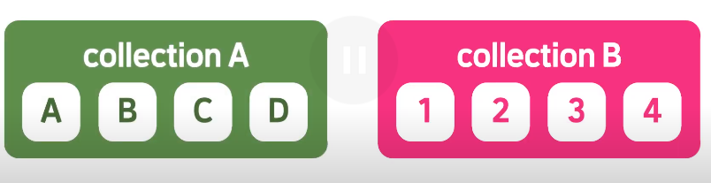

# 💎코틀린 기본

## idea  단축키

>Run : Alt+4
>
>Debug: Alt+5
>
>Ctrl+shift+f10 : 바로 컴파일
>
>Alt+shift+f10: 파일을 골라서 컴파일
>
>String 키워드를 클릭하고 Ctrl+b 를 눌러보면 String.kt파일이 열린다.
>
>
>
>자료형이 지정하지 않은 변수는 값을 할당해야 함.
>
>코틀린이 자동으로 자료형을 추론한 값을 알고 싶으면 변수를 클릭하고
>
>Ctrl+Shift +p 를 클릭.
>
>
>
>디버깅시에 하고자하는 줄에 브레이크포인트를 가르키는 회색에 빨간 점을 찍거나
>
>단축키 Ctrl+f8 을 누름
>
>그 다음 디버깅을 시작 하는 단축키 Shift + f9 을 누르고 한줄 씩 실행하려면
>
>f8키를 누른다.
>
>종료시에는 Ctrl+ f2 를 누른다.

## 기본개념

>프로그램의 실행 진입점인 main() 함수에서 매개변수를 통해 프로그램 외부의 인자를 
>
>받아들이려면 함수의 선언을 fun main(args: Array<String>) 로 선언해야한다.
>
>#### 코틀린 구성
>
>>코틀린 에서 프로젝트는 module,Package, File 등으로 구성되어 있다.( 자바랑 유사)
>>
>>코틀린은 자바처럼 클래스 이름과 파일 이름이 동일해야 하는 것이나  public 클래스는 
>>
>>하나만 사용해야 하는 등의 규칙은 없음. 대신에 파일이름이 클래스 이름과 같으면 파일명이
>>
>>Hello.kt ->Hello 로 변경된다.
>>
>>패키지는 개발시에 소스코드의 소속을 정해지기 위한 논리적 단위이다.
>>
>>코틀린은 자바와 달리 패키지명과 폴더구조와 같게 하지 않아도 된다.
>>
>>패키지가 점으로 표시되어 있으면 하위폴더 생성
>
>코틀린은 변수,필드,데이터,속성같은 외부 언어 에서 사용하는 단어를 프로퍼티라고 한다.
>
>필드나 메소드는 클래스 내부에서 정의되므로  멤버 필드,멤버 메서드라고 한다.
>
>외부언어에서의 인스턴스를 코틀린에서는 객체(object)라고 한다.
>
>정확히는 특정 클래스로부터 만들어진 객체는 그 클래스의 인스턴스 라고 한다.
>

### 코틀린 함수

>코틀린은 함수형 프로그래밍 과 객체지향 프로그래밍을 모두 지원하는 다중 패러다임 언어이다.
>
>함수형 프로그래밍은 코드가 간략화 되고 테스트나 재사용성이 더 좋아지면서 개발 생산성이 늘어나는 장점이 있다.
>
>다중 패러다임 언어: 한 가지 구현 규칙에 얽매이지 않고 다양한 문법과 형식을 지원하는 언어이다.
>
>자바나 코틀린은 함수를 호출할때 인자의 값만 복사하는 '값의 의한 호출'이 일반적이다.
>
>c/c++ 에서 사용하는 포인터 주소 연산이 없기 때문에 주소 자체를 사용해 호출하는 '참조에 의한 호출' 은 자바나 코틀린에서 사용되지 않는다. 
>
>#### 람다식을 매개변수로 받는 함수에 일반 함수로 받기
>
>> ::sum 혹은  { sum()} 같은 형식으로 받아야 한다.
>
>#### 일반함수에 람다식을 매개변수로 하나만 받는경우 () 생략 가능하다.
>
>ex)noParam{"Hello World"} 
>
>람다식을 매개변수로 2개이상 받는 다면 생략 불가능 혹은 마지막 람다식만 빼내어 구성가능
>
>ex)noParam({"Hello World"}){"Hello World"}
>
>#### 인라인 함수
>
>>함수가 호출되는 곳에 함수 본문의 내용을 모두 복사해 넣어 함수의 분기를 없애는 것.
>>
>>-> 코드의 성능 향상 
>>
>>함수 앞부분에 inline 작성
>>
>>ex) inline fun shortFunc()
>>
>>인라인 함수를 자주 사용하게 되면 코드 양만 증가하여 비 효율적이므로 일부 람다식은 
>>
>>noinline 으로 제어가능
>>
>>ex) noinline out: (Int)->Int
>
>#### 확장 함수
>
>>기존 클래스에 내가 원하는 함수를 하나 더 포함시켜 확장하는 기능 ex) Int, String
>>
>>fun String.getLongString(target:String) : String=
>>
>>​	if(this.length> tartget.length) this else target
>
>#### 최상위 함수와 지역 함수
>
>>최상위 함수는 main함수와 동등하게 선언된 함수를 말한다. 지역 함수는 main 내부에 선언된 함수를 
>>
>>말한다. 따라서 사용자 함수는 위치에 상관 없이 사용가능하지만 지역 함수는 선언부가 먼저 나와야
>>
>>사용 가능하다.

### 프로그램 흐름 제어

>#### if 문과 if~else문
>
>>if,else 문 블록중에 수행할 문장이 하나인 경우 블록 구문인 중괄호를 생략 가능하다.
>>
>>만약 블록의 표현식이 길어질때는 람다식 처럼 마지막 표현식이 변수에 반환되어 할당된다.
>>
>>```kotlin
>>val max= if(a>b){
>>   println("a 선택")
>>   a
>>}
>> else
>>   b
>>```
>
>#### when문
>
>>코틀린의 when은 자바 등 다른 언어에서 쓰이는 switch~case문과 비슷하지만
>>
>>각 수행 문장을 멈추는 break와 같은 문장이 필요하지 않다.
>>
>>아래 보는것과 같이 함수의 반환값과 값 비교도 가능하며(pareInt)
>>
>>in 연산자를 통해 범위 값 검사를 할 수 도 있고 , 
>>
>>is 라는 특정 자료형 검사도 할 수 있다. 
>>
>>```kotlin
>>when(x){
>>   0,1-> println(x)
>>   parseInt(y)-> println(y)
>>   in 1..10 -> println("in")
>>   is Int ->println("Int")
>>   else->println("error")
>>}
>> when{
>>    x in 0..10 ->println(x)
>> }
>>```
>
>#### for문
>
>>자바의 for문은 ; 으로 식을 구분하지만 코틀린은 세미콜론을 사용 할 수 없다.
>>
>>기본꼴 
>>
>>```kotlin
>>for(i in 0..3)
>>```
>>
>>을 통해서 0~3까지 반복하게 된다. 
>>
>>하행, 상행 및 다양한 반복 방법
>>
>>```kotlin
>>for(i in 5..3)
>>```
>>
>>을 하게 되면 실행하지 않게 된다. 역순으로 하고자 하면
>>
>>```kotlin
>>for(i in 5 downTo 3)
>>```
>>
>>로 작성하면 되며 특정 갯수만큼 증가나 감소하게 하려면
>>
>>```kotlin
>>for(i in 5 downTo 3 step 2)
>>```
>>
>> 처럼 step이라는 키워드를 사용한다. 
>>
>>#### While문
>>
>>>while문은 자바나 c언어 이랑 같게 동작한다. 

### 흐름의 중단

>#### return 으로 Unit반환하기 
>
>>return 
>>
>>return Unit
>>
>>하고 아무것도 적지 않는 것은 코틀린 상에서 Unit이라는 자료형 반환을 의미한다.
>
>인라인 함수, 익명함수 에서는 return문을 그대로 사용 가능하지만 일반 람다식에서는 
>
>return @lable 같은 형식을 사용해야 하며 break,continue는 지원하지 않는다.
>
>```kotlin
> Hello(2,3)lit@{a,b->
>      val result:Int=a+b
>      if(result>10) return@lit
>   }
>   
>```
>
>return 시에 라벨이 붙은 블록의 끝부분으로 반환하게 된다.  이 외에도 기존 코드를 명시적인 라벨이 아닌 암묵적인 라벨 즉 람다식의 이름을 사용해도된다. 

### 3.자료형

>자료형을 입력받을 시에 readLine()을 사용한다.  readLine()는 어떤 입력이든 String 타입으로 
>
>받기 때문에 받고자 하는 자료형으로 파싱하는 작업이 필요하다.
>
>ex) readLine!!.toInt() , readLine!!.toDouble()
>
>코틀린은 컴파일 과정을 거치면 참조형이 기본형으로 바뀐다.
>
>코틀린 컴파일러가 자동으로 최적화를 수행하는 것이다.
>
>
>
>이스케이프 문자로 /를 사용
>
>자료형을 다른 이름으로 하려면  typelias Username =String  으로 설정 가능하다.
>
>?. 를 null sfe operator 라고 한다.
>
>?: 는 객체가 null이 아니라면 그대로 사용하지만 null 아리면 연산자 우측의 객체로 반환된다.
>
>이러한 ?: 를 Elvis operator (엘비스연산자) 라고 한다.
>
>!!.는 참조연산자를 사용할때 null여부를 컴파일시 확인하지 않도록 하여 런타임시 NPE가 발생하도록 의도적으로 방치하는 연산자 이다.
>
>이러한 !!.non-null assertion operator라고 한다.
>
>##### val은 할당된 객체를 바꿀 순 없을 뿐이지 객체 내부의 속성을 변경 할 수 없는 것은 아니다. 
>
>절대 불가능은 const val 과 같은 상수를 의미한다. 상수 선언은 기본 자료형만 가능하며 런타임에 생성되는 일반적인 다른 클래스의 객체들은 담을수 없다.  속성이나 지역변수 로 단독적으로 사용할 수 없으며 
>
>반드시 companion object 안에서 생성해야 한다. 
>
>코틀린은 static이 없기 때문에 컴페니언 객체를 제공한다.
>
>
>
>#### 자바에서 코틀린 컴패니언 객체 사용하기 (@어노테이션)
>
>#### JvmStatic,JvmField
>
>>자바에서 코틀린의 컴패니언 객체를 접근하려면 @JvmStatic 애노테이션을 사용한다. 
>>
>>또 한 프로퍼티를 자바에서 사용하고자 할 경우에는 @JvmField  를 사용한다.
>>
>>이 둘의 차이를 알아보자
>>
>>#### JvmStatic은 static 변수의 get/set 함수를 자동으로 만들라는 의미이다.
>>
>>사실 companion object는 자바의 static과 다르다. 자바로 반환하면 bar클래스에 barSize 선언되었지만
>>
>>get/set 함수는 Bar.Companion 클래스에 들록 되어있다. 
>>
>>자바에서의 get/set 함수에 접근하려면 다음 Companion을 꼭 써줘야 한다. 
>>
>>#### JvmField는 get/set 을 생성하지 말라는 의미이다. 
>>
>>
>>
>>JvmField를 통해 get/set 함수가 만들어 지지 않는 것을 알 수 있다. 
>>
>>```kotlin
>>class KCustomer {
>>companion object {
>>   const val LEVEL = "INTERMEDIATE"
>>   @JvmStatic fun login() = println("Login...") // 어노테이션 표기 사용
>>   @JvmStatic val score = 3
>>   @JvmField val JOB = KJob()
>>}
>>}
>>```
>
>#### JvmName
>
>>최상위 함수는 main밑에 있어도 실행이 되고 역컴파일 되는 것을 보면 JVM에서 실행되기 위해
>>
>>static으로 선언되었음을 알 수 있다.
>>
>>자바코드에서는 이름이 자동 생성된 코틀린 클래스에 멤버 메소드처럼 접근 가능하다.
>>
>>이를 자동생성하지않고 코틀린 코드에서 이름을 명시 할 수 있다.
>>
>>접근할 클래스 이름을 바꾸고 싶다면 @file:JvmName("ClassName")을 코드 상단에 입력하면 된다.
>>
>>이처럼 파일명이나 메소드 이름을 변경 할 수 있다. 
>>
>>
>
>#### Throws
>
>>
>>
>>위의 코드는 자바에서 사용하는 Throw 예외함수 처리 이다. 사실 코틀린에서 throws 코드가 없기 때문에 
>>
>>@Throws(NumberFormatException::class) 을 사용한다. 
>
>#### JvmOverlads
>
>>코틀린 함수의 오버로딩 메소드들을 생성해주는 annotation 이다
>>
>>자바에서는 기본 인자라는 개념이 없기 때문에 자바에서 모든 인자를 입력해 주어야한다. 
>>
>>이를 자동으로 오버로딩 메소드를 생성해 주는 애노테이션이다. 
>
>
>
>

### 3.자료형 변환

>
>
>
>
>Int형으로 선언된 c는 기본형으로 변환되어 스택에 128이라는 값 자체를 저장하지만
>
>Int?형으로 선언된 d는 참조형으로 저장되므로 b에는 128이 저장된 힙의 참조 주소가
>
>저장되어 있다. 따라서 삼중 부호를 하면 false값이 나온다.
>
>코틀린에서 참조형으로 선언된 변수의 값이 -128~127 범위에 있으면 캐쉬에 저장되기때문에
>
>a,b는 스택이 아닌 캐시에 저장되게 된다. 따라서 true값이 나오는것.
>
>자료형 검사
>
>>is라는 키워드를 사용 
>>
>>ex) num is Int
>

### 4.스마트 캐스트

>스마트 캐스트에 적용되는 자료형은 Number형이다.
>
>Number형은 숫자를 저장하기 위한 특수한 자료형 객체
>
>
>
>
>

### 5.최상위 기본 클래스 Any 

>코틀린의 모든 클래스는 바로 any형이라는 슈퍼클래스를 가진다.
>
>Any는 자바의 최상위 클래스인 Object와 비슷하지만 서로 다른 유형이다.
>
>
>
>
>
>
>
>

### 6.when

>다중 조건문을 편하게 사용하기 위하여 when 을 사용
>
>
>
>복수 값을 지정가능 ex) 1,2-> 
>
>또한 함수의 반환값과 일치하는 문장도 삽입가능 하다. ex) parseInt(s)->
>
>범위지정자도 사용가능하다. ex) in 1..100 ->
>
>when 반환값을 값에다가도 할당가능하다.
>
>#### 인자가 없는 when 문
>
>>변수와 조건식을 when문에 직접 사용 할 수 있다.
>>
>>
>>
>>

### 7. fun 설정

>
>
>
>
>여기서 함수를 선언할때 안의 값을 매개변수 함수를 호출할때는 인자라고 부른다.
>
>코틀린은 매개변수 기본값 설정을 제공한다.
>
>
>
>
>
>또한 매개변수의 갯수가 다른경우를 설정하는 vararg (variable argument)를 이용하여
>
>좀 더 유연한 함수사용을 제공한다.
>
>
>
>
>
>return 값을 설정  , return 값이 없으면 :Int 를 삭제하거나 
>
>코틀린에서 다루는 특수한 자료형 Unit을 표기한다.
>
>함수를 더 간단하게 표현하게 위해서 **단일표현식** **함수**를 사용한다.
>
>또한 단일표현식에서는 반환형의 타입추론이 가능하므로 
>
>
>
>
>
>반환형을 생략할 수 있다.
>
>코틀린에서 함수는 내부적으로 기능을 가진 형태이지만 외부에서 볼때는
>
>**자료형이 결정된 변수라는 개념**으로 이해해야 함수형 언어의 특징을 가진 
>
>코틀린을 이해할 수 있다.
>
>#### 순수 함수
>
>>부작용이 없는 함수가 함수 외부의 어떤 상태도 바꾸지 않는다면 순수 함수라고 부른다.
>>
>>이런 특성 때문에 스레드에 사용해도 안전하고 코드를 테스트하기도 쉽다라는 장점이 있다.
>>
>>순수 함수의 조건.
>>
>>같은 인자에 대하여 항상 같은 값을 반환한다.
>>
>>함수 외부의 어떤 상태도 바꾸지 않는다.
>
>
>
>#### 람다함수
>
>>함수형 프로그래밍의 람다식은 다른 함수의 인자로 넘기는 함수, 함수의 결괏값으로 변환
>>
>>하는 함수, 변수에 저장하는 함수를 말한다.
>>
>>ex) {x,y -> x+y}
>>
>>또 한 변수에 람다식을 넣을 수 있다.
>>
>>
>>
>>또 한 생략을 통해 여라기지로 표현 가능하다.
>>
>>
>>
>>람다식은 인자 와 봔환값이 없을 수 있다. 이때에는 Unit을 사용한다.
>>
>>
>>
>>
>>
>>람다함수도 일반 함수처럼 여러구문의 사용이 가능한데
>>
>>
>>
>>여기서는 마지막 구문인 a+b 의 값을 Int로 반환된다.
>>
>>파라미터가 하나인 람다 함수는 it을 사용하여 간결하게 적을 수 있다.
>>
>>
>>
>>
>
>#### 일급 객체
>
>>일급 객체는 함수의 인자로 전달할 수 있다.
>>
>>일급 객체는 함수의 반환값에 사용 될 수 있다.
>>
>>일급 객체는 변수에 담을 수 있다.
>>
>>따라서 람다식이 일급 객체의 특성을 가질 수 있다.
>
>#### 고차 함수
>
>>고차함수란 다른 함수를 인자로 사용하거나 함수를 결괏값으로 반환하는 함수를 말한다.
>>
>>(**인스턴스로 취급하는 방법이다.**)
>>
>>**(String)->Unit** 이 꼴이 함 수를 나타낸 자료형의 일종으로 보는것이 이해하기 쉽다.
>>
>>val c: (String)-> Unit ={str:String} 이 기본 형식 () 안에 파라미터의 자료형이 기술되어 
>>
>>있으므로  val c: (String)-> Unit ={str} 로 생략할 수 있다.
>>
>>파라미터로 동작시킬 구문을 작성하면 val c: (String)-> Unit ={str-> println("$str 람다함수")}
>>
>>처럼 -> 뒤에 실행될 부분을 작성한다.
>>
>>람다형식을 변수에 할당할 시에는 코틀린의 타입추론 기능을 사용하여 축약하여
>>
>> val c ={str-> println("$str 람다함수")} 처럼 람다식 안에만 패러미터의 자료형을 기술하여
>>
>>*(String)->Unit 자료형으로 저장된다.
>>
>>매개변수에 람다식 함수를 이용한 고차함수이다.
>>
>>
>>
>>값에 의한 호출로 람다식 사용하기
>>
>>
>>
>>이름에 의한 람다식 호출하기 
>>
>>
>>
>>참조에 의한 호출방식으로 일반 함수 호출하려면 함수앞에 ::를 붙여준다.
>>
>>::는 일반함수를 고차함수로 변경해주는 연산자이다.
>>
>>
>>
>>
>>
>
>#### 스코프함수
>
>>함수형 언어의 특징을 좀 더 편리하게 사용 할 수 있도록 기본 제공함수이다.
>>
>>인스턴스의 속성이나 함수를 좀더 깔끔하게 불러 쓸수 있는 기능을 한다.
>>
>>스코프 함수의 종류로 apply, run,with,also,let 이 있다.
>>
>>apply는 인스턴스를 생성한 후 변수를 초기화 과정을 할때 주로 사용한다.
>>
>>인스턴스에 참조연산자를 사용하여 apply를 붙이고 중괄호로 람다함수를 만들어
>>
>>apply의 scope 안에서 직접 인스턴스의 속성과 함수를 참조연산자 없이 사용이 가능하다.
>>
>>
>>
>>main함수와 별도의 scope에서 인스턴스의 변수와 함수를 조작하므로 코드깔끔해 진다.
>>
>>
>>
>>run 스코프 함수는 람다함수와 같이 인스턴스 대신 마지막 구문에 결과값을 적는다.
>>
>>
>>
>>이미 인스턴스가 만들어진 후에 인스턴스의 함수나 속성을 scope내에서 사용해야할때 유용함.
>>
>>
>>
>>with는 run과 동일한 기능을 가지지만 단지 인스턴스를 참조연산자 대신 파라미터로 받는다
>>
>>라는 차이점만 가진다. with(a) {...}
>>
>>
>>
>>also와 let은 파라미터로 인스턴스를 넘긴것처럼 it을 통해 인스턴스를 사용할 수 있다.
>>
>>
>>
>>
>>
>>같은 이름의 변수나 함수가 scope바깥에 중복되어 있는 경우 혼란을 막기 위한 것이다.
>>
>>
>>
>>
>
>#### 익명 함수
>
>>anonymous Funciion 이라고도 하며 람다식에서 return 이나 break,continue 같은 제어문을
>>
>>사용하기 어렵기 때문에 만들어졌다.
>>
>>val add: (Int, Int)-> Int =fun(x,y) =x+y 가 예시이다.
>
>#### 인라인 함수
>
>>함수가 호출되는 곳에 함수 본문의 내용을 모두 복사해 넣어 함수의 분기없이 처리 되기 때문에
>>
>>코드의 성능을 높일 수 있다. 인라인 함수는 람다식 매개변수를 가지고있는 함수에서 작동한다. 
>>
>>
>
>#### 중위 함수
>
>>클래스의 멤버를 호출 할때 사용하는 점을 생략하고 함수이름 뒤에 소괄호를 붙이지 않아 지관적인 이름을 사용할 수 있는 표현법이다. 
>>
>>중위함수는 맴버 메소드 또는 확장함수이어야 하며 하나의 매겨변수를 가져야 사용할 수 있다.
>>
>>
>>
>>
>

### 8.지연 초기화와 위임

>#### 프로퍼티 지연 초기화하기
>
>>클래스를 선언할 때 프로퍼티 선언은 null을 허용하지 않는다.
>>
>>하지만 지연 초기화를 위한 lateinit키워드를 사용하면 값을 할당하지 않아도 컴파일러에서
>>
>>허용하게 된다.
>>
>>#### lateinit의 제한
>>
>>>var로 서언된 프로퍼티만 가능하다.
>>>프로퍼티에 대한 게터와 세터를 사용할 수 없다.
>>>
>>>**null을 통한 초기화를 할 수 없다.**
>>>
>>>모든 변수에 가능 한 것이 아닌 primitive type에서는 불가능하다. (String 가능)
>>>
>>>
>>>
>>>
>>
>>#### lazy의 제한
>>
>>>by lazy는 객체의 위임을 나타내며 lazy는 변수에 위임된 Lazy객체를 자체를 나타내므로
>>>
>>>이 변수의  value를 한 단계 더 거쳐 객체의 멤버로 접근 해야한다.
>>>
>>>호출 시점에 by lazy의 정의에 의해서 초기화를 진행한다.
>>>
>>>val 에서만 사용 가능하며 원시 자료형도 선언가능하다.
>>>
>>>lazy를 사용하는 경우 기본 Synchronized로 동작한다.
>>>
>>>
>>>
>>>
>>
>>#### lateinit,lazy는 Nullable이 필요하지 않는 경우에만 사용 할 것.
>
>#### by로 클래스위임
>
>>하나의 클래스를 다른 클래스에 위임하도록 선언하여 위임된 클래스가 가지는 인터페이스 메소드를 참조 
>>
>>없이 호출할 수 있도록 생성해주는 기능입니다.
>>
>>
>>
>>C는 B가 가지는 모든 A의 메소드를 가지며, 이를 `클래스 위임(Class delegation)`이라고 합니다.
>>
>>따라서 B가 가지고 있는 상속하지 않는 메소드는 가지지 않는다. 
>>
>>또 한 클래스 위임은 인스턴스에 대한 참조 없이 구현된 메소드를 더 쉽게 사용 할 수 있다. 
>>
>>코틀린은 final 형태의 클래스이므로 직접 클래스의 확장이 어렵다.
>>
>>이를 통해 무분별한 상속에 따른 복잡한 문제를 방지 할 수 있다.
>>
>>이 때 일반적으로 사용하는 것이 **데코레이터 패턴**이다. 
>
>#### observable(),vetoable()
>
>>두 함수는 비슷하지만 반환값에 따라 프로퍼티 변경을 허용하거나 취소할 수 있다.
>>
>>vetoable()변화가 있을때만 값을 지정한다.
>>
>>
>>
>>```kotlin
>>class User {
>>// observable은 값의 변화를 감시하는 일종의 콜백 루틴
>>var name: String by Delegates.observable("NONAME") {
>>   prop, old, new -> // 프로퍼티, 기존값, 새로운 값
>>   println("$old -> $new") // 이 부분은 이벤트가 발생할 때만 실행
>>}
>>}
>>
>>fun main() {
>>val user = User()
>>user.name = "Kildong" // 값이 변경되는 시점에서 첫 이벤트 발생
>>user.name = "Dooly" // 값이 변경되는 시점에서 두 번째 이벤트 발생
>>}
>>```
>>
>>```kotlin
>>fun main() {
>>
>>var max: Int by Delegates.vetoable(0) { // 초기값은 0
>>   prop, old, new ->
>>   new > old // 조건에 맞지 않으면 거부권 행사
>>}
>>
>>println(max) // 0
>>max = 10
>>println(max) // 10
>>
>>// 여기서는 기존값이 새 값보다 크므로 false 따라서 5를 재할당 하지 않음
>>max = 5
>>println(max) // 10
>>}
>>```
>
>

### 9.Class

>클래스는 '값'과 그 값을 사용하는 '기능'들을 묶어두운 것이다.
>
>즉 고유의 특징값인 속성과 기능의 구현을 위한 함수를 합친 개념이다.
>
>
>
>이처럼 클래스 선언과 동시에 생성자 선언을 동시에 한 코드이다.
>
>생성자는 새로운 인스턴스를 만들기 위해 호출하는 특수한 함수이다.
>
>생성자를 호출하면 클래스의 인스턴스를 만들어 반환 받을 수 있다.
>
>생성자는 인스턴스의 속성을 초기화하는 동시에 인스턴스 생성시 구문을 수행하는 역할을 한다.
>
>#### 객체와 인스턴스 정리하기
>
>>객체지향언어에서는 메모리에 올라간 객체를 인스턴스라고 한다. 
>>
>>따라서 특정 클래스로부터 만들어진 객체는 그 클래스의 인스턴스라고 한다. 
>
>
>
>속성의 초기화는 init를 통해 하며 패러미터와 반환형이 없는 특수한 함수이다.
>
>
>
>보조생성자는 기본생성자와 다른 생성자를 제공하여 인스턴스 생성시 편의를 제공하거나 추가적인 기능을 제공한다. 보조 생성자는 constructor() 를 사용한다.
>
>보조생성자는 반드시 기본 생성자를 통해 속성을 초기화 해줘야 한다. 
>
>constructor 는 기본생성자가 아니기 때문에 안에 매개변수 부분에 val,var선언은 불가하다.
>
>
>
>#### 클래스 상속
>
>>코틀린은 상속금지가 기본값으로 실행. 'open' 상태에서만 상속 가능
>>
>>상속에는 두가지 규칙이 있다.
>>
>>서브클래스는 슈퍼클래스에 존재하는 속성과 같은 이름의 속성을 가질수 없다.
>>
>>서브클래스가 생성될때 반드시 슈퍼클래스의 생성자가 호출되어야 한다.
>>
>>클래스의 상속은  클래스 선언뒤에 콜론을 붙이고 슈퍼클래스의 생성자의 호출을 한다.
>>
>>
>>
>>슈퍼 클래스에서 허용만 한다면 오버라이딩이라는 방법으로 서브클래스에서
>>
>>같은 이름과 형태로된 함수의 내용을 구현할 수 있다.
>>
>>수퍼클래스에서 open이 붙은 함수는  서브클래스에서 override를 붙여 재구현 할 수 있다.
>>
>>#### 추상화 클래스
>>
>>>추상화는 선언부만 기능이 구현되지않는 추상함수,추상함수를 포함하는 추상클래스로 구현되어있다.
>>>
>>>abstarct를 붙인 추상클래스는 미완성 클래스 이기때문에 반드시 서브클래스에서 상속을 받아
>>>
>>>abstarct 표시가 된 함수를 무조건 구현해야 한다. 상속시 ()가 들어간다. 
>>>
>>>
>>
>>#### 인터페이스
>>
>>>인터페이스에서 생성된 추상화 함수는 open이 붙지 않아도서브클래스에서 상속 받을 수 있다.
>>>
>>>(자동으로 인터페이스 내부에 abstract이 선언되어있기 때문이다. )
>>>
>>>
>>
>>#### 인터페이스와 추상 클래스의 차이
>>
>>>인터페이스는 추상클래스와 다르게 프로퍼티에 상태 정보를 저장할 수 없다. 
>>>
>>>단 val로 선언된 프로퍼티에 대해서는 get()을 구현 가능
>
>#### 내부클래스 와 중첩클래스
>
>>중첩 클래스는 하나의 클래스가 다른클래스의 기능과 강하게 연관 되어 있다는 의미를 
>>
>>전달하기 위해 만들어진 형식으로 사용 할때는 외부클래스.내부클래스로 사용한다.
>>
>>중첩 클래스는 형식만 안에 있을뿐 외부 클래스의 내용을 공유 할 수 없다.
>>
>>중첩 클래스는 오로지 companion object만 접근 할 수 있다. 
>>
>>
>>
>>
>>
>>내부클래스는 중첩클래스에 inner 를 붙이고 혼자 내부객체를 만들수 없고 외부 클래스의 
>>
>>객체가 있어야만 생성과 사용이 가능한 클래스이다.
>>
>>내부 클래스는 외부 클래스의 속성과 함수를 사용 할 수 있다.
>>
>>
>>
>>예제와 같이 Outer 클래스와 Inner  클래스에 같은 이름의 속성이나 함수가 있다면
>>
>>this@Outer.text처럼 사용하면 된다.
>>
>>따라서 innerClass는 외부 클래스 객체 가 있어야 부를 수 있으므로
>>
>>Outer().Inner() 를 통해 생성하며 중첩 클래스는 Outer.Inner()로 부르면 된다. 
>
>#### 가시성 지시자
>
>>private: 이 요스는 외부에서 접근할 수 없다.
>>
>>public: 이 요소는 어디서든 접근이 가능하다
>>
>>protected:외부에서 접근할 수 없으나 하위 상속 요소에서는 가능하다.
>>
>>>이때 클래스의 생성자 constructor 앞에 기재하게 된다면 constructor를 생략 할 수 없으며
>>>
>>>상속받은 클래스만 생성가능
>>
>>internal: 같은 정의의 모듈 내부에서는 접근이 가능하다. 
>
>#### 대수적 데이터 타입
>
>>다른 자료형의 값을 가지는 자료형 
>>
>> 대수적 타입은 곱타입과 합타입으로 분리 할 수 있습니다. 두 타입의 차이점을 설명하면 다음과 같습니다.
>>
>>#### 곱타입
>>
>>>예시로 class가 있다. 
>>>
>>>```kotlin
>>>data class Person(val name: String, val age: Int, val email: String)
>>>
>>>val lazysoul = Person("lazysoul", 33, "kotlin@gmail.com")
>>>val goinhacker = Person("goinhacker", 36, "fp@gmail.com")
>>>val myeongin = Person("myeongin", 33, "myeongin@gmail.comm")
>>>
>>>```
>>>
>>>Person 으로 만들 수있는 인스턴스는 String으로 올수 있는 값의 개수 * Int 로 올수 있는 값의 개수 * 
>>>
>>>String으로 올수 있는 값의 개수 라고 볼 수 있다. 
>>
>>#### 합타입
>>
>>>예시로 enum class 가 있다. 
>>>
>>>```kotlin
>>>enum class RGB {
>>>    RED(),
>>>    GREEN(),
>>>    BLUE()
>>>}
>>>fun sayRGB(rgb: RGB) = when (rgb) {
>>>       RGB.RED -> println("rgb = RED")
>>>       RGB.GREEN -> println("rgb = GREEN")
>>>       RGB.BLUE -> println("rgb = BLUE")
>>>   }
>>>```
>>>
>>>Kotlin은 when()을 사용해 패턴매칭을 한다. 
>>>
>>>red는 RED, green은 GREEN, blue는 BLUE 로 값을 할당했습니다. 각 프로퍼티들의 타입은 RGB이다.
>>>
>>>즉 RGB로 선언된 값들 중에 하나가 할당되어야 한다. 
>>>
>>>합타입생성 시점에 모든 타입에대해 알고 있기때문에 모든 타입에 대해 처리가 가능하다. 모든 타입에대
>>>
>>>해 처리가 되어 있다면 else 구문이 필요 없다. 
>>>
>>>합타입을 사용하면 타입을 강제 하면서, 동시에 다형성을 표현 할수 있다.
>>>
>>>인터페이스는 합타입과 비슷하지만 다르다. 
>>>
>>>```kotlin
>>>interface RGBInterface
>>>
>>>class Red : RGBInterface
>>>
>>>class Green : RGBInterface
>>>
>>>class Blue : RGBInterface
>>>
>>>private fun sayRGBInterface(rgb: RGBInterface) = when (rgb) {
>>>        is Red -> println("rgb = RED")
>>>        is Green -> println("rgb = GREEN")
>>>        is Blue -> println("rgb = BLUE")
>>>        else -> {
>>>            throw IllegalStateException("Not RGB")
>>>        }
>>>    }
>>>```
>>>
>>>인터페이스는 생성 시점에 어떤 Object들이 상속을 받았는지 알 수 없다.
>>>
>>>그렇기 때문에 else 구문으로 예외처리를 해야 한다. 
>>>
>>>반면에 enum class는 초기 enum class 생성시 모든 타입을 정의한다. 
>>>
>>>따라서 enum class로 추상화한 타입을 모두 알 수 있다. 그렇기 때문에 else 구문이 필요하지 않다. 
>>>
>>>주의할 점은 모든 타입에 대한 패턴매칭을 구현해야 한다. 만약 처리하지 않는다면 에러가 발생한다. 
>>
>>#### 실드 클래스와 이넘 클래스 차이
>>
>>>sealed class, enum class 모두 타입을 제한하고 추상화를 하는데 유용하다. 
>>>
>>>다른점이 있다면 Kotlin 에서 **enum class는 모두 같은타입의 변수와 같은타입의 함수를 가져야 한다.**
>>>
>>>하지만 **sealed class는 서로 다른 타입의 변수, 함수를 각각 갖을 수 있습니다.** 
>>
>>#### **실드 클래스**
>>
>>>실드 클래스는 클래스 혹은 object을 묶는 클래스이다. 
>>>
>>>실드 클래스는 그 자체는 추상 클래스 이기 때문에 객체를 만들 수는 없다. 
>>>
>>>실드 클래스는 같은 파일 안에서는 상속이 가능하지만, 다른 파일에서는 상속이 불가능하게 만들었다. 
>>>
>>> **sealed클래스는 컴파일러가 when의 경우의 수를 예측**할 수 있으나 **내부 클래스는 컴파일러가 모든 경우의 수를 예측할 수 없다**는 것이다. 
>>
>>#### 이넘 클래스 (Enum class)
>>
>>>실드 클래스랑 유사하지만 다양한 자료형은 다루지 못한다. 
>>>
>>>열거형의 줄임말로 상태를 구분하기 위한 객체를 여러가지 생성하고 그 중 하나를 나타낸다.
>>>
>>>일반 클래스처럼 메소드를 넣을 수 있으며 객체 마지막 선언부에 : 를 추가하고 그 다음 에 넣는다.
>
>#### 데이터 클래스 
>
>>데이터를 다루는 데에 최적화된 class로 5가지 기능을 내부적으로 자동으로 생성한다.
>>
>>내용의 동일성을 판단하는 **equals()**의 자동구현
>>
>>객체의 내용에서 고유한 코드를 생성하는 **hashcode()**의 자동구현
>>
>>포함된 속성을 보기쉽게 나타내는 **toString()**의 자동구현
>>
>>객체를 복사하여 똑같은 내용의 새 객체를 만드는 **copy()**의 자동구현
>>
>>copy()함수를 통해 새 객체를 생성할때에는 똑같은 내용으로도 생성할 수 있고 일부 속성을 바꿀수 있다.
>>
>>속성을 순서대로 반환하는 **componentX()**의 자동구현
>>
>>데이터 클래스는 abstract,open,sealed 키워드를 사용할 수 없다. 
>>
>>data 클래스의 프로퍼티가 꼭 val일 필요는 없다. 
>>
>>하지만 데이터 클래스의 모든 프로퍼티를 읽기 전용으로 만들어 데이터 클래스를 불변(immutable) 클래스로 만드는 것이 권장한다.
>>
>>코틀린 컴파일러는 데이터 클래스의 인스턴스를 더 쉽게 불변 객체로 활용할 수 있게 메소드를 제공하는데, 이것이 `copy` 메소드 이다. copy 메소드는 객체를 복사하면서 일부 프로퍼티를 바꿀 수 있게 해준다.
>>
>>복사본은 원본과 다른 생명주기를 가지며, 복사본의 프로퍼티 값을 바꾸거나 복사본을 제거해도 프로그램에서 원본을 참조하는 다른 부분에 전혀 영향을 주지 않기 때문이다. 
>>
>>
>>
>>일반 클래스는 제대로 작동 안하는 것을 알 수 있다. 
>>
>>
>>
>>for문 안에 보이는 것과 같이 (a,b) in list 로 나누는 것을 객체 디스트럭처링(Destructuring) 이라고 한다. 
>
>
>
>

### 10.scope

>#### 스코프 규칙 3가지
>
>>스코프 외부에서는 스코프 내부의 멤버를 참조 연산자로만 참조가 가능하다.
>>
>>> 다른 패키지 에 있는 것을 import를 할때
>>>
>>> 클래스 참조 ex) a.eat() <- 참조 연산자를 사용
>>>
>>> 젭근제한자는 외부에서 내부의 멤버를 참조 할때 그 권한을 개발자가 제어 할 수 있는
>>>
>>> 기능이다. public, internal, private, protected 등이 있다. 변수 함수 클래스 앞에 
>>>
>>> 붙일 수 있다.
>>>
>>> 패키지 스코프에서는 public은 어떤 패키지에서도 접근 가능이며
>>>
>>> internal은 같은 모듈 내에서만 접근 가능하며 private는 같은 파일 내에서만 접근 가능하다.
>>>
>>> 
>>>
>>> 클래스 스코프에서는 public은 클래스 외부에서 늘 접근가능 하며 pirvate는 클래스 내부에서만 접근 가능 하며 potected 는 클래스 자신과 상속받은 클래스에서 접근 가능하다.
>>
>>동일스코프내에서는 멤버들을 공유할수 있다.
>>
>>
>>
>>하위 스코프에서는 상위 스코프의 맴버를 재정의 할 수 있다.
>>
>>
>
>

### 11.object

>단 하나의 객체만으로 공통적인 속성과 함수를 사용해야 하는 코드에는 object를 사용
>
>인스턴스를 생성하지않고 그 자체가 객체이다.
>
>프로그램이 종료되기 전까지 저장하는 용도로 사용한다.
>
>따라서 인스턴스를 사용하지 않기 때문에 object 이름에 직접 참조연산자를 붙여 사용한다.
>
>singleton Pattern 을 지원한다.(클래스의 인스턴스를 단 하나만 만들어 사용하도록 하는
>
>코딩 아키택쳐 패턴)
>
>기존 클래스에 object를 만들 수 있다. (companion object) 라고 한다.
>
>인스턴스간에 공용속성 및 함수를 별도로 만드는 기능이다. (static 멤버랑 유사하다)

### 12.observer

> 이벤트가 일어나는 것을 감시하는 역할을 한다.
>
> 이벤트를 즉각적으로 처리할수 있도록  만드는 프로그래밍 패턴이다.
>
> 이벤트를 수신하는 클래스, 이벤트의 발생 및 전달하는 클래스 2가지가 필요한다.
>
> 
>
> 클래스 A에서 클래스 B로 수신을 할 수 있지만 반대로는 불가 하기때문에 만들어 진것이
>
> 인터페이스를 통한 호출이다. 이 인터페이스를 옵저버 이며 코틀린에서는 리스너이며
>
> 이렇게 이벤트를 넘겨주는 행위를 callback 이라고 한다.
>
> 예시로 이벤트를 수신해서 출력하는 EventPrinter ,숫자를 카운트 하면 5의배수마다 이벤트를 발생할 count, 둘을 연결하는 인터페이스 EvnetListener가 있다고 가정한다.
>
> 
>
> 클래스 카운터는 이벤트를 상속받기 위해 생성자에서 이벤트리스너를 속성으로 받아온다.
>
> 
>
> 이벤트를 발생하기 위해 각자 인터페이스를 상속 받는다. 
>
> Event 클래스에서 Counter의 인스턴스를 만들되  this라는 키워드로 이벤트리스너의   구현부를
>
> 넘겨준다.
>
> 
>
> 1. EventPrinter는 EventListener를 상속받아 구현된 클래스 입니다 
>
> 2. EventPrinter내에서 선언된 this 는 EventPrinter() 를 통해 생성된 객체 자신을 나타냅니다. 여러개의 객체를 생성했다면 각각 자기 자신을 가리키는 것입니다. 
> 3. EventPrinter의 this 를 넘겼지만 받는 쪽(Counter)에서는 EventListener를 요구했기 때문에 업캐스팅이라는 과정을 거쳐 해당 객체의 기능이 제한됩니다. 
>
> EvnetListner를 상속받아 구현하지 않고 임시로 만든 별도의 EvnetListener 객체를 대신넘겨줄 수 있다. 익명객체라고 한다.(Anonymous Object)
>
> 
>
> 

### 13.다형성

>이름이 동일하지만 매개변수가 서로 다른 형태를 취하거나 실행 결과를 다르게 가질 수 있는 것을 
>
>다형성이라고 한다.
>
>상위 자료형인 수퍼클래스로 변환하는 것을 up-Casting 이라고 하고
>
>상위 자료형을 담는 역할을 한다.
>
>Up-Casting된 자료를 하위자료로 바꾸게 되면 Down-Casting이라고 하고
>
>별도의 as,is 연산자가 필요하다.
>
>**as**는 변수를 호환되는 자료형으로 변환해주는 캐스팅 연산자로 코드내에서 사용하면
>
>즉시 자료형을 변환하고 반환한다. as는 반환값 뿐만 아니라 변수자체도 다운캐스팅 된다.
>
>**is**는 변수가 자료형에 호환되는지를 먼저 체크한 후 변환해 주는 캐스팅 연사자로 
>
>조건문 안에서 사용된다.  따라서 is는 조건문 안에서만 잠시 다운캐스팅 된다는 점이다.
>
>
>
>#### super,this
>
>>super.프로퍼티 이름 // 상위 클래스의 프로퍼티 참조
>>
>>super.메소드이름() // 상위 클래스의 메소드 참조
>>
>>super() //상위 클래스의 생성자 참조 
>>
>>this.프로퍼티 이름 // 상위 클래스의 프로퍼티 참조
>>
>>this.메소드이름() // 상위 클래스의 메소드 참조
>>
>>this() //상위 클래스의 생성자 참조 
>
>이너 클래스에서 바깥 클래스를 호출 하려면 this@label을 통해 부르고
>
>바깥 클래스의 상위 클래스를 호출하려면 super@label을 통해 부른다.
>
>코틀린은 자바처럼 한 번에 2개 이상의 클래스를 상속받는 다중 상속이 되지 않는다.
>
>하지만 인터페이스는 필요한 만큼 상속 할 수 있다. 이때 상속받은 메소드 중에 이름이 겹치는게 있다면
>
>앵글 브래킷(<>)을 통해서 구분 가능하다
>
>super<x>.f()
>
>super<y>.f()
>
>오버라이딩시 상위 클래스에 프로퍼티를 val로 정의한 경우에는 하위 클래스에서 var로 변경 가능하지만
>
>var를 val로 변경할 수는 없다. 
>
>커스텀 getter,setter
>
>>```kotlin
>>class User(id:Int,name:String,age:Int){
>>    val id=id
>>    get()=field
>>    var name=name
>>    get()=field
>>    set(value){
>>        field=value
>>    }
>>}
>>```
>>
>>

### 14.generic

>클래스나 함수에서 사용하는 자료형을 외부에서 지정할 수 있는 기능이다.
>
>제너릭을 사용함으로 다른 자료형으로 형 변환시 발생 할 수 있는 오류를 줄여준다. 
>
>또 한, 메서드나 클래스에서 컴파일 시간에 자료형을 검사해 적당한 자료형을 선택 할 수 있도록 하기 위함.
>
>캐스팅 연산자는  프로그램의 속도를 저하시킬수 있는 것이 배경이다.
>
>함수나 클래스를 선언할때 고정적인 자료형 대신 실제 자료형으로 대체되는 
>
>타입 패러미터를 받아 사용하는 방법이다.
>
>#### 형식매개변수  null 제어
>
>>```kotlin
>>//class GenericNull<T: Any> {  // 특정 타입을 지정하면 null이 허용되지 않음
>>class GenericNull<T> { // 기본적으로 null이 허용되는 형식 매개변수
>>    fun EqualityFunc(arg1: T, arg2: T) {
>>        println(arg1?.equals(arg2))
>>    }
>>}
>>
>>fun main() {
>>
>>    val obj = GenericNull<String>() // non-null로 선언됨
>>    obj.EqualityFunc("Hello", "World") // null이 허용되지 않음
>>
>>    val obj2 = GenericNull<Int?>() // null가능한 형식으로 선언됨
>>    obj2.EqualityFunc(null, 10) // null 사용
>>}
>>```
>>
>>위에 보이는 것 과 같이 null 을 허용하지 않게 하려면 Any형으로 자료형을 선언 해주면 된다. 
>
>#### 형식 매개변수 제한
>
>>```kotlin
>>class Calc<T:Number> {} 
>>```
>>
>>처럼 형식 매개변수 안에 :Number 처럼 제한을 둘 수 있으며 String이 들어오게 되면 오류가 발생한다.
>
>#### 다수조건의 형식 매개변수 제한하기
>
>>```kotlin
>>class HandlerA:InterfaceA,InterfaceB
>>class HandlerB:InterfaceA
>>class ClassA<T> where T: InterfaceA,InterfaceB
>>```
>>
>>위와 같은 식이 있다고 하였을때 where 의 조건은 || 가 아닌 && 이다.
>>
>>따라서 HandlerA는 객체 생성 가능하지만 HandlerB는 생성하지 못한다.
>
>
>
>#### 제너릭 자료형 변환
>
>>제너릭 클래스는 가변성을 지정하지 않으면 형식 매개변수에 상-하위 클래스가 지정되어도 서로 자료형이 
>>
>>변환되지 않는다. 
>>
>>만약 가변성을 주기 위해서는 in, out을 설정해주어야 한다. 
>>
>>T타입이 return 타입에 들어가면 producer, 파라미터에 들어가면 consumer라고 볼수 있다.
>>
>>예를 들어 List.get() 메소드는 producer이고 List의 add() || set()메소드는 consumer인 셈이다. 
>
>#### 가변성의 3가지 유형
>
>>코틀린에서는 Generic의 모든 타입은 Invariance이다. Invariance의 반대말은 Covariance인데, in/out 키워드로 Generics를 Covariance로 변경할 수 있다.
>>
>>
>>
>>공변성 : T` 이 T의 하위 자료형이면, C<T'> 는 C<T>의 하위 자료형이다. 생산자의 입장의 OUT 성질
>>
>>>out을 사용하게 되면 형식 매개변수를 갖는 프포퍼티는 var로 지정될 수 없고
>>>
>>>val만 허용한다. 이때 var를 사용하려면 private를 사용해야 한다.
>>>
>>>class Box<out T:Animal> (private var elem:T)
>>>
>>>또 한 생상자의 입장이기 때문에 소비하는 위치에 사용되면 안된다. 
>>>
>>>ex) fun add(t:T) {}
>>
>>반공변성  :T` 이 T의 하위 자료형이면, C<T> 는 C<T'>의 하위 자료형이다. 소비자의 입장의 IN성질
>>
>>>소비자의 입장이기 때문에 생산 하는 위치 있으면 안된다.
>>>
>>>ex) fun add(): T? {}
>>
>>무변성: C<T> 는 C<T'>는 아무 관계가 없다. 
>>
>>
>>
>>위와 같은 상황이 무변성인데 둘의 형식 매개변수가 다르기 때문에 데이터를 쓰지 못한다.
>
>#### 자료형 프로젝션
>
>>#### 선언 지점 변성(Declaration-site variance)
>>
>>>클래스를 선언하면서 클래스 자체에 가변성을 지정하는 방식으로 클래스에 in/out을 지정한다.
>>>
>>>이는 클래스 전체적으로 공변성이 지정되기 때문에, 클래스를 사용하는 장소에서는 따로 자료형을 지정하지 않아도 되기때문에 편리하다.
>>>
>>>ex) class Box<in T: Animal>
>>
>>#### 사용 지점 변성(use-site variance)
>>
>>>메서드 매개변수 or 제네릭 클래스를 생성할 때와 같이 사용 위치에서 가변성을 지정하는 방식이다.
>>>
>>>```kotlin
>>>class TypeClass<T> (var parent: T)
>>>
>>>fun <T> print(element: TypeClass<out Parent>) {
>>>    val parentObj: Parent = element.parent
>>>    println(parentObj)
>>>}
>>>```
>>>
>>>사용하고자 하는 요소의 특정 자료형에 in 혹은 out을 지정해 제한하는 것이다. 
>>
>>#### 스타 프로잭션
>>
>>>스타 프로젝션`<*>`은 어떤 자료형이라도 들어올 수 있으나 구체적으로 자료형이 결정되고 난 후에는 그 
>>>
>>>자료형과 하위 자료형의 요소만 담을 수 있도록 제한할 수 있다.
>>>
>>>in으로 정의되어 있는 타입 매개변수를 *로 받으면 in Nothing으로 간주하고,
>>>
>>>out으로 정의되어 있는 타입 매개변수를 *로 받으면 out Any?인 것으로 간주한다.
>>>
>>>따라서 *을 사용할 때 그 위치에 따라 메서드 호출이 제한될 수 있습니다.
>>>
>>>```kotlin
>>>class InOut<in T, out U>(t: T, u: U) {
>>>    val prop: U = u        // U는 out 위치
>>>
>>>    fun fuc(t: T) {        // T는 in 위치
>>>        print(t)
>>>    }
>>>}
>>>
>>>fun starFuc(v: InOut<*,*>) {
>>>    v.fuc(1)    // 오류! Nothing으로 인자 처리
>>>    print(v.prop)
>>>}
>>>```
>
>
>

### 15.Array

>1차원적으로 순서 번호에 해당하는 인덱스와 값이 들어 있는 자료형에 따른 요소의 저장 공간을 가지고 있다.
>
>기본적인 배열을 생성하기 위해서는 
>
>**arrayOf<T>(),Array(요소갯수, 초기값),arrayOfNulls<T>(요소 갯수)** 생성자를 사용해 배열을 만든다. 
>
>arrayOf<자료형이름> 형태나 자료형 이름 +ArrayOf() 형태의 조합으로 나타낼 수 있다. 
>
>ex) arrayOf<Int> || intArrayOf() 
>
>자바 표준 라이브러리에서 제공하는 
>
>**Arrays.toString(arr)**  배열의 내용을 문자열로 반환하고 
>
>**arr.size  , arr.sum** 과 같은 매소드를 제공한다. 
>
>다차원 배열에서는 **deepToString()** 을 사용한다. 
>
>
>
>배열이 일단 정의 되면 고정되기 때문에 다음과 같이 할당하거나 자를 수 있다.
>
>val arr2=arr1.plus(6)
>
>val arr3=arr1.sliceArray(0..2)
>
>
>
>#### 기타 배열 API
>
>```kotlin
>arr.first() arr.last() 
>arr.contains() arr.size arr.count() arr.average()
>a.forEach({i-> println(i)})
>a.forEachIndexed({i,e-> println("arr[$i] $e ")})
>```
>
>#### iterator를 통한 반복문 
>
>```kotlin
>fun main() {
> var a=arrayOf(1,2,3,4,"123")
>   var interater=a.iterator()
>    while(interater.hasNext())
>        println(interater.next())
>}
>```
>
>#### 배열 정렬
>
>>정렬한 배열을 **새로운 배열**로 생성하고 할당
>>
>>sortedArray() , sortedArrayDescending()
>>
>>람다식으로 정렬한 배열을 새로운 배열로 생성하고 할당
>>
>>sortedBy{it}
>>
>>
>>
>>**원본배열**을 수행 하려면
>>
>>sort() ,sortDescending()
>>
>>람다식으로 정렬한 배열을 **원본배열**에서 수행 
>>
>>sortBy{it} , minBy{} , maxBy{}
>>
>>
>>
>>#### sortWith 에서 Comparator를 통한 비교
>>
>>```kotlin
>>products.sortWith(
>>        Comparator<Product> { p1, p2 ->
>>            when {
>>                p1.price > p2.price -> 1
>>                p1.price == p2.price -> 0
>>                else -> -1
>>            }
>>        }
>>)
>>```
>>
>>#### compareBy를 통한 비교 name을 먼저 비교후 price를 비교
>>
>>```kotlin
>>products.sortWith(compareBy({it.name}, {it.price}))
>>products.forEach { println(it) }
>>```
>>
>>#### filter{it} 을 통한 배열 필터링
>>
>>arr.filter{e-> e>0 }.forEach{e->print("$e ")}

### 16.Collection 

>#### List
>
>>데이터를 모아 관리하는 Collection 클래스를 상속받는 서브클래스중 가장 단순한 형태로
>>
>>여러개의 데이터를 원하는 순서로 넣어 관리하는 형태이다.
>>
>>List<out T> , mutableList<T> 이렇게 존재한다.
>>
>>List<out T>는 생성시에 넣은 객체를 대체,추가,삭제 할수 없다.
>>
>>mutableList<T>는 생성시에 객체를 대체,추가,삭제 할 수 있다.
>>
>>리스트를 만들때에는 전용 생성단어인
>>
>>listOf(1,2,3) , mutableListOf("a","b","c") 를 사용한다.
>>
>>mutableList<T>에는 add() , remove(),removeAt(), indexOf() 추가 삭제 검색 할 수 있으며
>>
>>무작위로 섞는 shuffle() 과 정렬하는 sort() 를 제공한다.
>>
>>고정적인 list를 가변적적인 mutableList로 바꾸는 방법은 .toMutableList() 이다. 
>>
>>요소의 인덱스를 통해 List에 접근하려면 컬렉션에 .indices 멤버를 추가 하면 된다. 
>>
>>ex) for( i in arr.indices)
>>
>>
>
>#### Set
>
>>list는와 달리 중복을 허용하지 않으며 순서가 없다.
>>
>>set은 인덱스로 위치를 지정하여 객체를 참조 할수는 없으며 contains()을 통해 데이터 존재 여부를
>>
>>알때 사용한다. 추가와 삭제는 add(), remove() 를 통해 만든다.
>>
>>set<out T> , mutabelSet<T> 를 통해 생성 한다.
>
>#### Map
>
>>Map은 객체를 넣을때 그 객체를 찾아낼 수 있는 key를 쌍으로 넣어주는 객체이다.
>>
>>객체의 위치가 아닌 고유의 key를 통해 존재 여부를 알아낸다.
>>
>>추가와 삭제는 put(), remove() 를 사용한다.
>>
>>
>>
>>속성값이 key와 value로 이루어져 있고 연결시킬때는 to를 사용하여 연결한다.
>
>#### 컬렉션에서 유용한 함수
>
>>코틀린은 함수형 언어의 특징을 가지고 있기 때문에  좀 더 collection 을 용이하게 사용 가능하다.
>>
>>일반 함수 또는 람다 함수 형태를 사용하여  for문 업싱도 아이템을 순회하며 참조하거나 조건을 걸고
>>
>>구조의 변경까지 가능하다.
>>
>>forEach()는 it을 통해 순서대로 출력 할 수 있다. 
>>
>>filter{} 는 특정조건을 거를 수 있다. 
>>
>>map{} 수식을 변경하여 collection으로 만들어 수정하게 만들수 있다. 
>>
>>
>>
>>first()는 첫번째값을 반환하지만 람다함수 형태  first{it>3} 이면 조건에 맞는 첫번째 아이템을 반환한다. 
>>
>>last{}는 조건에 맞는 마지막 아이템을 반환한다. 
>>
>>first는 -> find로 대체 될 수 있으며 last는 ->findLast로 대체 할 수 있다. 
>>
>>조건에 맞는 객체가 없는경우 
>>
>>
>>
>>를 사용하면 null 값을 반환한다. 
>>
>>count()는 컬렉션의 모든 아이템의 개수를 반환하고 람다식으로 할시에 조건에 맞는 갯수만 반환한다. 
>>
>>
>>
>>
>>
>>associateBy는 객체에서 key를 추출하여 map으로 만드는 함수이다. 
>>
>>
>>
>>
>>
>>groupBy는 특정한 값을 키로 지정하여 해당 값을 가진 객체들끼리 묶은 배열을 map으로 만들어 주는 기능을 한다.
>>
>>
>>
>>
>>
>>partition는 조건을 걸어 true ,false 그룹으로 만든다. 두 그룹 객체는 하나의 Pair라는 클래스 객체로 반환
>>
>>
>>
>>first, second로 참조하여 사용한다. 
>>
>>
>>
>>
>>
>>flatMap{}은 아이템마다 만들어진 컬렉션을 합쳐서 반환하는 함수이다. 
>>
>>
>>
>>
>>
>>합쳐서 하나의 객체로 반환하여 준다. 
>>
>>
>>
>>getOrElse()는 인덱스 위치에 아이템이 있으면 아이템을 반환하고 아닌 경우 지정한 기본값을 반환하는 함수이다. 
>>
>>
>>
>>5라는 객체가 있으므로 반환하고 없는 객체이면 기본값인 50을 넣는다.
>>
>>
>>
>>zip은 컬렉션 두개의 아이템을 1:1로 매칭하여 새로운 컬렉션을 제공하는 함수이다. 
>>
>>
>>
>>
>>
>>결과 List의 아이템의 개수는 적은 컬렉션을 따라간다. 
>>
>>
>>
>>
>
>

### 17.String

>length는 길이는 알려주는 기능을 하며 toLowerCase(),toUpperCase() 는 대소문자로 반환시켜주는 기능을 하며
>
>Split()은 특정 문자로 문자열을 나누어 주는 역할을 하면서,자바와 달리 정규식이 아닌 일반 문자열에을 넣어도 동작한다.
>
>jointoString()은 문자열들을 합쳐주는 역할을 하며 괄호안에 특정문자를 넣어서 연결시킬수 있다.
>
>substring(5..10)는 IntRange형식을 사용하여  일정부분만 나오는 기능을 제공한다.
>
>
>
>null 혹은 비어있거나 빈칸인지 알기 위해서 만들어진 함수들을 제공한다.
>
>isNullOrEmpty() 와 isNullOrBlank() 가 그의 예시이다.
>
>또한 특정 문자로 시작하거나 끝나는 문자열인지 알기 위해서 사용하는 함수로
>
>startsWith() 과 endsWith()등이 있고 특정문자를 포함하는 여부를 뭍는 contains()가 있다.
>
>
>
>StringBuilder를 사용하면 문자열이 사용할 공간을 좀 더 크게 ㅈ집아서 특정 단어를 변경 할 수 있다.
>
>단 기존 문자열보다 느리고 메모리가 낭비되는 단점이 있다. 
>
>

### 18.코루틴

>일반적으로 모든구문을 동기적으로 실행한다.
>
>여러개의 루틴을 동시에 실행하여 동기적으로 결과값을 얻고 싶으면 비동기 처리인 코루틴을 통해 얻어야 한다.
>
>코루틴을 사용하려면 import kotlinx.coroutines.*을 사용한다. 
>
>제어 범위 실행범위를 지정할 수 있다.
>
>GloblaScope: 프로그램 어디서나 제어,동작이 가능한 기본범위를 말하며 
>
>CoroutineScope: 특정한 목적의 Dispacher를 지정하여 제어 및 동작이 가능한 범위를 말한다. 
>
>
>
>
>
>launch 나 async를 통해 새로운 코루틴을 생성할수 있다. 
>
>
>
>
>
>루틴의 대기를 위한 delay(),join(),await() 가 있다.
>
>
>
>
>
>위의 3가지 함수는 루틴의 대기가 가능한 구문안에서만 동작이 가능하다. 

### 19.Singleton Pattern

>
>
>전역변수를 추가하지 않고 객체를 하나만 생성하도록 하며, 생성된 객체를 어디에서든지 참조 할수 있도록 하는 디자인 패턴이다. -> 객체가 서로 동일한 정보를 가질 때 하나의 메모리만 유지해 자원의낭비를 줄인다. 
>
>새로 하위 클래스를 선언하지 않고 조금 변경한 객체를 생성하고 싶을 때에는
>
>obejct 표현식이나 obejct 선언으로 좀 더 쉽게 처리 할 수 있다. 
>
>```kotlin
>object OCustomer {
>var name = "Kildong"
>fun greeting() = println("Hello World!")
>val HOBBY = Hobby("Basketball")
>init {
>   println("Init!")
>}
>}
>```
>
>object로 선언된 OCustomer는 멤버 프로퍼티와 메소드를 객체 생성없이  이름의 점 표기법으로 바로 사용 할 수 있다.  
>
>이 역시 단일 인스턴스를 생성해 처리하기 때문에 싱글톤 패턴
>
>**object 선언 방식**을 사용하면 접근 시점에 객체가 생성되기때문에 주생성자,부생성자를 사용 할 수 없다.
>
>하지만 init으로 최초 접근은 실행된다. 
>
>만일 자바에서 object선언된 인스턴스를 접근하려면 INSTANCE 키워드를 사용한다. 
>
>**object 표현식**은 선언과 달리 이름이 없으며 싱글톤이 아니다. 따라서 표현식이 사용 될 때마다 새로운 인스턴스가 새로 생성된다.
>
>결과적으로 이름이 없는 익명 내부 클래스로 불리는 형태를 object 표현식으로 만들 수 있다. 
>
>이는 하위 클래스를 만들지 않고도 Supermane 클래스의 fly()를 오버라이딩 변경했다.
>
>
>
>```kotlin
>class Outer {
>// Private function -> 반환 타입은 익명 객체 타입이 된다
>private fun foo() = object {
>   val x: String = "x"
>}
>
>// Public function -> 반환 타입은 Any가 된다
>fun publicFoo() = object {
>   val x: String = "x"
>}
>
>fun bar() {
>   val x1 = foo().x        // 문제없음
>   //val x2 = publicFoo().x  // ERROR: Unresolved reference 'x'
>}
>}
>
>```
>
>이런 익명 객체는 지역이나 private 정의 영역에서만 자료형으로 사용 될 수 있다. 
>
>만일 익명 객체를 public 함수의 반환 자료형이나 public 속성의 자료형으로 쓴다면 
>
>Any형으로 바뀌어 참조가 불가능해진다.  익명 내부 클래스와 같이 object 표현식 안의 코드는 
>
>둘러싸여 있는 범위 내부의 변수에 접근 할 수 있다. 

### 20.데코레이터 패턴(decorator)

>데코레이터 패턴이란 상속을 허용하지 않는 기존 클래스 대신 사용할 수 있는 새로운 클래스(데코레이터)를 
>
>만들되, 기존 클래스와 같은 인터페이스를 데코레이터가 제공하게 만들고, 
>
>기존 클래스를 데코레이터 내부에 필드로 유지하는 것이다.
>
>데코레이터 패턴은 객체를 데코레이터 클래스의 객체로 감싸서 런타임 때 객체의 기능을 확장하거나 변경하는 데 사용된다.
>
>이것은 행위를 수정하기 위해 상속을 사용하는 것에 대해서 유연한 대안을 제공한다. 
>
>```kotlin
>interface CoffeeMachine {
>    fun makeSmallCoffee()
>    fun makeLargeCoffee()
>}
>
>class NormalCoffeeMachine : CoffeeMachine {
>    override fun makeSmallCoffee() = println("Normal: Making small coffee")
>
>    override fun makeLargeCoffee() = println("Normal: Making large coffee")
>}
>
>// 데코레이터
>class EnhancedCoffeeMachine(val coffeeMachine: CoffeeMachine) : CoffeeMachine by coffeeMachine {
>
>    // 재정의하는 행위
>    override fun makeLargeCoffee() {
>        println("Enhanced: Making large coffee")
>        coffeeMachine.makeLargeCoffee()
>    }
>
>    // 확장된 행위
>    fun makeCoffeeWithMilk() {
>        println("Enhanced: Making coffee with milk")
>        coffeeMachine.makeSmallCoffee()
>        println("Enhanced: Adding milk")
>    }
>}
>
>val normalMachine = NormalCoffeeMachine()
>val enhancedMachine = EnhancedCoffeeMachine(normalMachine)
>
>// 재정의하지 않은 행위
>enhancedMachine.makeSmallCoffee()
>// 재정의한 행위
>enhancedMachine.makeLargeCoffee()
>// 확장한 행위
>enhancedMachine.makeCoffeeWithMilk()
>```
>
>```kotlin
>// outputNormal: Making small coffee
>
>Enhanced: Making large coffee
>Normal: Making large coffee
>
>Enhanced: Making coffee with milk
>Normal: Making small coffee
>Enhanced: Adding milk
>```
>
>다양한 패턴 : https://kimchanjung.github.io/tag/design-pattern/
>
>https://medium.com/hongbeomi-dev/%EB%B2%88%EC%97%AD-design-pattern-in-kotlin-3-structural-2e5e007fc0e3
>

### 21. Relflection(리플렉션)

>코틀린에서 더블콜론(::)은 리플렉션을 위해 사용한다. 
>
>리플렉션이란 코드를 작성하는 시점에는 런타임상 컴파일된 바이트코드에서 내가 작성한 코드가 어디에 위치하는지 알 수 없기때문에 바이트코드를 이용해 내가 참조하려는 값을 찾기위해 사용한다.
>
>*SomeClass.class //클래스 그 자체를 리플렉션*
>*someInstance.getClass() //인스턴스에서 클래스를 리플렉션*
>
>액티비티를 넘길때는 SomeClass::class.java와 같이 끝에 .java가 붙는것을 볼 수 있다. 
>
>그 이유는 자바에서 쓰는 클래스와 코틀린에서 쓰는 클래스가 다르기 떄문이다.
>
>자바에서의 ‘SomeClass.class’는 Class를 리턴하고 반면 코틀린에서는 SomeClass::Class를하면 KClass를 리턴합니다. 
>
>그렇기때문에 KClass를 Class로 바꾸어주어야하는데 이때 ‘.Java’를 이용하여 자바클래스 값을 받습니다.

### 면접 질문

>#### get()과 직접 참조(=)의 차이
>
>> 직접 선언하는 것(b)과 get() = ... 으로 선언하는 것(c)의 차이점은, 직접 선언하면 b 와 a 는 서로 동일한 객
>>
>> 체를 바라보게 되는 것이고, get() 으로 선언할 경우엔 내부적으로 함수가 호출되고, 
>>
>> 해당 함수의 결과 값으로 a 객체를 리턴하는 것.
>
>null을 허용하느냐(valueOf() 하지 않느냐(toString())의 차이